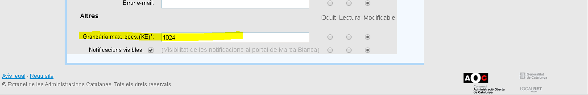

<h1> Preguntes freqüents </h1>

<h3> Quina és la mida màxima dels documents de resolució/annexos per adjuntar a una tramesa?</h3>

Els documents de resolució/annexos que és poden adjuntar a una tramesa de diverses formes:

* Directament com a _base64_ dins del missatge.
* Indicant una ruta FTP (els ens que estan integrats mitjançant aquesta via).
* Adjuntant el document al missatge través de la _PCI_ fent ús de [`MTOM`](https://en.wikipedia.org/wiki/Message_Transmission_Optimization_Mechanism). Per a més informació respecte a l'ús d'aquest mecanisme podeu consultar [la guia d'integració de la _PCI_](https://www.aoc.cat/knowledge-base/plataforma-de-col-laboracio-administrativa-2/)

En una tramesa és obligatori adjuntar un document de tipus _Resolució_ i opcionalment és poden adjuntar fins a un màxim de 4 documents més de tipus _Annex_. Fent un total màxim de 5 documents.

En el cas d'adjuntar el/s document/s directament dins del missatge, la mida màxima permesa per un document és de **2MB**.
Per a la resta de casos la mida màxima permesa per un document és de **6MB**.
Aquesta és la restricció màxima. A nivell d'ens és pot configurar un límit més restrictiu.
A través de l'aplicació d'eNotum dins [_d'EACAT_](https://www.eacat.cat), anant a configuració i seleccionant l'ens en qüestió:

Aquest camp aplica sempre i quan sigui més restrictiu que els **2MB** en cas d'adjuntar via missatgeria, o de **6MB** per a les altres formes. En cas de setejar amb un valor superior no és tindrà en compte.

**NOTA ADDICIONAL**: Degut a una restricció futura de la _PCI_, proximament en cas d'ajuntar el/s document/s en _base64_ dins del missatge, el total del missatge (document/s i resta de contingut a excepció unicament dels tags) no podrà superar els **2MB**. Es recomana per tant utilitzar una dels altres mecanismes en cas de voler adjuntar document/s pesats.

<h3> Es pot notificar a telefons estrangers? </h3>

**eNotum** accepta números de telèfons estrangers. Els servei web concretament fa els següents passos amb aquest ordre per tal de validar els telèfons:
* Normalitza el telèfon:
  * Si el telèfon hi ha un caràcter `+` el remplaça per `00`.
  * Si el telèfon comença per `0034` elimina aquests caràcters perquè és el prefix d'Espanya.
* Valida el telèfon:
  * Validem la correctesa de qualsevol número de teléfon de país o regió del mon mitjançant la llibreria https://github.com/googlei18n/libphonenumber
