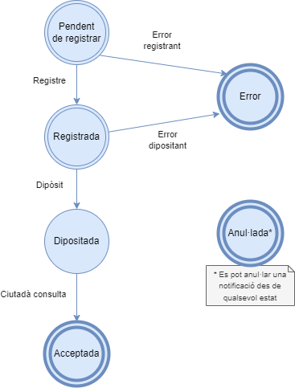

# Integració missatgeria versió 4.0

1. [Introducció](#1-introducció)
   1. [Integració PCI](#11-integració-pci)
   2. [Cicle de vida de les notificacions](12-cicle-de-vida-de-les-notificacions)
   3. [Cicle de vida de les comunicacions](13-cicle-de-vida-de-les-comunicacions)
2. [Missatgeria](#2-missatgeria)
    1. [Missatgeria específica eNotum versió 4.0](#missatgeria-específica-enotum-versió-40)
3. [Operacions](#3-operacions)
   1. [Operació ProcessarTramesa](#operació-processartramesa)
   2. [Operació Resum](#operació-resum)
   3. [Operació Evidencia](#operació-evidencia)
   4. [Operació Practicar](#operació-practicar)
   5. [Operació RecuperarReport](#operació-recuperarreport)
   6. [Operació Consulta](#operació-consulta)
   7. [Operació Cerca](#operació-cerca)
   8. [Operació Anul·lació](#operació-anullacio)
   9. [Tipus comuns](#tipus-comuns)
4. [Reports de canvis d'estat](#4-reports-de-canvi-destat)
5. [Codis d'error d'eNotum](#5-codis-derror-denotum)
6. [Notes per la migració de missatgeria de versions anteriors](#6-notes-per-la-migració-de-missatgeria-de-versions-anteriors)
   1. [Correspondencia d'estats](#61-correspondencia-destats)


# 1. Introducció

A continuació és descriu el funcionament i les diferents modalitats de consum de la versió de missatgeria _4.0_ d'**eNotum**.

## 1.1. Integració PCI

Tal i com es reflecteix a la següent figura, el Backend d'**eNotum** s'integra dins de l'arquitectura de la Plataforma de Col·laboració Interadministrativa (en endavant _PCI_) a mode d'un nou servei accessible a través de la MTI. 

Per tant els integradors que vulguin accedir a l'**eNotum** ho hauran de fer a través de la missatgeria de la _PCI_ utilitzant l'element `<DatosEspecificos>` d'aquesta, per a més informació podeu consultar [el document d'integració de la _PCI_ aqui](https://suport-enotum.aoc.cat/hc/ca/articles/4412319190929-Documentaci%25C3%25B3-gen%25C3%25A8rica-per-a-integrar-se-a-la-PCI)


## 1.2. Cicle de vida de les notificacions

Per tal de comprendre com utilitzar les operacions que estan publicades per a la integració amb **eNotum** és recomanable entendre el cicle de vida de les notificacions. Això ens permetrà saber en quins estats pot estar la notificació i l'efecte que tindrà l’execució de les operacions sobre l’estat d’aquesta.

### 1.2.1. Diagrama de cicle de vida

En el següent diagrama d'estats es mostra els diferents estats possibles de la notificació i les transicions que es poden donar.


### 1.2.2. Descripció dels estats de les notificacions

#### 1.2.2.1. Pendent de processar

L'estat _Pendent de processar_ és l'estat inicial de la notificació. La notificació està en aquest estat just en el moment en que l'integrador ha llançat la operació [_ProcessarTramesa_](#petici%C3%B3---peticioprocessartramesa) i el missatge de resposta de l'operació ha indicat un codi de notificació, o sigui, que no hi ha hagut cap error. En el cas que la petició de processar tramesa hagi produït algun error la notificació no es crea i, per tant, no està en aquest estat.

Un cop en aquest estat el motor de **eNotum** s'encarrega de pujar els documents a DESA'L i de registrar la notificació. Si en el missatge de [_ProcessarTramesa_](#petici%C3%B3---peticioprocessartramesa) s'indiquen els UUID dels documents de DESA'L no es realitzarà la pujada de documents. Si s'indica un número de registre i una data de registre no es realizarà l'assentament ja que s'entèn que l'integrador ja ha fet el registre de sortida prèviament a enviar el missatge de _ProcessarTramesa_.

Si aquestes operacions es realitzen correctament es passa a l'estat _Registrada_. Si alguna d'aquestes operacions falla el motor de **eNotum** programa un nou intent de realitzar-les al cap d'un cert temps. L'execució pot reintentar-se un nombre determinat de cops. Quan s'exhaureixen els reintents la notificació passa a l'estat _Error_.

#### 1.2.2.2. Registrada

La notificació està en aquest estat quan els documents ja estan carregats i la notificació ja està registrada. 

Quan estem en aquest estat el motor d'**eNotum** dipositarà la notificació i crearà l'evidència de dipòsit. Si aquest procés s'executa sense problemes es passarà a l'estat _Dipositada_. Com en l'estat anterior, si falla el procés es reintentarà un nombre definit de cops i, si finalment cap acaba correctament, la notificació passa a l'estat _Error_.

#### 1.2.2.3. Dipositada

La notificació passa a aquest estat quan s'ha efectuat el dipòsit de la notificació. Només s'arriba a aquest estat a partir de l'estat _Registrada_.

En aquest estat s'avisa als destinataris de la notificació que han rebut una notificació i que poden accedir a l'aplicació per tal de poder consultar les seves notificacions. Aquesta informació s'envia per correu electrònic i/o via un SMS al telèfon del destinatari. Ambdós camps s'agafaran dels nodes `/BustiesCorreu/BustiaCorreu` i `/Telefons/Telefon` respectivament del node `<PersonaFisica>` o `<PersonaJuridica>` que ve informat dins el node `/Notificacio/Destinatari` de la `<Tramesa>`. En aquest estat també s'enviaran els correus electrònics i missatges de text a les persones d'avís associades a cada destinatari. Les persones d'avís es diferencien dels destinataris de la notificació en el fet que no poden accedir a la notificació i només s'assabenten a través d'aquest avís de que el destinatari al que estan associades ha rebut una notificació.

L'integrador pot permetre que els empleats encarregats de crear/gestionar les notificacions puguin consultar l'estat en que es troben les notificacions i diversa informació addicional amb les operacions [_PeticioCerca_](#petici%C3%B3---peticiocerca) i [_PeticioConsulta_](#petici%C3%B3---peticioconsulta).

Si el ciutadà no practica la notificació aquesta es manté en aquest estat durant el temps de vigència de la notificació indicat al camp `<DiesExpiracio>`. Al expirar aquest període el sistema rebutja automàticament la notificació creant una evidència de rebuig i la notificació passa a l'estat _Expirada_.

Quan la notificació està en aquest estat el ciutadà pot decidir acceptar o rebutjar la notificació. Utilitzant l’operació [_Practicar notificació_](#petici%C3%B3---peticiopracticar) l’estat de la notificació passa a ser Acceptada o Rebutjada en funció del que s’hagi especificat en l’element <Decisio> de l’operació de practicar.

#### 1.2.2.5. Acceptada / Rebutjada / Expirada

Un cop la notificació està en qualsevol d'aquests estats - que es consideren tots estats finals ja que un cop la notificaciño assoleix un d'aquests estats el mateix ja no es modificarà - el ciutadà pot consultar les dades de la notificació. L'integrador pot recuperar aquestes dades amb la operació [_PeticióConsulta_](#petici%C3%B3---peticioconsulta). Aquesta operació només pot ser consultada amb el rol _Ciutada_ quan la notificació està en els estats _Acceptada_, _Rebutjada_ o _Expirada_. 

Un cop es pot fer la consulta per ciutada perquè la notificació es troba en un d'aquests estats, la informació retornada serà la mateixa, és a dir, la informació sobre la notificació retornada no serà més o menys restrictiva en funció de l'estat. Remarquem aquest fet ja que en versions anteriors d'**eNotum** les dades recuperades per la consulta en cas de que l'estat de la notificació fos _Acceptada_ eren més que per qualsevol dels altres tres estats de _Rebutjada_.

#### 1.2.2.9. Error

Arriben a aquest estat les notificacions que han estat involucrades en l'execució d'algun procés del sistema que ha produït repetidament errors.

En aquest estat les notificacions no poden ser acceptades ni rebutjades ni pel ciutadà ni pel sistema.

Per l'operació [_PeticioCerca_](#petici%C3%B3---peticiocerca) de ciutadà no es mostren les notificacions en aquest estat. En canvi per aquesta mateixa operació amb rol _EMPLEAT_ sí es mostren aquestes notificacions per tal que l'empleat sigui conscient de que la notificació està en error.

Quan una notificació està en aquest estat l'administrador del sistema pot rellançar manualment el procés on s'ha produït l'error.

#### 1.2.2.10. Anul·lada

Un cop en aquest estat la notificació no pot ser canviada d'estat a un estat anterior.

La notificació arriba a aquest estat quan l'ens que ha generat la notificació demana que aquesta s'anul·li. Hi ha diversos motius que poden motivar l'anul·lació d'una notificació: que aquesta contingui dades errònies, que l'expedient que la motiva ha estat declarat nul, etc.

L'anul·lació d'una notificació es pot realitzar per part d'un usuari amb rol _Empleat_ a través de de la petició [_PeticioAnullacio_](#petici%C3%B3---peticioanullacio) i també a través de l'aplicació eNOTUM del portal [EACAT](https://eacat.aoc.cat/enotum/). Al portal de suport podeu trobar la guia sobre [com anul·lar una notificació des de les pantalles d'EACAT](https://suport-enotum.aoc.cat/hc/ca/articles/4412324029713-Anul-laci%C3%B3-de-notificacions-electr%C3%B2niques).

## 1.3. Cicle de vida de les comunicacions

En el cas de les comunicacions el cicle de vida és similar al de les notificacions excepte en el fet de que no es necessita validesa legal de que el destinatari ha practicat la notificació, i que a més a més les comunicacions no tenen un temps determinat de vigència i per tant no expiren, així doncs el cicle de vida es simplifica i queda de la següent manera:



### 1.3.1. Descripció dels estats de les comunicacions

Com es pot observar en el diagrama anterior hi ha poques diferències en els estats de les comunicacions respecte els de les notificacions. Aquestes comparteixen els estats inicials fins que aquesta es diposita. Un cop en aquest estat, la diferencia radica en l'absència de l'estat _Rebutjada_ i en la manera de fer la transició cap a l'estat _Acceptada_ des de l'estat _Dipositada_. També es pot observar que no hi ha l'estat d'expiració al final de la vida de la comunicació donat que no tenen data de caducitat.

# 2. Missatgeria

Com es comenta en [el punt 1 d'aquest document](#11-integració-pci) **eNotum** funciona com a servei dins de la _PCI_, serà per tant necessari treballar amb la missatgeria de la _PCI_, encapsulant la missatgeria específica de **eNotum** dins d'aquesta.

Específicament per a fer ús del servei d'**eNotum** dins de la missatgeria de la _PCI_ és necessari informar els següents elements del missatge _XML_:

* `//Peticion/Atributos/CodigoProducto` el _string_ ENOTUM
* `//Peticion/Atributos/CodigoCertificado` el _string_ ENOTUM
* `//Peticion/Solicitudes/SolicitudTransmision/DatosGenericos/Transmision/CodigoCertificado` el _string_ ENOTUM
* `//Peticion/Solicitudes/SolicitudTransmision/DatosEspecíficos` Petició _XML_ específica d'**eNotum**

Pel que fa a la resta del missatge _PCI_, cal que aquest compleixi amb els requisits definits [al document d'integració de la PCI aqui](https://suport-enotum.aoc.cat/hc/ca/articles/4412319190929-Documentaci%25C3%25B3-gen%25C3%25A8rica-per-a-integrar-se-a-la-PCI)

## Missatgeria específica eNotum versió 4.0

A continuació es detallaran els elements comuns a totes les modalitats de consum:

### Petició

Totes les peticions de les modalitats de consum _WS_ que ofereix **eNotum** extenen el tipus _PeticioType_.

[Aquí podeu veure la definició completa del esquema _Peticio.xsd_](https://github.com/ConsorciAOC/eNotum/blob/master/missatgeria/4.0/xsds/Peticio.xsd)

```xml
<xs:complexType name="PeticioType" abstract="true">
	<xs:sequence>
		<xs:element name="BackOffice" type="xs:string" minOccurs="0"/>
		<xs:element name="Usuari" type="UsuariType"/>
	</xs:sequence>
</xs:complexType>
```

Per tant com és pot veure totes les peticions, a banda dels elements específics de cada modalitat de consum, tenen els següents elements:

* `PeticioType/BackOffice` : Codi del backoffice que realitza la petició. S'ha de demanar l'alta a través del portal de suport.
* `PeticioType/Usuari` : Dades de l'usuari, es descriuen a continuació.

#### Usuari

Dins el tipus _UsuariType_ es defineixen els diferents tipus de Rol que pot assumir un usuari: Empleat, Ciutada, Representant i FuncionariHabilitat. Per operar amb qualsevol dels rols, excepte el d'Empleat, s'ha d'informar el AccessToken recupeat de l'autenticació amb VALId.

```xml
<xs:complexType name="UsuariType">
	<xs:choice>
		<xs:element name="Empleat">
			<xs:complexType>
				<xs:sequence>
					<xs:element name="CodiOrganisme" type="xs:string"/>
					<xs:element name="CodiDepartament" type="xs:string"/>
				</xs:sequence>
			</xs:complexType>
		</xs:element>
		<xs:element name="Ciutada">
			<xs:complexType>
				<xs:choice minOccurs="0">
					<xs:element name="VALIdAccessToken" type="xs:string"/>
					<xs:sequence>
						<xs:element name="IdParaulaPas" type="xs:string"/>
						<xs:element name="ParaulaPas" type="xs:string"/>
					</xs:sequence>
				</xs:choice>
			</xs:complexType>
		</xs:element>
		<xs:element name="Representant">
			<xs:complexType>
				<xs:sequence>
					<xs:element name="VALIdAccessToken" type="xs:string"/>
					<xs:element name="Interessat">
						<xs:complexType>
							<xs:choice>
								<xs:element name="PersonaFisica" type="DocumentPersonaFisicaType"/>
								<xs:element name="PersonaJuridica" type="DocumentPersonaJuridicaType"/>
							</xs:choice>
						</xs:complexType>
					</xs:element>
				</xs:sequence>
			</xs:complexType>
		</xs:element>
		<xs:element name="FuncionariHabilitat">
			<xs:complexType>
				<xs:sequence>
					<xs:element name="VALIdAccessToken" type="xs:string"/>
					<xs:element name="Interessat">
						<xs:complexType>
							<xs:choice>
								<xs:element name="PersonaFisica" type="DocumentPersonaFisicaType"/>
								<xs:element name="PersonaJuridica" type="DocumentPersonaJuridicaType"/>
							</xs:choice>
						</xs:complexType>
					</xs:element>
				</xs:sequence>
			</xs:complexType>
		</xs:element>
	</xs:choice>
</xs:complexType>
```

* `Empleat`
L'empleat públic és el rol d'usuari autoritzat per a la creació de notificacions. A banda permet fer les operacions de modalitats de consum de Cerca, Consulta etc. A excepció de les operacions de Practicar i Resum.
* `Empleat/CodiOrganisme`
Codi ENS de l'Organisme donat d'alta a eNotum al que pertany l'empleat públic que realitza l'operació.
* `Empleat/CodiOrganisme`
Codi ENS del Departament donat d'alta a eNotum al que pertany l'empleat públic que realitza l'operació.
* `Ciutada`
El ciutadà és el rol d'usuari autoritzat a cercar i acceptar notificacions vinculades al propi usuari.
* `Ciutada/VALIdAccessToken`
AccessToken resultat de l'autenticació del ciutadà a VALId.
* `Ciutada/IdParaulaPas`
**Reservat per ús intern.** S'eliminarà properament.
* `Ciutada/ParaulaPas`
**Reservat per ús intern.** S'eliminarà properament.
* `Representant`
El representant és el rol d'usuari autoritzat a cercar i acceptar notificacions en nom d'un ciutadà. Aquesta representació ha d'estar acreditada a través d'un certificat de representant o a través d'una representació a [Representa](https://representa.cat).
* `/Representant/VALIdAccessToken`
AccessToken resultat de l'autenticació del representant a VALId.
* `/Representant/Interessat`
Persona física o jurídica a la que representa l'usuari. Es validarà la vinculació entre representant i interessat amb el certificat de representant utilitzat en l'autenticació amb VALId o es consultarà si existeixen representacions vigents a [Representa](https://representa.cat).
* `/FuncionariHabilitat` : Per tal de donar sortida a les peticions de tramitació atesa i de compareixença espontània es permet actuar als funcionaris habilitats en nom de l'interessat de la notificació. **:warning: S'habilitarà en un futur**.
* `/FuncionariHabilitat/VALIdAccessToken` : AccessToken resultat de l'autenticació del funcionari a VALId.

### Resposta

Totes les respostes a les modalitats de consum _WS_ que ofereix **eNotum** estenen l'esquema de resposta _RespostaType_.

[Aquí podeu veure la definició completa del esquema _Resposta.xsd_](https://github.com/ConsorciAOC/eNotum/blob/master/missatgeria/4.0/xsds/Resposta.xsd)

```xml
<xs:include schemaLocation="Errors.xsd"/>

<xs:complexType name="RespostaType" abstract="true">
	<xs:sequence>
		<xs:element name="Errors" type="ErrorsType" minOccurs="0"/>
	</xs:sequence>
</xs:complexType>
```

El tipus _RespostaType_ incorpora tan sols l'element Errors de forma opcional. De manera que totes les operacions invocades poden retornar un error amb el mateix format.

### Errors

L'element `<Errors>` serà una seqüencia amb els possibles errors de la petició retornats:

```xml
	<xs:complexType name="ErrorsType">
		<xs:sequence>
			<xs:element name="Error" maxOccurs="unbounded">
				<xs:complexType>
					<xs:sequence>
						<xs:element name="CodiError" type="Number"/>
						<xs:element name="MissatgeError" type="xs:string"/>
						<xs:element name="DadesNotificacio" type="DadesNotificacioErrorType" minOccurs="0"/>
						<xs:element name="FaseError" type="xs:string" minOccurs="0"/>
						<xs:element name="TipusError" type="xs:string" minOccurs="0"/>
					</xs:sequence>
				</xs:complexType>
			</xs:element>
		</xs:sequence>
	</xs:complexType>
```

A la practica, les respostes de les modalitats de consum amb elements `<Error>`, només tindran informat els elements obligatoris: `<CodiError>` i `<MissatgeError>`. Els tres elements opcionals restants mai vindran informat en aquests casos. Podeu veure els possibles [codis i missatges d'error en aquest apartat](#5-codis-derror-denotum).

Els tres elements opcionals vindran informats en els missatges d'error que envia eNOTUM als backoffices integrats informant dels errors en les fases d'execució de la notifiació. Veure la secció [Reports de canvi d'estat](#4-reports-de-canvi-destat) més endavant.

# 3. Operacions

A continuació és detallaran els elements específics per a les diferents operacions de les modalitats de consum que ofereix el _WS_ d'**eNotum**.

## Operació _ProcessarTramesa_

Aquesta operació permet la creació de notificacions dins del sistema.

### Petició

[Aquí podeu veure la definició completa del esquema _PeticioProcessarTramesa.xsd_](https://github.com/ConsorciAOC/eNotum/blob/master/missatgeria/4.0/xsds/PeticioProcessarTramesa.xsd)

La definició d'aquesta petició estén la _peticioType_ afegint l'element `<Tramesa>` que es descriu a continuació.

#### Tramesa
```xml
<xs:element name="Tramesa">
	<xs:complexType>
		<xs:sequence>
			<xs:element name="DadesAvisos" minOccurs="0"/>
			<xs:element name="DadesOfici"/>
			<xs:element name="Documents" type="DocumentsType"/>
			<xs:element name="Notificacio" type="NotificacioAmbDestinatarisType" maxOccurs="unbounded"/>
		</xs:sequence>
	</xs:complexType>
</xs:element>

```
La tramesa és l'estructura que permet la creació de notificacions i/o comunicacions i permet agrupar-les. Està formada per els elements que es descriuen a continuació:

#### DadesAvisos
```xml
<xs:element name="DadesAvisos" minOccurs="0">
	<xs:complexType>
		<xs:all>
			<xs:element name="DiesAvisos" type="DiesAvisosType" minOccurs="0"/>
		</xs:all>
	</xs:complexType>
</xs:element>
```	
L'element `<DadesAvisos>` és opcional ja que **eNotum** disposa d'un comportament per defecte per als valors especificats en aquest element, en cas de que vinguin informats al missatge, aquests tindran prioritat per a ser utilitzats en comptes dels que hi hagi establers per defecte. `<DadesAvisos>` està format pels següents elements:

#### DiesAvisos
```xml
<xs:element name="DiesAvisos" minOccurs="0"/>
	<xs:complexType>
		<xs:sequence>
			<xs:element name="DiaAvis" type="xs:positiveInteger" minOccurs="0" maxOccurs="unbounded"/>
		</xs:sequence>
	</xs:complexType>
</element>
```
* `/DiesAvisos/DiaAvis`
Llista d'elements d'aquest tipus amb els número de dies a comptar a partir del enviament per el qual s'enviaran recordatoris al/s destinatari/s de la notificació mentre aquesta no es trobi en un estat final.

#### DadesOfici

La definició d'aquest element la podeu trobar a l'apartat de dades comuns [DadesOficiType](#dadesoficitype).

#### Documents

La definició d'aquest element la podeu trobar a l'apartat de dades comuns [DocumentsType](#documentstype).

#### NotificacioAmbDestinataris

El tipus NotificacioAmbDestinataris estén el tipus NotificacioType que podeu trobar a l'apartat de dades comuns [NotificacioType](#notificaciotype).

```xml
<xs:complexType name="NotificacioAmbDestinatarisType">
	<xs:complexContent>
		<xs:extension base="NotificacioType">
			<xs:sequence>
				<xs:element name="Destinataris" type="DestinatarisType"/>
			</xs:sequence>
		</xs:extension>
	</xs:complexContent>
</xs:complexType>
```

#### Destinataris

```xml
<xs:complexType name="DestinatarisType">
	<xs:sequence>
		<xs:element name="Destinatari" maxOccurs="100">
			<xs:complexType>
				<xs:sequence>
					<xs:choice>
						<xs:element name="PersonaFisica" type="PersonaFisicaType"/>
						<xs:element name="PersonaJuridica" type="PersonaJuridicaType"/>
					</xs:choice>
					<xs:element name="Titular" type="xs:boolean" minOccurs="0"/>
					<xs:element name="Idioma" type="Idioma" minOccurs="0"/>
					<xs:element name="Obligat" type="xs:boolean" minOccurs="0"/>
				</xs:sequence>
			</xs:complexType>
		</xs:element>
	</xs:sequence>
</xs:complexType>
```

Aquest element defineix els destinataris de les notificacions de la tramesa.

* `/Destinatari/PersonaFisica`
Dades del destinatari en cas de que es tracti d'una persona física. La definició d'aquest element la podeu trobar a l'apartat de dades comuns [PersonaFisicaType](#personafisicatype).
* `/Destinatari/PersonaJuridica`
Dades del destinatari en cas de que es tracti d'una persona jurídica. La definició d'aquest element la podeu trobar a l'apartat de dades comuns [PersonaJuridicaType](#personajuridicatype).
* `/Destinatari/Titular`
Camp opcional, que permet marcar quin dels destinataris de la notificació és el titular d'aquesta. Només és permet marcar un dels destinataris com a titular. El titular és la persona física o jurídica sobre la que recau l'efecte de la notificació.
* `/Destinatari/Idioma`
Opcionalment permet indicar l'idioma específic de l'usuari entre del següents valors:
	* *ca* : Indica que l'idioma de la notificació és català.
	* *es* : Indica que l'idioma de la notificació és castellà.
	* *oc* : Indica que l'idioma de la notificació és aranés.
	* *en* : Indica que l'idioma de la notificació és anglés.
* `/Destinatari/Obligat`
Camp opcional, que permet indicar si el destinatari està obligat a relacionar-se amb l'administració per via electrònica. Per defecte aquest camp pren el valor 'true' en el cas de persones jurídiques i 'false' en el cas de persones físiques.

### Resposta

[Aquí podeu veure la definició completa del esquema _RespostaProcessarTramesa.xsd_](https://github.com/ConsorciAOC/eNotum/blob/master/missatgeria/4.0/xsds/RespostaProcessarTramesa.xsd)

Aquest esquema és la resposta a la creació de les notificacions que ens retorna els identificadors per a les notificacions creades, estén el tipus _RespostaType_ i que permet triar entre retornar una llista d'errors produïts durant l'execució de la petició o el següent element amb la resposta de l'operació:

```xml
<xs:element name="NotificacionsCreades">
		<xs:complexType>
				<xs:sequence>
						<xs:element name="IdNotificacio" type="Number" maxOccurs="unbounded"/>
				</xs:sequence>
		</xs:complexType>
</xs:element>
```

* `/RespostaProcessarTramesa/NotificacionsCreades/IdNotificacio`
Identificador/s de les notificacions creades.


## Operació _Resum_

Aquesta modalitat de consum permet obtenir un resum de les notificacions pendents (actives i no practicades per un usuari) agrupades per l'ens emissor de la notificació.

### Peticio

[Aquí podeu veure la definició completa del esquema _PeticioResum.xsd_](https://github.com/ConsorciAOC/eNotum/blob/master/missatgeria/4.0/xsds/PeticioResum.xsd)

La definició d'aquesta petició estén la _peticioType_ afegint la sequéncia amb els elements que es descriuen a continuació:

```xml
<xs:sequence>
	<xs:element name="TipusAcces" type="TipusAccesType" minOccurs="0"/>
	<xs:element name="TipusObjecte" type="TipusObjecteType" minOccurs="0"/>
	<xs:element name="DataPublicacio" type="PeriodeDataTemps" minOccurs="0"/>
</xs:sequence>
```

* `/PeticioResum/TipusAcces` 
Indica el nivell d'autenticació requerit al ciutadà per les notificacions que es volen recuperar:
	* *BAIX*
	* *SUBSTANCIAL*
	* *ALT*
* `/PeticioResum/TipusObjecte`
Indica si es volen recuperar notificacions o comunicacions en la petició de resum:
	* *NOTIFICACIO*
	* *COMUNICACIO*
* `/PeticioResum/DataPublicacio`
Periode de temps en que es vol extreure el recompte de notificacions. Si no s'informa es fa el recompte dels últims 30 dies.

### Resposta

[Aquí podeu veure la definició completa del esquema _RespostaResum.xsd_](https://github.com/ConsorciAOC/eNotum/blob/master/missatgeria/4.0/xsds/RespostaResum.xsd)

```xml
<xs:sequence>
	<xs:element name="NotificacionsEntitat" minOccurs="0" maxOccurs="unbounded"/>
	<xs:element name="TotalNotificacions" type="Number"/>
	<xs:element name="TotalNotificacionsPendents" type="Number"/>
</xs:sequence>
```

* `/RespostaResum/NotificacionsEntitat`
Resum de notificacions pendents per aquest usuari agrupat per ens, aquest element es descriu amb més detall a [continuació](#notificacionsentitat).
* `/RespostaResum/TotalNotificacions`
Número total de notificacions de l'usuari per a tots els ens.
* `/RespostaResum/TotalNotificacionsPendents`
Número total de notificacions pendents de l'usuari per a tots els ens.

### NotificacionsEntitat

```xml
<xs:element name="NotificacionsEntitat" minOccurs="0" maxOccurs="unbounded">
	<xs:complexType>
		<xs:sequence>
			<xs:element name="NomOrganisme" type="xs:string"/>
			<xs:element name="CodiOrganisme" type="xs:string"/>
			<xs:element name="NomDepartament" type="xs:string"/>
			<xs:element name="CodiDepartament" type="xs:string"/>
			<xs:element name="Notificacions" type="Number"/>
			<xs:element name="NotificacionsPendents" type="Number"/>
		</xs:sequence>
	</xs:complexType>
</xs:element>
```
* `/NotificacionsEntitat/NomOrganisme`
Nom de l'organisme al que pertanyen les notificacions.
* `/NotificacionsEntitat/CodiOrganisme`
Codi de l'organisme al que pertanyen les notificacions.
* `/NotificacionsEntitat/NomDepartament`
Nom del departament al que pertanyen les notificacions.
* `/NotificacionsEntitat/CodiDepartament`
Codi del departament al que pertanyen les notificacions.
* `/NotificacionsEntitat/Notificacions`
Numero de notificacions de l'usuari en aquesta entitat.
* `/NotificacionsEntitat/NotificacionsPendents`
Numero de notificacions pendents per part de l'usuari en aquesta entitat.

## Operació _Evidencia_

Aquesta petició permet recuperar les evidencies de diposit i pràctica en format _XML_ així com el justificant en format _PDF_ d'una notificació.

### Petició

[Aquí podeu veure la definició completa del esquema _PeticioEvidencia.xsd_](https://github.com/ConsorciAOC/eNotum/blob/master/missatgeria/4.0/xsds/PeticioEvidencia.xsd)

La definició d'aquesta petició estén la _peticioType_ afegint la sequéncia amb els elements que es descriuen a continuació:

```xml
<xs:sequence>
	<xs:element name="IdNotificacio" type="Number"/>
	<xs:element name="TipusEvidencia" type="TipusEvidenciaType"/>
	<xs:element name="IdiomaEvidenciaPDF" type="Idioma" minOccurs="0" />
</xs:sequence>
```

* `/PeticioEvidencia/IdNotificacio`
Identificador de la notificació per la que es vol recuperar l'evidència.
* `/PeticioEvidencia/TipusEvidencia`
Indica el tipus d'evidència a recuperar:
	* *XML* : Retornarà l'evidència de dipòsit i l'evidència d’acceptació o rebuig de la notificació en format _XML_
	* *PDF* : Retornarà la URL d'on descarregar el justificant electrònic de validesa en format _PDF_
* `/PeticioEvidencia/IdiomaEvidenciaPDF`
Idioma en el que es retornarà el document d’evidències, només aplica per a peticions amb rol Ciutadà, Representant o Funcionari Habilitat i quan el camp `<TipusEvidencia>` agafa el valor _PDF_. En cas de no venir informat o de peticions amb rol Empleat, el _PDF_ es retornarà en català.

### Resposta

[Aquí podeu veure la definició completa del esquema _RespostaEvidencia.xsd_](https://github.com/ConsorciAOC/eNotum/blob/master/missatgeria/4.0/xsds/RespostaEvidencia.xsd)

```xml
<xs:sequence>
	<xs:element name="IdNotificacio" type="xs:integer" />
	<xs:element name="TipusEvidencia" type="TipusEvidenciaType" />
	<xs:element name="Diposit" type="xs:string" minOccurs="0">
		<xs:annotation>
			<xs:documentation>Evidència del dipòsit de la notificació.</xs:documentation>
		</xs:annotation>
	</xs:element>
	<xs:element name="AcceptacioRebuig" type="xs:string" minOccurs="0">
		<xs:annotation>
			<xs:documentation>Evidència de l'acceptació o rebuig de la notificació.</xs:documentation>
		</xs:annotation>
	</xs:element>
	<xs:element name="Anullacio" type="xs:string" minOccurs="0">
		<xs:annotation>
			<xs:documentation>Evidència de l'anul·lació de la notificació.</xs:documentation>
		</xs:annotation>
	</xs:element>
	<xs:element name="EvidenciaPDF" minOccurs="0">
		<xs:annotation>
			<xs:documentation>URL de descàrrega de l'evidència de la notificacio</xs:documentation>
		</xs:annotation>
		<xs:complexType>
			<xs:sequence>
				<xs:element name="UUID" type="uuid"/>
				<xs:element name="URLDescarrega" type="xs:anyURI"/>
			</xs:sequence>
		</xs:complexType>
	</xs:element>
</xs:sequence>
```

* `/RespostaEvidenciaType/IdNotificacio`
Identificador de la notificació per la qual es retorna l'evidència.
* `/RespostaEvidenciaType/TipusEvidencia`
Tipus d’evidència retornada:
	* _XML_ : Per a les evidències de dipósit i practica.
	* _PDF_ : Per al justificant en format PDF.
* `/RespostaEvidenciaType/Diposit`
Evidència del dipòsit de la notificació.
* `/RespostaEvidenciaType/AcceptacioRebuig`
Evidència de l'acceptació o rebuig de la notificació.
* `/RespostaEvidenciaType/Anullacio`
Evidència de l'anul·lació de la notificació.
* `/RespostaEvidenciaType/EvidenciaPDF/UUID`
UUID del document de DESA'L de l'evidència de la notificació en format _PDF_.
* `/RespostaEvidenciaType/EvidenciaPDF/URLDescarrega`
URL de descàrrega de l'evidència de la notificació en format _PDF_.

## Operació _Practicar_

Aquesta petició permet practicar una notificació per part del destinatari de la mateixa, o del seu representant o d'un funcionari habilitat mitjançant autenticació amb _valid_. En cas de peticions amb rol Empleat, permet indicar dades sobre l'acceptació en cas de notificacions acceptades en format _paper_.

### Petició

[Aquí podeu veure la definició completa del esquema _PeticioPracticar.xsd_](https://github.com/ConsorciAOC/eNotum/blob/master/missatgeria/4.0/xsds/PeticioPracticar.xsd)

 La definició d'aquesta petició estén la _peticioType_ afegint la sequéncia amb els elements que es descriuen a continuació:

```xml
<xs:sequence>
	<xs:element name="IdNotificacio" type="Number"/>
	<xs:element name="Decisio" type="DecisioPracticarType"/>
	<xs:element name="DadesPracticarCanalPaper" type="DadesPracticarCanalPaperType" minOccurs="0"/>
	<xs:element name="CanviCanal" type="DadesCanviCanalType" minOccurs="0"/>
</xs:sequence>
```

* `/PeticioPracticar/IdNotificacio`
Id de la notificació que es vol practicar.
* `/PeticioPracticar/Decisio`
Marca la decisió del ciutadà sobre la notificació, els possibles valors són:
	* *ACCEPTAR* 
	* *REBUTJAR*
* `/PeticioPracticar/DadesPracticarCanalPaper`
En cas de notificacions complementaries, si aquestes s'han practicat en paper però és vol informar de dades relacionades amb aquesta acció, el funcionari amb rol Empleat ho pot fer mitjançant aquest camp que es descriu en més detall en el següent punt.
* `/PeticioPracticar/CanviCanal`
En cas de notificacions complementaries, que l'usuari practica de forma activa en digital, pot donar el seu consentiment a ser notificat digitalment les pròperes notificacions així com la bústia i/o correu electrònic on fer les notificacions.

### DadesPracticarCanalPaper

```xml
<xs:complexType name="DadesPracticarCanalPaperType">
	<xs:sequence>
		<xs:element name="Funcionari" type="NIF"/>
		<xs:element name="DataPracticada" type="xs:dateTime"/>
		<xs:element name="Referencia" type="String100Max"/>
	</xs:sequence>
</xs:complexType>
```
* `/DadesPracticarCanalPaper/NIF`
NIF del funcionari que informa que la notificació s'ha practicat en format paper.
* `/DadesPracticarCanalPaper/DataPracticada`
Data en la qual el ciutadà va practicar la notificació en format paper.
* `/DadesPracticarCanalPaper/Referencia`
Camp de text amb la referència de la practica en paper.


### DadesCanviCanalType

```xml
<xs:complexType name="DadesCanviCanalType">
	<xs:sequence>
		<xs:element name="Canal" type="CanalType"/>
		<xs:element name="BustiaCorreu" type="String255Max" minOccurs="0"/>
		<xs:element name="Telefon" type="String50Max" minOccurs="0"/>
	</xs:sequence>
</xs:complexType>
```

En cas de practicar una notificació complementaria per part del ciutadà, permet indicar a l'usuari de forma opcional si desitja o no rebre les futures notificacions en paper.
* `/CanviCanal/Canal`
Indica com vol rebre les futures notificacions:
	* *PAPER* : En format paper.
	* *DIGITAL* : En format digital.

### Resposta

[Aquí podeu veure la definició completa del esquema _RespostaPracticar.xsd_](https://github.com/ConsorciAOC/eNotum/blob/master/missatgeria/4.0/xsds/RespostaPracticar.xsd)

Resposta a les peticions explícites de l'usuari vinculades amb la pràctica de les notificacions.

```xml
<xs:sequence>
	<xs:element name="IdNotificacio" type="Number"/>
	<xs:element name="Decisio" type="DecisioPracticarType"/>
</xs:sequence>
```

* `/RespostaPracticar/IdNotificacio`
Identificador de la notificació sobre la que s'està operant.
* `/RespostaPracticar/Decisio`
Indica la decisió que ha prés l'usuari sobre la notificació:
	* _ACCEPTAR_ : L'usuari ha acceptat la notificació.
	* _REBUTJAR_ : L'usuari ha rebutjat la notificació.

## Operació _RecuperarReport_

Aquesta petició permet recuperar el report amb el resum de dades d'una notificació concreta, o el report de totes les notificacions que han canviat d'estat per un departament en una data concreta. 

### Petició

[Aquí podeu veure la definició completa del esquema _PeticioRecuperarReport.xsd_](https://github.com/ConsorciAOC/eNotum/blob/master/missatgeria/4.0/xsds/PeticioRecuperarReport.xsd)

La definició d'aquesta petició estén la _peticioType_ afegint la sequéncia amb els elements que es descriuen a continuació:

```xml
<xs:choice>
	<xs:element name="IdNotificacio" type="Number">
		<xs:annotation>
			<xs:documentation>Identificador de la notificació a consultar.</xs:documentation>
		</xs:annotation>
	</xs:element>
	<xs:element name="DataReport" type="xs:date">
		<xs:annotation>
			<xs:documentation>Data del dia del qual es vol obtenir el report.</xs:documentation>
		</xs:annotation>
	</xs:element>
</xs:choice>
```

* `/PeticioRecuperarReport/IdNotificacio`
Identificador de la notificació de la que es vol recuperar el report.
* `/PeticioRecuperarReport/DataReport`
Data del dia del qual es vol obtenir el report. El format de la data ha de ser: `yyyy '-' mm '-' dd zzzzzz?`. De manera que unes dates vàlides serien: _2002-10-10+05:00_ o _2002-10-09Z_ o _2002-10-09_.

### Resposta

[Aquí podeu veure la definició completa del esquema _RespostaRecuperarReport.xsd_](https://github.com/ConsorciAOC/eNotum/blob/master/missatgeria/4.0/xsds/RespostaRecuperarReport.xsd)

Retorna el report amb el resum de dades d'una notificació concreta, o el report de totes les notificacions que han canviat d'estat per un departament en una data concreta.

```xml
<xs:sequence minOccurs="0">
	<xs:element ref="Report"/>
</xs:sequence>
```

La definició d'aquest element la podeu trobar a l'apartat de dades comuns [Report](#report).

## Operació _Consulta_

Aquesta petició permet consultar les dades d'una notificació concreta. Segons les necessitats per les que consulta l'integrador es pot indicar quina informació es vol que inclogui la resposta.

### Petició

[Aquí podeu veure la definició completa del esquema _PeticioConsulta.xsd_](https://github.com/ConsorciAOC/eNotum/blob/master/missatgeria/4.0/xsds/PeticioConsulta.xsd)

La definició d'aquesta petició estén la _peticioType_ afegint la sequéncia amb els elements que es descriuen a continuació:

```xml
<xs:sequence>
	<xs:element name="IdNotificacio" type="Number"/>
	<xs:element name="IncloureDadesOfici" type="xs:boolean" default="false" minOccurs="0"/>
	<xs:element name="IncloureDocuments" type="xs:boolean" default="false" minOccurs="0"/>
	<xs:element name="IncloureDestinataris" type="xs:boolean" default="false" minOccurs="0"/>
	<xs:element name="IncloureDadesSignador" type="xs:boolean" default="false" minOccurs="0"/>
</xs:sequence>

```
* `/PeticioConsulta/IdNotificacio`
Id de la notificació que es desitja consultar.
* `/PeticioConsulta/IncloureDadesOfici`
Indica si es vol que s'informi el bloc DadesOfici de la resposta. Si aquest camp no s'informa, no s'inclouran les dades en la resposta.
* `/PeticioConsulta/IncloureDocuments`
Indica si es vol que s'informi el bloc Documents de la resposta. Si aquest camp no s'informa, no s'inclouran les dades en la resposta.
* `/PeticioConsulta/IncloureDestinataris`
Indica si es vol que s'informi el bloc Destinataris de la resposta. Si aquest camp no s'informa, no s'inclouran les dades en la resposta.
* `/PeticioConsulta/IncloureDadesSignador`
Indica si es vol que s'informi el bloc DadesSignador de la resposta. Si aquest camp no s'informa, no s'inclouran les dades en la resposta.

### Resposta

[Aquí podeu veure la definició completa del esquema _RespostaConsulta.xsd_](https://github.com/ConsorciAOC/eNotum/blob/master/missatgeria/4.0/xsds/RespostaConsulta.xsd)

Aquesta modalitat retorna una resposta detallada de totes les dades vinculades amb una notificació concreta.

```xml
<xs:sequence>
	<xs:element name="IdNotificacio" type="Number"/>
	<xs:element name="Emissor" type="EmissorType"/>
	<xs:element name="DadesNotificacio" type="NotificacioType" minOccurs="0"/>
	<xs:element name="DadesEstat" minOccurs="0"><...>
	<xs:element name="DadesOfici" type="DadesOficiType" minOccurs="0"/>
	<xs:element name="Documents" type="DocumentsType" minOccurs="0"/>
	<xs:element name="Destinataris" minOccurs="0"><...>
	<xs:element name="DadesSignador" type="DadesSignadorType" minOccurs="0"/>
</xs:sequence>
```

* `/RespostaConsulta/IdNotificacio`
Identificador de la notificació consultada.
* `/RespostaConsulta/Emissor`
Dades de l'emissor de la notificació consultada, podeu consultar els detalls d'aquest element [aqui](#EmissorType)
* `/RespostaConsulta/DadesNotificacio`
Dades de la notificació consultada, es descriuen amb més detall [aquí](#NotificacioType)
* `/RespostaConsulta/DadesEstat`
Dades relatives a l'estat de la notificació consultada, es descriuen amb més detall a [continuació](#dadesestat)
* `/RespostaConsulta/DadesOfici`
Dades d'ofici de la notficiació consulta, es descriu amb més detall [aquí](#dadesoficitype)
* `/RespostaConsulta/Documents`
Documents vinculats amb la notificació consultada, aquest tipus d'element es descriu amb més detall [aquí](#documentstype)
* `/RespostaConsulta/Destinataris`
Dades dels destinataris de la notificació consultada, es descriuen amb més detall a 
[continuació](#destinataris)
* `/RespostaConsulta/DadesSignador`
Dades del practicant de la notificació consultada, es descriuen amb més detall a [continuació](#DadesSignadorType)

### DadesEstat

```xml
<xs:element name="DadesEstat" minOccurs="0">
	<xs:complexType>
		<xs:sequence>
			<xs:element name="Estat" type="EstatType"/>
			<xs:element name="DataPublicacio" type="xs:dateTime" nillable="true"/>
			<xs:element name="DataAcceptacioRebuig" type="xs:dateTime" nillable="true"/>
			<xs:element name="DataAnullacio" type="xs:dateTime" minOccurs="0"/>
			<xs:element name="MotiuAnullacio" type="String500Max" minOccurs="0"/>
		</xs:sequence>
	</xs:complexType>
</xs:element>
```

* `/DadesEstat/Estat`
Descripció de l'estat en el que es troba la notificació en el moment de la consulta.
* `/DadesEstat/DataPublicacio`
Data en la que la notificació ha estat dipositada. Aquesta data es correspon amb la data de segell de temps de la signatura d'evidència de dipòsit.
* `/DadesEstat/DataAcceptacioRebuig`
Data en que la notificació ha estat acceptada o rebutjada.
* `/DadesEstat/DataAnullacio`
Data en que la notificació ha estat anul·lada.
* `/DadesEstat/MotiuAnullacio`
Motiu al·legat per l'empleat públic per anul·lar la notificació.


### Destinataris

```xml
<xs:element name="Destinataris" minOccurs="0">
	<xs:complexType>
		<xs:sequence>
			<xs:element name="Destinatari" maxOccurs="unbounded">
				<xs:complexType>
					<xs:sequence>
						<xs:choice>
							<xs:element name="PersonaFisica" type="PersonaFisicaType"/>
							<xs:element name="PersonaJuridica" type="PersonaJuridicaType"/>
						</xs:choice>
						<xs:element name="Titular" type="xs:boolean" minOccurs="0"/>
						<xs:element name="Idioma" type="Idioma" minOccurs="0"/>
						<xs:element name="HaSignat" type="xs:boolean"/>
						<xs:element name="CanviCanal" type="DadesCanviCanalType" minOccurs="0"/>
						<xs:element name="Obligat" type="xs:boolean" minOccurs="0"/>
					</xs:sequence>
				</xs:complexType>
			</xs:element>
		</xs:sequence>
	</xs:complexType>
</xs:element>
```

Aquest element descriu la seqüència de destinataris d'aquesta notificació.

* `/Destinataris/Destinatari/PersonaFisica`
Dades de la persona física destinataria de la notificació. El tipus `PersonaFisicaType` està descrit amb més detall [aquí](#personafisicatype).
* `/Destinataris/Destinatari/PersonaJuridica`
Dades de la persona jurídica destinataria de la notificació. El tipus `PersonaJuridicaType` està descrit amb més detall [aquí](#personajuridicatype).
* `/Destinataris/Destinatari/Titular`
Indica si el destinatari és el titular de la notifiació.
* `/Destinataris/Destinatari/Idioma`
Idioma en que el destinatari ha rebut l'avís de la notificació.
* `/Destinataris/Destinatari/HaSignat`
Atribut booleà que indica si el destinatari ha realitzat l'acció d’acceptació o rebuig de la notificació.
* `/Destinataris/Destinatari/CanviCanal`
Dades relacionades amb el canvi de canal, en cas que la notificació fos en format _paper_ i el destinatari hagués aportat informació al respecte de canviar el format de recepció de les notificacions (només aplica a persones físiques ja que les persones jurídiques només poden rebre notificacions en format digital). El tipus `DadesCanviCanalType` està descrit amb més detall [aquí](#DadesCanviCanalType)
* `/Destinataris/Destinatari/Obligat`
Retorna opcionalment el valor d'aquest camp només en el cas que hagi estat informat a la petició. És a dir, independentment del valor "real" només és retornarà `true`|`false` en cas que s'hagi informat a la petició de _ProcessarTramesa_.

## Operació _Cerca_

Aquesta petició permet realitzar cerques sobre les notificacions aplicant diferents criteris de cerca.

### Petició

[Aquí podeu veure la definició completa del esquema _PeticioCerca.xsd_](https://github.com/ConsorciAOC/eNotum/blob/master/missatgeria/4.0/xsds/PeticioCerca.xsd)

A grans trets La definició d'aquesta petició estén la _peticioType_ afegint la sequéncia amb els elements que es descriuen a continuació:

```xml
<xs:sequence>
	<xs:element name="DadesCerca">
		<xs:complexType>
			<xs:all>
				<xs:element name="CriterisEntitat" minOccurs="0"/>
				<xs:element name="CriterisDestinatari" minOccurs="0"/>
				<xs:element name="CriterisNotificacio" minOccurs="0"/>
				<xs:element name="CriterisData" minOccurs="0">
				<xs:element name="Paginacio"/>
		</xs:complexType>
	</xs:element>
</xs:sequence>
```

* `/DadesCerca/CriterisEntitat` 
Criteris de cerca relacionats amb l'entitat que ha emés les notificacions.
* `/DadesCerca/CriterisDestinatari`
Criteris de cerca relacionats amb els destinataris receptors de les notificacions.
* `/DadesCerca/CriterisNotificacio`
Criteris de cerca sobre les propietats de les notificacions creades.
* `/DadesCerca/CriterisData`
Criteris de dates de les diferents etapes del procés de notificació.
* `/DadesCerca/Paginacio`
Permet específicar la pàginació de la cerca.

#### CriterisEntitat

```xml
<xs:element name="CriterisEntitat" minOccurs="0">
	<xs:complexType>
		<xs:all>
			<xs:element name="CodiOrganisme" type="xs:string" minOccurs="0"/>
			<xs:element name="CodiDepartament" type="xs:string" minOccurs="0"/>
			<xs:element name="BackOffice" type="xs:string" minOccurs="0"/>
		</xs:all>
	</xs:complexType>
</xs:element>
```

Aquest element permet filtrar les notificacions en funció de les següents elements vinculats a les entitats de les mateixes:
* `/CriterisEntitat/CodiOrganime`
Codi ENS de l'organisme emissor de les notificacions.
* `/CriterisEntitat/CodiDepartament`
Codi ENS del departament emissor de les notificacions.
* `/CriterisEntitat/BackOffice`
Codi del backoffice emissor de les notificacions.

#### CriterisDestinatari

```xml
<xs:element name="CriterisDestinatari" minOccurs="0">
	<xs:complexType>
		<xs:sequence>
			<xs:choice minOccurs="0">
				<xs:element name="Persona" type="FiltrePersonaType"/>
				<xs:element name="PersonaFisica" type="FiltrePersonaFisicaType"/>
				<xs:element name="PersonaJuridica" type="FiltrePersonaJuridicaType"/>
			</xs:choice>
			<xs:element name="CanviCanal" type="xs:boolean" minOccurs="0" default="false"/>
			<xs:element name="Obligat" type="xs:boolean" minOccurs="0"/>
		</xs:sequence>
	</xs:complexType>
</xs:element>
```

* `/CriterisDestinatari/Persona`
Aquest element permet filtrar bàsicament per les bústies de correu i/o telefons dels destinataris de les notificacions, es descriu amb més detall a [continuació](#persona)
* `/CriterisDestinatari/PersonaFisica`
Aquest element permet cercar per els mateixos camps que el camp anterior `/Persona`, i a més a més permet afegir criteris vinculats a la identificació de la persona física destinataria de la notificació. Aquest camp es descriu amb més detall a [continuació](#personafisica)
* `/CriterisDestinatari/PersonaJuridica`
Aquest element permet cercar per els mateixos camps que el camp anterior `/Persona`, i a més a més permet afegir criteris vinculats a la identificació de la persona jurídica destinataria de la notificació. Aquest camp es descriu amb més detall a [continuació](#personajuridica)
* `/CriterisDestinatari/CanviCanal`
És un booleà que permet indicar si s'han de cercar notificacions que hagin canviat de canal, el camp és opcional i en cas de no venir informat no s'aplicarà cap criteri, es a dir no informar el camp és diferent que informar-lo amb el valor `false`. Els possibles valors són:
	* *true* : Indica explicitament que s'han de cercar notificacions per les quals l'usuari hagi decidit fer un canvi de canal a digital i hagi donat les dades de contacte electrònic.
	* *false* : Indica explicitament que s'han de cercar notificacions per les quals l'usuari no hagi demanat un canvi de canal.
* `/CriterisDestinatari/Obligat`
Permet filtrar per les notificacions en que el destinatari és un subjecte obligat.

#### FiltrePersonaType

```xml
<xs:complexType name="FiltrePersonaType">
	<xs:sequence>
		<xs:element name="BustiesCorreu" type="BustiesCorreuType" minOccurs="0"/>
		<xs:element name="Telefons" type="TelefonsType" minOccurs="0"/>
	</xs:sequence>
</xs:complexType>
```

* `/Persona/BustiesCorreu/BustiaCorreu`
Adreça de correu electrònic del destinatari que es vol cercar. Cercarà tots els destinataris llur adreça de correu contingui la cadena passada com a valor per aquest criteri de cerca.
* `/Persona/Telefons/Telefon`
Número de telèfon del destinatari que es vol cercar. Cercarà tots els destinataris llur número de telèfon contingui la cadena numèrica passada com a valor per aquest criteri de cerca.

#### FiltrePersonaFisicaType

```xml
<xs:complexType name="FiltrePersonaFisicaType">
	<xs:complexContent>
		<xs:extension base="FiltrePersonaType">
			<xs:sequence>
				<xs:element name="DocumentIdentificatiu" type="DocumentPersonaFisicaType" minOccurs="0"/>
				<xs:element name="Nom" type="xs:string" minOccurs="0"/>
				<xs:element name="NomSentit" type="String255Max" minOccurs="0"/>
				<xs:element name="PrimerCognom" type="xs:string" minOccurs="0"/>
				<xs:element name="SegonCognom" type="xs:string" minOccurs="0"/>
			</xs:sequence>
		</xs:extension>
	</xs:complexContent>
</xs:complexType>
```

Aquest element extent de `FiltrePersonaType` per tant permet cercar per els mateixos camps que l'element [`FiltrePersonaType`](#FiltrePersonaType) però addicionalment cerca pels següents camps:

* `/PersonaFisica/DocumentIdentificatiu/NIF`
NIF/NIE del destinatari de les notificacions a cercar.
* `/PersonaFisica/DocumentIdentificatiu/Passaport`
Passaport del destinatari de les notificacions a cercar.
* `/PersonaFisica/DocumentIdentificatiu/IDC`
Identificador nacional del país comunitari del destinatari de les notificacions a cercar.
* `/PersonaFisica/Nom`
Nom de pila del destinatari de les notificacions a cercar. Cercarà tots els destinataris llur nom contingui la cadena passada com a valor per aquest criteri de cerca.
* `/PersonaFisica/NomSentit`
Nom sentit del destinatari de les notificacions a cercar. Cercarà tots els destinataris llur nom sentit contingui la cadena passada com a valor per aquest criteri de cerca.
* `/PersonaFisica/PrimerCognom`
Primer cognom del destinatari de les notificacions a cercar. Cercarà tots els destinataris llur primer cognom contingui la cadena passada com a valor per quest criteri de cerca.
* `/PersonaFisica/SegonCognom`
Primer cognom del destinatari de les notificacions a cercar. Cercarà tots els destinataris llur primer cognom contingui la cadena passada com a valor per quest criteri de cerca.

#### FiltrePersonaJuridicaType

```xml
<xs:complexType name="FiltrePersonaJuridicaType">
	<xs:complexContent>
		<xs:extension base="FiltrePersonaType">
			<xs:sequence>
				<xs:element name="DocumentIdentificatiu" type="DocumentPersonaJuridicaType" minOccurs="0"/>
				<xs:element name="RaoSocial" type="xs:string" minOccurs="0"/>
				<xs:element name="PersonaVinculada" type="FiltrePersonaVinculadaType" minOccurs="0"/>
			</xs:sequence>
		</xs:extension>
	</xs:complexContent>
</xs:complexType>
```

Aquest element extent de `FiltrePersonaType` per tant permet cercar per els mateixos camps que l'element [`FiltrePersonaType`](#FiltrePersonaType) però addicionalment cerca pels següents camps:

* `/PersonaJuridica/DocumentIdentificatiu/CIF`
NIF d'empresa del destinatari de les notificacions a cercar.
* `/PersonaJuridica/DocumentIdentificatiu/VAT`
VAT number de l'empresa extrangera del destinatari de les notificacions a cercar.
* `/PersonaJuridica/RaoSocial`
Raó social, en el cas de perfils de persona jurídica, del destinatari que es vol cercar. Cercarà tots els destinataris que disposin de raó social informada que contingui la cadena passada com a valor per aquest criteri de cerca.
* `/PersonaJuridica/PersonaVinculada`
Permet filtrar per els mateixos camps que `FiltrePersonaFisicaType` (NIF/NIE,passaport,nom i cognoms) però en aquest cas de persona vinculada a la persona jurídica destinataria de la notificació.

#### CriterisNotificacio

```xml
<xs:element name="CriterisNotificacio" minOccurs="0">
	<xs:complexType>
		<xs:sequence>
			<xs:element name="Titol" type="xs:string" minOccurs="0"/>
			<xs:element name="IdNotificacio" type="IntervalValorsEnters" minOccurs="0"/>
			<xs:element name="Referencia" type="IntervalValors" minOccurs="0"/>
			<xs:element name="NumeroRegistre" type="IntervalValors" minOccurs="0"/>
			<xs:element name="Estat" type="EstatCercableType" minOccurs="0"/>
			<xs:element name="TipusAcces" type="TipusAccesType" minOccurs="0"/>
			<xs:element name="Etiquetes" type="EtiquetesType" minOccurs="0"/>
			<xs:element name="TipusObjecte" type="TipusObjecteType" minOccurs="0"/>
			<xs:element name="Canal" type="CanalType" minOccurs="0"/>
			<xs:element name="Consultada" type="xs:boolean" minOccurs="0"/>
			<xs:element name="ProcedimentSIA" type="String50Max" minOccurs="0"/>
			<xs:element name="ProcedimentQuadreClassificacio" type="String50Max" minOccurs="0"/>
			<xs:element name="Expedient" type="xs:string" minOccurs="0"/>
			<xs:element name="Tramit" type="xs:string" minOccurs="0"/>
			<xs:element name="NumeroCas" type="xs:string" minOccurs="0"/>
		</xs:sequence>
	</xs:complexType>
</xs:element>
```

Aquest element permet filtrar les notificacions en funció d'alguns dels valors informats a les mateixes:
* `/CriterisNotificacio/Titol`
Títol de la notificació que es vol cercar. Cercarà totes les notificacions llur títol contingui la cadena passada com a valor per aquest criteri de cerca.
* `/CriterisNotificacio/IdNotificacio`
Permet indicar un rang de cerca de identificadors de notificacions.
	* `/CriterisNotificacio/IdNotificacio/ValorSuperior`
	Valor de tall superior pel interval de cerca.
	* `/CriterisNotificacio/IdNotificacio/ValorInferior`
	Valor de tall inferior pel interval de cerca.
	* En cas de voler buscar per un identificador de notificació en concret, s'ha d'indicar el mateix identificador per el valor inferior i el superior.
* `/CriterisNotificacio/Referencia`
Permet indicar un rang de cerca dels valors de la referencia, així com un valor absolut del mateix.
	* `/CriterisNotificacio/Referencia/ValorSuperior`
	Valor de tall superior pel interval de cerca.
	* `/CriterisNotificacio/Referencia/ValorInferior`
	Valor de tall inferior pel interval de cerca.
	* `/CriterisNotificacio/Referencia/ValorAbsolut`
	Cadena de text sobre la que es farà la cerca. Aquesta cadena es buscarà com a prefix de qualsevol referència existent, en mode case insensitive. Per example el valor "Ref" retornarà "referència","Referència","referendum","Reflexió" o "referència dia 27/10/2017".

* `/CriterisNotificacio/NumeroRegistre`
Número de registre de la notificació a cerca, igual que en els casos anteriors permet indicar un rang de cerca de valors així com un valor absolut del mateix.
	* `/CriterisNotificacio/NumeroRegistre/ValorSuperior`
	Valor de tall superior pel interval de cerca.
	* `/CriterisNotificacio/NumeroRegistre/ValorInferior`
	Valor de tall inferior pel interval de cerca.
	* `/CriterisNotificacio/NumeroRegistre/ValorAbsolut`
	Valor absolut del número de registre.
	
* `/CriterisNotificacio/Estat`
Cerca per l'estat en el que es troben les notificacions. Els estats en el que es poden trobar i pels quals es pot cercar són els següents:
	* _PENDENT_ : La notificació ha entrat al sistema i està pendent de començar a processar-se.
	* _REGISTRADA_: La notificació ha estat registrada. El registre el pot haver fet eNOTUM o bé es pot tractar d'una notificació registrada abans d'haver estat introduïda al sistema.
	* _DIPOSITADA_: La notificació ha estat dipositada i per tant ja és accessible als ciutadans.
	* _ACCEPTADA_: El ciutadà ha acceptat la notificació.
	* _REBUTJADA_: El ciutadà ha rebutjat la notificació.
	* _EXPIRADA_: El sistema ha expirat la notificació sense que l'usuari l’hagi practicat.
	* _ERROR_: S'ha produït un error irrecuperable en el tractament de la notificació i el seu processament ha quedat aturat.
	* _ANUL·LADA_: L'empleat públic ha decidit anul·lar la notificació ja sigui perquè conté dades erronies o és nul·la.
	
	A més d'aquests estats, existeixen un seguit de meta estats de cerca no directament relacionats amb un estat de la notificació, però que permet cercar per aquest valor:
	* _TRANSIT_: La notificació és troba pendent de la fase de dipòsit.
	* _REBUTJADA_JURIDICAMENT_: La notificació ha estat rebutjada, ja sigui per el ciutadà o per el sistema al haver expirat.
	* _PRACTICADA_: Es troba en un estat final, ja sigui per que el ciutadà l'ha practicat o perquè la notifiació ha expirat.
 
* `/CriterisNotificacio/TipusAcces`
Permet cercar per el tipus d'accés configurat a la notificació, els possibles valors són:
	* *BAIX*
	* *SUBSTANCIAL*
	* *ALT*
	
* `/CriterisNotificacio/Etiquetes`
Aquest element permet filtrar per una etiqueta arbitrària que s'ha informat a l'hora de crear la notificació, es descriu amb més detall [aquí](#EtiquetesType)

* `/CriterisNotificacio/TipusObjecte`
Tipus de les notificacions a cercar:
	* _NOTIFICACIO_
	* _COMUNICACIO_

* `/CriterisNotificacio/Canal`
Canal en el que s'ha generat la notificació:
	* _PAPER_ Retorna només les notificacions complementaries generades en paper.
	* _DIGITAL_ Retorna només les notificacions generades unicament en format digital.
	
* `/CriterisNotificacio/Consultada`
En funció de si la notificació ha estat consultada o no.

* `/CriterisNotificacio/ProcedimentSIA`
Cerca per camp procediment SIA informat en la creació de la notificació.

* `/CriterisNotificacio/ProcedimentQuadreClassificacio`
Cerca per camp procediment del quadre de classificació informat en la creació de la notificació.

* `/CriterisNotificacio/Expedient`
Cerca per camp expedient informat en la creació de la notificació.

* `/CriterisNotificacio/Tramit`
Cerca per camp tràmit informat en la creació de la notificació.

* `/CriterisNotificacio/NumeroCas`
Cerca per camp numero de cas informat en la creació de la notificació.

#### CriterisData

```xml
<xs:element name="CriterisData" minOccurs="0">
	<xs:complexType>
		<xs:sequence>
			<xs:element name="DataCreacio" type="PeriodeDataTemps" minOccurs="0"/>
			<xs:element name="DataRegistre" type="PeriodeDataTemps" minOccurs="0"/>
			<xs:element name="DataPublicacio" type="PeriodeDataTemps" minOccurs="0"/>
			<xs:element name="DataAcceptacioRebuig" type="PeriodeDataTemps" minOccurs="0"/>
			<xs:element name="DataExpiracio" type="PeriodeData" minOccurs="0"/>
		</xs:sequence>
	</xs:complexType>
</xs:element>
```

Aquest element permet filtrar per les diferents dates dels estats per els quals passa la notificació.

Tots els elements de cerca per data permeten fer-ho per un interval de temps, indicant una data inferior i una data superior per als diferents criteris tal i com es pot veure pel tipus de l'element:

```xml
<xs:complexType name="PeriodeDataTemps">
	<xs:all>
	 <xs:element name="DataInferior" type="xs:dateTime"/>
	 <xs:element name="DataSuperior" type="xs:dateTime"/>
	</xs:all>
</xs:complexType>
<xs:complexType name="PeriodeData">
	<xs:all>
		<xs:element name="DataInferior" type="xs:date"/>
		<xs:element name="DataSuperior" type="xs:date"/>
	</xs:all>
</xs:complexType>
```
* `/CriterisData/DataCreacio`
Permet cercar per els intervals de la data de creació.
* `/CriterisData/DataRegistre`
Permet cercar per els intervals de la data de registre.
* `/CriterisData/DataPublicacio`
Permet cercar per els intervals de la data de publicació.
* `/CriterisData/DataAcceptacioRebuig`
Permet cercar per els intervals per la data de practicar.
* `/CriterisData/DataExpiracio`
Permet cercar per els intervals per la data d'expiració.

#### Paginacio

```xml
<xs:element name="Paginacio">
	<xs:complexType>
		<xs:sequence>
			<xs:element name="NumeroPagina" type="PositiveNumber"/>
			<xs:element name="ResultatsPerPagina" type="PositiveNumber50Max"/>
			<xs:element name="CampOrdenacio" type="xs:string" minOccurs="0"/>
			<xs:element name="SentitOrdenacio" type="SentitOrdenacioType" minOccurs="0"/>
		</xs:sequence>
	</xs:complexType>
</xs:element>
```
Aquest element permet definir la pàginació de les cerques realitzades.

* `/Paginacio/NumeroPagina`
Camp obligatori que indica el número de pagina que retorna la cerca
* `/Paginacio/ResultatsPerPagina`
Camp obligatori entre 1 i 50 que permet indicar el número de registres que es tornen per cada pàgina.
* `/Paginacio/CampOrdenacio`
Permet indicar el camp d'ordenació per el qual es retornaran els resultats de la cerca, els valors permesos per a l'ordenació són els següent:
	* _CodiNotificacio_
	* _NumeroRegistre_
	* _DataCreacio_
	* _DataRegistre_
	* _DataPublicacio_
	* _DataVisualitzacio_
	* _DataAcceptarRebutjar_
	* _DataReintent_
	* _Estat_
	* _Titol_
	
* `/Paginacio/SentitOrdenacio`
Indica el sentit de l'ordenació dels camps retornats en cas que s'hagi indicat un camp d'ordenació:
	* _Ascendent_ Sentit d'ordenació ascendent.
	* _Descendent_ Sentit d'ordenació descendent.

### Resposta

[Aquí podeu veure la definició completa del esquema _RespostaCerca.xsd_](https://github.com/ConsorciAOC/eNotum/blob/master/missatgeria/4.0/xsds/RespostaCerca.xsd)

Retorna un seguit de notificacions que acompleixen els criteris de cerca fets en la petició.

```xml
<xs:sequence>
	<xs:element name="Resultats" type="ResultatsType" />
	<xs:element name="DadesPaginacio" type="DadesPaginacioType" />
</xs:sequence>
```

* `/RespostaCerca/Resultats`
Conté la seqüència de notificacions que compleixen el criteri de cerca. L'element es descriu amb més detall a [continuació](#Resultats)
* `/RespostaCerca/DadesPaginacio`
Conté les dades de paginació dels resultats de cerca. L'element es descriu amb més detall a [continuació](#DadesPaginacio)

### Resultats

```xml
<xs:complexType name="ResultatsType">
	<xs:sequence>
		<xs:element name="Notificacio" minOccurs="0" maxOccurs="unbounded">
			<xs:complexType>
				<xs:sequence>
					<xs:element name="IdNotificacio" type="Number"/>
					<xs:element name="Emissor" type="EmissorType"/>
					<xs:element name="Titol" type="String100Max"/>
					<xs:element name="Referencia" type="String255Max"/>
					<xs:element name="TipusObjecte" type="TipusObjecteType"/>
					<xs:element name="DataCreacio" type="xs:dateTime"/>
					<xs:element name="DadesRegistre" minOccurs="0">
						<xs:complexType>
							<xs:sequence>
								<xs:element name="NumeroRegistre" type="String100Max" nillable="true"/>
								<xs:element name="DataRegistre" type="xs:dateTime" nillable="true"/>
							</xs:sequence>
						</xs:complexType>
					</xs:element>
					<xs:element name="DataPublicacio" type="xs:dateTime" nillable="true"/>
					<xs:element name="DataAcceptacioRebuig" type="xs:dateTime" nillable="true"/>
					<xs:element name="Estat" type="EstatType"/>
					<xs:element name="DiesExpiracio" type="PositiveNumber1000Max" minOccurs="0"/>
					<xs:element name="DataLimit" type="xs:dateTime" minOccurs="0"/>
					<xs:element name="TipusAcces" type="TipusAccesType"/>
					<xs:element name="Idioma" type="Idioma"/>
					<xs:element name="Consultada" type="xs:boolean" minOccurs="0"/>
					<xs:element name="Canal" type="CanalType" minOccurs="0"/>
					<xs:element name="ProcedimentSIA" type="String50Max" minOccurs="0"/>
					<xs:element name="ProcedimentQuadreClassificacio" type="String50Max" minOccurs="0"/>
					<xs:element name="Expedient" type="xs:string" minOccurs="0"/>
					<xs:element name="Tramit" type="xs:string" minOccurs="0"/>
					<xs:element name="NumeroCas" type="xs:string" minOccurs="0"/>
				</xs:sequence>
			</xs:complexType>
		</xs:element>
	</xs:sequence>
</xs:complexType>
```

* `/Resultats/Notificacio/IdNotificacio`
Identificador de BD de la notificació dins de la llista de resultats obtinguts de la cerca.
* `/Resultats/Notificacio/Emissor`
Emissor de la notificació dins de la llista de resultats obtinguts de la cerca. L'element es descriu amb més detall [aquí](#EmissorType)
* `/Resultats/Notificacio/Titol`
Títol de la notificació dins de la llista de resultats obtinguts de la cerca.
* `/Resultats/Notificacio/Referencia`
Referència de la notificació dins de la llista de resultats obtinguts de la cerca.
* `/Resultats/Notificacio/TipusObjecte`
Indica si és una notificació o és una comunicació. Els valors que pot retornar són
	* _NOTIFICACIO_ 
	* _COMUNICACIO_
* `/Resultats/Notificacio/DataCreacio`
Data d'entrada de la notificació al sistema dins de la llista de resultats obtinguts de la cerca.
* `/Resultats/Notificacio/DadesRegistre/NumeroRegistre`
Número d'assentament de la notificació dins de la llista de resultats obtinguts de la cerca.
* `/Resultats/Notificacio/DadesRegistre/DataRegistre`
Data d'assentament de la notificació dins de la llista de resultats obtinguts de la cerca.
* `/Resultats/Notificacio/DataPublicacio`
Data de dipòsit de la notificació dins de la llista de resultats obtinguts de la cerca.
* `/Resultats/Notificacio/DataAcceptacioRebuig`
Data d'acceptació o rebuig de la notificació dins de la llista de resultats obtinguts de la cerca.
* `/Resultats/Notificacio/Estat`
Descripció de l'estat de la notificació dins de la llista de resultats obtinguts de la cerca.
* `/Resultats/Notificacio/DiesExpiracio`
Dies que falten fins que expiri la notificació.
* `/Resultats/Notificacio/DataLimit`
Data en que expirarà la notificació. Pot ser que aquest camp no vingui informat si la notificació no ha estat dipositada.
* `/Resultats/Notificacio/TipusAcces`
Modalitat d'accés a la notificació per part del ciutadà. Els possibles valors són:
	* *BAIX*
	* *SUBSTANCIAL*
	* *ALT*
* `/Resultats/Notificacio/Idioma`
Idioma del contingut de la notificació.
* `/Resultats/Notificacio/Consultada`
Indica si la notificació ha estat consultada.
* `/Resultats/Notificacio/Canal`
Indica el tipus de canal per al qual s'ha enviat la notificació. Els possibles valors són:
	* _DIGITAL_
	* _PAPER_
* `/Resultats/Notificacio/ProcedimentSIA`
Identificador del procediment SIA informat a la notificació durant la seva creació.
* `/Resultats/Notificacio/ProcedimentQuadreClassificacio`
Identificador del procediment segons el Quadre de Classificació informat a la notificació durant la seva creació.
* `/Resultats/Notificacio/Expedient`
Identificador de l'expedient informat a la notificació durant la seva creació.
* `/Resultats/Notificacio/Tramit`
Identificador del tràmit informat a la notificació durant la seva creació.
* `/Resultats/Notificacio/NumeroCas`
Identificador del número de cas informat a la notificació durant la seva creació.

### DadesPaginacio

```xml
<xs:complexType name="DadesPaginacioType">
	<xs:sequence>
		<xs:element name="NumeroPagina" type="PositiveNumber"/>
		<xs:element name="ResultatsPerPagina" type="PositiveNumber50Max"/>
		<xs:element name="TotalResultats" type="Number"/>
		<xs:element name="TotalPagines" type="Number"/>
	</xs:sequence>
</xs:complexType>
```

* `/DadesPaginacio/NumeroPagina`
Número de pàgina actual del llistat de resultats de la cerca.
* `/DadesPaginacio/ResultatsPerPagina`
Número de registres retornats per pàgina.
* `/DadesPaginacio/TotalResultats`
Número total de resultats de la cerca.
* `/DadesPaginacio/TotalPagines`
Número total de pàgines de la cerca.

## Operació _Anul·lacio_

Aquesta petició permet anul·lar d'una notificació concreta. Hi ha diversos motius que poden motivar l'anul·lació d'una notificació: que aquesta contingui dades errònies, que l'expedient que la motiva ha estat declarat nul, etc.

### Petició

[Aquí podeu veure la definició completa del esquema _PeticioAnullacio.xsd_](https://github.com/ConsorciAOC/eNotum/blob/master/missatgeria/4.0/xsds/PeticioAnullacio.xsd)

La definició d'aquesta petició estén la _peticioType_ afegint la sequéncia amb els elements que es descriuen a continuació:

```xml
<xs:sequence>
	<xs:element name="IdNotificacio" type="Number"/>
	<xs:element name="Motiu" type="String500Max"/>
</xs:sequence>
```
* `/PeticioAnullacio/IdNotificacio`
Id de la notificació que es desitja anul·lar.
* `/PeticioAnullacio/Motiu`
Motiu pel que s'anul·la la notificació.

### Resposta

[Aquí podeu veure la definició completa del esquema _RespostaAnullacio.xsd_](https://github.com/ConsorciAOC/eNotum/blob/master/missatgeria/4.0/xsds/RespostaAnullacio.xsd)

Resposta a les peticions explícites de l'usuari vinculades amb l'anul·lació de les notificacions.

```xml
<xs:sequence>
	<xs:element name="IdNotificacio" type="Number"/>
</xs:sequence>
```

* `/RespostaAnullacio/IdNotificacio`
Identificador de la notificació que s'ha anul·lat.

## Tipus comuns

Hi ha una serie d'elements comuns entre les diferents operacions. A continuació se'n detalla la definició:

### DadesOficiType

Aquest element indica les dades d'ofici vinculades a la notificació:

```xml
<xs:complexType name="DadesOficiType">
	<xs:sequence>
		<xs:element name="CosNotificacio" type="String4000Max"/>
		<xs:element name="PeuRecurs" type="String4000Max" minOccurs="0"/>
		<xs:element name="OficinaRegistre" type="xs:string" minOccurs="0"/>
		<xs:element name="UnitatOrganitzativa" type="xs:string" minOccurs="0"/>
	</xs:sequence>
</xs:complexType>
```

* `/DadesOfici/CosNotificacio`
Cos de la notificació
* `/DadesOfici/PeuRecurs`
Peu de recurs.
* `/DadesOfici/OficinaRegistre`
Codi d'oficina de registre a usar per registrar les notificacions. Aquest paràmetre no és obligatori ja que per defecte el sistema usarà la oficina de registre parametritzada per a l'entitat emissora de les notificacions (organisme\departament). Així, només cal informar aquest paràmetre en el cas que s'hagués de realitzar el registre contra una oficina diferent de la habitual.
* `/DadesOfici/UnitatOrganitzativa`
Codi d'unitat organitzativa a usar per registrar les notificacions. Aquest paràmetre no és obligatori ja que per defecte el sistema usarà la unitat organitzativa (codi organisme) parametritzada per a l'entitat emissora de les notificacions (organisme\departament). Així, només cal informar aquest paràmetre en el cas que s'hagués de realitzar el registre contra una oficina diferent de la habitual.

### DocumentsType

El tipus DocumentsType conté els documents associats a la notificació. Conté obligatòriament un document de resolució i a més pot contenir fins a 4 annexos.

```xml
<xs:complexType name="DocumentsType">
	<xs:sequence>
		<xs:element name="Resolucio" type="DocumentType"/>
		<xs:element name="Annex" type="DocumentType" minOccurs="0" maxOccurs="4"/>
	</xs:sequence>
</xs:complexType>
```

La definició de `DocumentType` es pot veure a continuació:

```xml
<xs:complexType name="DocumentType">
	<xs:sequence>
		<xs:element name="Nom" type="String100Max"/>
		<xs:element name="Hash" type="HashType" minOccurs="0"/>
		<xs:element name="Mida" type="PositiveNumber" minOccurs="0"/>
		<xs:element name="UUID" type="uuid" minOccurs="0"/>
		<xs:choice>
			<xs:element name="Dades" type="xs:base64Binary"/>
			<xs:element name="Ruta" type="xs:string"/>
			<xs:element name="UUIDFitxer" type="uuid"/>
			<xs:element name="UUIDDocument" type="uuid"/>
			<xs:element name="IdFicheroPCI" type="xs:string"/>
		</xs:choice>
	</xs:sequence>
</xs:complexType>
```

En l'operació _ProcessarTramesa_ es permet informar el contingut dels documents mitjançant els elements Dades, URLDescarrega, Ruta, UUIDFitxer, UUIDDocument i IdFicheroPCI. Un cop es processa la tramesa i s'incorporen els documents a DESA'L, l'operació _ConsultaNotificacio_ retorna només el camp UUID amb l'identificador del document que està a DESA'L.

En el full de ruta del servei esperem que tots els ens integrats acabin utilitzant el servei DESA'L per informar els documents de les notificacions. De manera que s'aniran deprecant els altres mètodes progressivament.

* `/Document/Nom`
Nom del fitxer del document, amb extensió. E.g: _holaRepublica.pdf_
* `/Document/Hash`
Element que conté les dades del resum críptografic del document
* `/Document/Mida`
Mida del document en bytes. No és necessari informar-la en l'operació de _ProcessarTramesa_
* `/Document/UUID`
UUID del document guardat a DESA'L. Aquest UUID és generat per eNOTUM en el moment de dipositar la notificació. No s'ha d'informar en l'operació de _ProcessarTramesa_
* `/Document/Dades`
En cas que és vulgui incrustar el document dins del missatge en _base64_. S'ha de tenir en compte que per a documents on la mida superi **1MB**, no recomanem aquest mecanisme, donat que la _PCI_ té una restricció on el missatge _XML_ de la petició complet no pot superar els **2MB**. 
* `/Documents/Document/Ruta`
Ruta del document pujat al FTP. Aquesta ruta és la relativa dins el directori arrel de l'usuari que es connecta al FTP. Només disponible per als ens que s'han donat d'alta amb la integració per aquesta via.
* `/Documents/Document/UUIDFitxer`
Identificador del Fitxer creat a DESA'L per l'organisme emissor de la notificació.
* `/Documents/Document/UUIDDocument`
Identificador del Document creat a DESA'L per l'organisme emissor de la notificació.
* `/Documents/Document/IdFicheroPCI`
Permet adjuntar un document mitjançant _MTOM_. Aquest identificador s'ha de correspondre amb el `<Id>` del `<Fichero>` de les `<DatosGenericos>` de la missatgeria de la _PCI_ per a que **eNotum** pugui recuperar correctament el document. En aquest cas el document s'adjunta en la petició _XML_ i s'ha d'específicar mitjançant el tag `<Contendio>` del `<Fichero>` en fromat _MTOM_ dins de la missatgeria de la _PCI_. Per a més informació podeu consultar [la guia d'integració de la _PCI_](https://suport-enotum.aoc.cat/hc/ca/articles/4412319190929-Documentaci%25C3%25B3-gen%25C3%25A8rica-per-a-integrar-se-a-la-PCI)

### HashType

```xml
<xs:complexType name="HashType">
	<xs:simpleContent>
		<xs:extension base="xs:base64Binary">
			<xs:attribute name="Algoritme" type="AlgoritmeHashType" use="required"/>
		</xs:extension>
	</xs:simpleContent>
</xs:complexType>

<xs:simpleType name="AlgoritmeHashType">
	<xs:restriction base="xs:string">
		<xs:enumeration value="SHA-1"/>
		<xs:enumeration value="SHA-256"/>
	</xs:restriction>
</xs:simpleType>
```

* `/HashType`
Valor del resum criptogràfic del document en base64.
* `/HashType/Algoritme`
Algoritme utilitzat per obtenir el resum criptogràfic del document. Pot tenir els valors SHA-1 o SHA-256

### NotificacioType

```xml
<xs:complexType name="NotificacioType">
	<xs:sequence>
		<xs:element name="Titol" type="String100Max"/>
		<xs:element name="Referencia" type="String255Max"/>
		<xs:element name="IdNotificacioEmissor" type="String255Max" minOccurs="0"/>
		<xs:choice minOccurs="0">
			<xs:element name="DadesRegistre">
				<xs:complexType>
					<xs:sequence>
						<xs:element name="NumeroRegistre" type="String100Max"/>
						<xs:element name="DataRegistre" type="xs:dateTime"/>
					</xs:sequence>
				</xs:complexType>
			</xs:element>
			<xs:element name="SenseRegistre" type="EmptyString"/>
		</xs:choice>
		<xs:element name="TipusObjecte" type="TipusObjecteType"/>
		<xs:element name="TipusAcces" type="TipusAccesType"/>
		<xs:element name="DiesExpiracio" type="PositiveNumber180Max" minOccurs="0"/>
		<xs:element name="Etiquetes" type="EtiquetesType" minOccurs="0"/>
		<xs:element name="Idioma" type="Idioma" minOccurs="0"/>
		<xs:element name="Canal" type="CanalType" minOccurs="0"/>
		<xs:element name="ProcedimentSIA" type="String50Max" minOccurs="0"/>
		<xs:element name="ProcedimentQuadreClassificacio" type="String50Max" minOccurs="0"/>
		<xs:element name="Expedient" type="String50Max" minOccurs="0"/>
		<xs:element name="Tramit" type="String50Max" minOccurs="0"/>
		<xs:element name="NumeroCas" type="String50Max" minOccurs="0"/>
	</xs:sequence>
</xs:complexType>
```

* `/Notificacio/Titol`
Títol de la notificació. Màxim 100 caràcters i mínim 3 caràcters.
* `/Notificacio/Referencia`
Cadena d'identificació de la notificació. Tot i que no cal que aquesta sigui única respecte a les demés notificacions existents al sistema, es recomanable utilitzar seqüències úniques de caràcters per facilitar la localització posterior a les cerques. Màxim 255 caràcters i mínim 3 caràcters.
* `/Notificacio/IdNotificacioEmissor`
Identificador de la notificació propi del emissor. Serveix en les peticions de lots asíncrones per a que el emissor pugui associar el seu identificador intern amb l'identificador de notificació retornat per eNotum.
* `/Notificacio/DadesRegistre/NumeroRegistre`
Número de registre (opcional) pel cas de notificacions que vinguin pre-registrades. Si el paràmetre ve informat, eNOTUM no realitzarà el registre de la notificació corresponent i la dipositarà usant com a dades d'assentament les proporcionades a la petició.
* `/Notificacio/DadesRegistre/DataRegistre`
Data de l'assentament (opcional) pel cas de notificacions que vinguin pre-registrades. Si el paràmetre ve informat, junt amb el de número de registre, eNOTUM no realitzarà el registre de la notificació corresponent i la dipositarà usant com a dades d'assentament les proporcionades a la petició. Es validarà que la data informada no sigui posterior a la data actual i que no sigui anterior a 30 dies.
* `/Notificacio/SenseRegistre`
De forma també opcional, només en el cas d'estar creant una COMUNICACIO, mitjançant aquest element es pot indicar que no es vol crear registre de sortida per a aquest enviament concret.
* `/Notificacio/TipusObjecte`
Indica si es tracta d'una notificació o d'una comunicació. Els valors possibles per aquest paràmetre son:
	* *NOTIFICACIO* : Indica que l'enviament serà de tipus notificació.
	* *COMUNICACIO* : Indica que l'enviament serà de tipus comunicació.
* `/Notificacio/TipusAcces`
Indica el nivell d'autenticació requerit al ciutadà per tal de poder accedir a la notificació. Els possibles valors són:
	* *BAIX*
	* *SUBSTANCIAL*
	* *ALT*
* `/Notificacio/DiesExpiracio`
Dies a partir dels quals la notificació exiprarà, a contar a partir de la data de dipòsit. El màxim valor establert per a aquest camp és de _180_ dies.	
* `/Notificacio/Etiquetes`
Etiquetes per a agrupar la notificació. El tipus `EtiquetesType` es descriu amb [aquí](#etiquetestype).
* `/Notificacio/Idioma`
Idioma de la notificació. Els possibles valors són:
	* *ca* : Indica que l'idioma de la notificació és català.
	* *es* : Indica que l'idioma de la notificació és castellà.
	* *oc* : Indica que l'idioma de la notificació és aranés.
	* *en* : Indica que l'idioma de la notificació és anglés.
* `/Notificacio/Canal`
Canal d'enviament per al que s'envia originalment la notificació. Els possibles valors són:
	* *DIGITAL* : La notificació s'envia únicament per via telemàtica.
	* *PAPER* : La notificació s'envia per via telemàtica i pot ser enviada en format paper en cas de que no sigui accedida per via telemàtica.
* `/Notificacio/ProcedimentSIA`
Codi del procediment SIA de l'expedient associat a la notificació. 50 caràcters màxim.
* `/Notificacio/ProcedimentQuadreClassificacio`
Codi del procediment, segons el Quadre de Classificació, de l'expedient associat a la notificació. 50 caràcters màxim.
* `/Notificacio/Expedient`
Opcionalment es pot indicar l'expedient al que està relacionada la notificació. S'aplicarà un límit màxim en la mida del camp en funció de l'emissor de la notificació: 50 caràcters màxim per la majoria d'ens i 34 caràcters per als ens que registrin a S@RCAT (S@RCAT no permet números d'expedient superiors a 34 caràcters).
* `/Notificacio/Tramit`
Opcionalment es pot indicar el tràmit amb el que està relacionada la notificació. 50 caràcters màxim i 3 mínim.
* `/Notificacio/NumeroCas`
Opcionalment es pot indicar el numero de cas amb el que està relacionada la notificació. 50 caràcters màxim.

### InteressatType

```xml
<xs:complexType name="InteressatType">
	<xs:choice>
		<xs:element name="PersonaFisica" type="PersonaFisicaSimpleType"/>
		<xs:element name="PersonaJuridica" type="PersonaJuridicaSimpleType"/>
	</xs:choice>
</xs:complexType>
```

### PersonaFisicaType

```xml
<xs:complexType name="PersonaType" abstract="true">
	<xs:sequence>
		<xs:element name="BustiesCorreu" type="BustiesCorreuType" minOccurs="0"/>
		<xs:element name="Telefons" type="TelefonsType" minOccurs="0"/>
		<xs:element name="PersonesAvis" type="PersonesAvis" minOccurs="0"/>
	</xs:sequence>
</xs:complexType>

<xs:complexType name="PersonaFisicaType">
	<xs:complexContent>
		<xs:extension base="PersonaType">
			<xs:sequence>
				<xs:element name="DocumentIdentificatiu" type="DocumentPersonaFisicaType"/>
				<xs:element name="Nom" type="NoEmptyString"/>
				<xs:element name="PrimerCognom" type="NoEmptyString"/>
				<xs:element name="SegonCognom" type="xs:string" minOccurs="0"/>
			</xs:sequence>
		</xs:extension>
	</xs:complexContent>
</xs:complexType>
```
Per a l'element `PersonaFisica` serà obligatori informar una bústia de correu o un telèfon. Excepte en el cas en que la persona física és subjecte obligat (el `/Destinatari/Obligat` tindrá el valor *true*) o el `/Notificacio/Canal` és PAPER, llavors no es realitzarà aquesta comprovació i aquests camps seran opcionals.

* `/PersonaFisica/BustiesCorreu/BustiaCorreu`
Adreça de correu electrònic del destinatari.
* `/PersonaFisica/Telefons/Telefon`
Telèfon mòbil del destinatari. A nivell de missatgeria no existeix restricció al respecte del camp, però al servidor es comprova i normalitza el format del telèfon.
* `/PersonaFisica/PersonesAvis`
Dades de les persones que rebran l'avís de la notificació però que no podràn accedir a la mateixa.
* `/PersonaFisica/DocumentIdentificatiu`
Document d'identitat de la persona física destinataria de la notificació. El tipus `DocumentPersonaFisicaType` es descriu [aquí](#documentpersonafisicatype).
* `/PersonaFisica/Nom`
Nom del destinatari.
* `/PersonaFisica/PrimerCognom`
Primer cognom del destinatri.
* `/PersonaFisica/SegonCognom`
Segon cognom del destinatari.

### PersonaFisicaSimpleType

```xml
<xs:complexType name="PersonaFisicaSimpleType">
	<xs:sequence>
		<xs:element name="DocumentIdentificatiu" type="DocumentPersonaFisicaType"/>
		<xs:element name="NomComplet" type="xs:string"/>
	</xs:sequence>
</xs:complexType>
```

* `/PersonaFisicaSimpleType/DocumentIdentificatiu`
Document d'identitat de la persona física destinataria de la notificació. El tipus `DocumentPersonaFisicaType` es descriu [aquí](#documentpersonafisicatype).
* `/PersonaFisicaSimpleType/NomComplet`
Nom i cognoms del destinatari.


### PersonaJuridicaType

```xml
<xs:complexType name="PersonaType" abstract="true">
	<xs:sequence>
		<xs:element name="BustiesCorreu" type="BustiesCorreuType" minOccurs="0"/>
		<xs:element name="Telefons" type="TelefonsType" minOccurs="0"/>
		<xs:element name="PersonesAvis" type="PersonesAvis" minOccurs="0"/>
	</xs:sequence>
</xs:complexType>

<xs:complexType name="PersonaJuridicaType">
	<xs:complexContent>
		<xs:extension base="PersonaType">
			<xs:sequence>
				<xs:element name="DocumentIdentificatiu" type="DocumentPersonaJuridicaType"/>
				<xs:element name="RaoSocial" type="NoEmptyString" nillable="false" />
				<xs:element name="PersonaVinculada" type="PersonaVinculadaType" minOccurs="0"/>
			</xs:sequence>
		</xs:extension>
	</xs:complexContent>
</xs:complexType>
```
Per a l'element `PersonaJuridica` informar la bústia de correu o el telèfon serà opcional.

* `/PersonaJuridica/BustiesCorreu/BustiaCorreu`
Aquests camp, té la mateixa definició que l'equivalent de `PersonaFisica`
* `/PersonaJuridica/Telefons/Telefon`
Aquests camp, té la mateixa definició que l'equivalent de `PersonaFisica`
* `/PersonaJuridica/PersonesAvis`
Aquests camp, té la mateixa definició que l'equivalent de `PersonaFisica`
* `/PersonaJuridica/DocumentIdentificatiu`
Document d'identitat de la persona jurídica destinataria de la notificació. El tipus `DocumentPersonaJuridicaType` es descriu amb [aquí](#documentpersonajuridicatype).
* `/PersonaJuridica/RaoSocial`
Raó social de l'empresa.
* `/PersonaJuridica/PersonaVinculada`
Persona vinculada de l'empresa destinataria

### PersonaJuridicaSimpleType

```xml
<xs:complexType name="PersonaJuridicaSimpleType">
	<xs:sequence>
		<xs:element name="DocumentIdentificatiu" type="DocumentPersonaJuridicaType"/>
		<xs:element name="RaoSocial" type="xs:string"/>
	</xs:sequence>
</xs:complexType>
```

* `/PersonaJuridicaSimpleType/DocumentIdentificatiu`
Document d'identitat de la persona jurídica destinataria de la notificació. El tipus `DocumentPersonaJuridicaType` es descriu amb [aquí](#documentpersonajuridicatype).
* `/PersonaJuridicaSimpleType/RaoSocial`
Raó social de l'empresa.


### PersonaVinculada

```xml
<xs:complexType name="PersonaVinculadaType">
		<xs:sequence>
			<xs:element name="DocumentIdentificatiu" type="DocumentPersonaFisicaType"/>
			<xs:element name="Nom" type="xs:string"/>
			<xs:element name="PrimerCognom" type="xs:string"/>
			<xs:element name="SegonCognom" type="xs:string" minOccurs="0"/>
		</xs:sequence>
</xs:complexType>
```

Persona vinculada a l'empresa, que podrà accedir a la notificació.
* `/PersonaVinculada/DocumentIdentificatiu`
Document d'identitat de la persona física vinculada a l'empresa receptora de la notificació. El tipus `DocumentPersonaFisicaType` es descriu [aquí](#documentpersonafisicatype).
* `/PersonaVinculada/Nom`
Nom de la persona vinculada de l'empresa.
* `/PersonaVinculada/PrimerCognom`
Primer cognom de la persona vinculada de l'empresa.
* `/PersonaVinculada/SegonCognom`
Segon cognom de la persona vinculada de l'empresa.

### PersonesAvis

```xml
<xs:complexType name="PersonesAvis">
	<xs:sequence>
		<xs:element name="PersonaAvis" type="PersonaAvisType" maxOccurs="unbounded"/>
	</xs:sequence>
</xs:complexType>

<xs:complexType name="PersonaAvisType">
		<xs:sequence>
			<xs:element name="NomComplet" type="xs:string"/>
			<xs:element name="BustiaCorreu" type="xs:string"/>
			<xs:element name="Telefon" type="xs:string" minOccurs="0"/>
		</xs:sequence>
</xs:complexType>
```

* `/PersonesAvis/PersonaAvis/NomComplet`
Nom complet de les persones que rebran l’avís.
* `/PersonesAvis/PersonaAvis/BustiaCorreu`
Bústia de correu de les persones que rebran l’avís.
* `/PersonesAvis/PersonaAvis/Telefon`
Telèfon de les persones que rebran l’avís.


### DocumentPersonaFisicaType

El tipus _DocumentPersonaFisicaType_ identifica una persona física mitjançant el seu _NIF/NIE_ o el seu _passaport_

```xml
<xs:complexType name="DocumentPersonaFisicaType">
	<xs:choice>
		<xs:element name="NIF" type="NIF"/>
		<xs:element name="PASSAPORT" type="Passaport"/>
		<xs:element name="IDC" type="IDC"/>
	</xs:choice>
</xs:complexType>

<xs:simpleType name="NIF">
	<xs:restriction base="xs:string">
		<xs:pattern value="[XYZKLM]?[0-9]{7,8}[A-Z]"/>
	</xs:restriction>
</xs:simpleType>

<xs:complexType name="Passaport">
	<xs:simpleContent>
		<xs:extension base="PassaportType">
			<xs:attribute name="Pais" type="ISO3166Code2Digits"/>
		</xs:extension>
	</xs:simpleContent>
</xs:complexType>

<xs:simpleType name="PassaportType">
	<xs:restriction base="xs:string">
		<xs:pattern value="[A-Z0-9]{1,9}"/>
	</xs:restriction>
</xs:simpleType>

<xs:complexType name="IDC">
	<xs:simpleContent>
		<xs:extension base="IDCType">
			<xs:attribute name="Pais" type="ISO3166Alpha2" use="required"/>
		</xs:extension>
	</xs:simpleContent>
</xs:complexType>

<xs:simpleType name="IDCType">
	<xs:restriction base="xs:string">
		<xs:pattern value="[A-Z0-9]{1,20}"/>
	</xs:restriction>
</xs:simpleType>

<xs:simpleType name="ISO3166Code2Digits">
	<xs:restriction base="xs:string">
		<xs:pattern value="[A-Z][A-Z]"/>
	</xs:restriction>
</xs:simpleType>
```
* `NIF`
NIF o NIE de la persona física. A nivell de missatgeria es valida la següent expressió regular `[XYZKLM]?[0-9]{7,8}[A-Z]`. A nivell de servidor també es comprova el [codi de control](https://es.wikipedia.org/wiki/N%C3%BAmero_de_identificaci%C3%B3n_fiscal#C%C3%B3digo_de_control_para_n%C3%BAmeros_de_DNI_o_NIE) del mateix.
* `PASSAPORT`
Passaport de la persona física. A nivell de missatgeria es valida la següent expressió regular `[A-Z0-9]{1,9}`. No confondre amb l'identificador nacional que apareix en els passaports i que pot ser de diferent longitud.
* `PASSAPORT/Pais`
País d'emissió del passaport en format [ISO 3166-1 alfa-2](https://es.wikipedia.org/wiki/ISO_3166-1_alfa-2). Inicialment és **opcional** però un futur serà **obligatori**.
* `IDC`
Identificador nacional del la persona física dins un país comunitari. Es valida la següent expressió regular `[A-Z0-9]{1,20}`
* `IDC/Pais`
País d'emissió de l'identificador nacional en format [ISO 3166-1 alfa-2](https://es.wikipedia.org/wiki/ISO_3166-1_alfa-2).


### DocumentPersonaJuridicaType

El tipus _DocumentPersonaJuridicaType_ identificar una persona jurídica mitjançant el seu _NIF d'empresa_ o el seu _VAT number_ en cas d'empreses extrangeres.

```xml
<xs:complexType name="DocumentPersonaJuridicaType">
	<xs:choice>
		<xs:element name="CIF" type="CIF"/>
		<xs:element name="VAT" type="VAT"/>
	</xs:choice>
</xs:complexType>

<xs:complexType name="VAT">
	<xs:simpleContent>
		<xs:extension base="VATType">
			<xs:attribute name="Pais" type="ISO3166Code2Digits"/>
		</xs:extension>
	</xs:simpleContent>
</xs:complexType>

<xs:simpleType name="VATType">
	<xs:restriction base="xs:string">
		<xs:pattern value="[A-Z0-9]{1,50}"/>
	</xs:restriction>
</xs:simpleType>
```

* `CIF`
NIF d'empresa de la persona jurídica. A nivell de missatgeria es valida la següent expressió regular `[A-Z][0-9]{7}[A-J,0-9]`. A nivell de servidor també es comprova el [digit de control](https://es.wikipedia.org/wiki/N%C3%BAmero_de_identificaci%C3%B3n_fiscal#C%C3%B3digo_de_control_para_otros_NIF).
* `VAT`
VAT number de l'empresa extrangera de la persona jurídica. A nivell de missatgeria es valida la següent expressió regular `[A-Z0-9]{1,50]`. De manera que s'han d'informar sense espais, guions, punts, etc. En cas d'informar l'atribut `Pais` es validarà el format del contingut del camp en funció del país indicat.
* `VAT/Pais`
País de l'empresa extrangera en format [ISO 3166-1 alfa-2](https://es.wikipedia.org/wiki/ISO_3166-1_alfa-2). Inicialment és **opcional** però un futur serà **obligatori**.

### EmissorType

```xml
<xs:complexType name="EmissorType">
	<xs:sequence>
		<xs:element name="CodiOrganisme" type="xs:string"/>
		<xs:element name="NomOrganisme" type="xs:string"/>
		<xs:element name="CodiDepartament" type="xs:string"/>
		<xs:element name="NomDepartament" type="xs:string"/>
		<xs:element name="BackOffice" type="xs:string" minOccurs="0"/>
	</xs:sequence>
</xs:complexType>
```

* `/CodiOrganisme`
Codi de l'organisme emissor de la notificació.
* `/NomOrganisme`
Nom de l'organisme emissor de la notificació.
* `/CodiDepartament`
Codi del departament emissor de la notificació.
* `/NomDepartament`
Nom del departament emissor de la notificació.
* `/BackOffice`
Nom del backoffice emissor de la notificació.

### EtiquetesType

```xml
<xs:complexType name="EtiquetesType">
	<xs:sequence>
		<xs:element name="Etiqueta" type="EtiquetaType" maxOccurs="unbounded"/>
	</xs:sequence>
</xs:complexType>

<xs:complexType name="EtiquetaType">
	<xs:simpleContent>
		<xs:extension base="xs:string">
			<xs:attribute name="Idioma" type="Idioma"/>
		</xs:extension>
	</xs:simpleContent>
</xs:complexType>
```

Les etiquetes son un concepte opcional que poden afegir els ens per classificar les notificacions. Els ciutadans poden filtrar per aquest concepte en el portal de la ciutadania. Les etiquetes estan definides prèviament i son les mateixes per tots els ens usuaris del servei. Si addicionalment és necessari crear-ne alguna es pot demanar al Portal de Suport.

* `/Etiquetes/Etiqueta`
Nom de l'etiqueta.
* `/Etiquetes/Etiqueta@Idioma`
Idioma de la etiqueta, els possibles valors són:
	* *ca* : Indica que l'idioma de l'etiqueta és català.
	* *es* : Indica que l'idioma de l'etiqueta és castellà.
	* *oc* : Indica que l'idioma de l'etiqueta és aranés.

### Report

[El detall del _Report_ explicitament es troba en el següent esquema](https://github.com/ConsorciAOC/eNotum/blob/master/missatgeria/4.0/xsds/Report.xsd)

```xml
<xs:element name="Report">
	<xs:complexType>
		<xs:sequence>
			<xs:element name="Emissor" type="EmissorType"/>
			<xs:element name="DataInforme" type="xs:date"/>
			<xs:element name="TipusInforme" type="TipusInformeType"/>
			<xs:element name="DadesNotificacio" type="ReportNotificacioType" maxOccurs="unbounded" minOccurs="0"/>
		</xs:sequence>
	</xs:complexType>
</xs:element>
```

* `/Report/Emissor`
Dades de l'enitat emissora de la notificacio. El tipus _EmissorType_ es descriu [aquí](#emissortype).
* `/Report/DataInforme`
Data de l'informe.
* `/Report/TipusInforme`
Tipus d'informe.
	* _Diari_
	* _Online_
* `/Report/DadesNotificacio`
Llistat de dades del report. És descriu amb més detall a [continuació](#ReportNotificacioType).

### ReportNotificacioType

Cadascuna de les notificacions retornades per el report retorna un element del tipus `ReportNotificacioType`:

```xml
	<xs:complexType name="ReportNotificacioType">
		<xs:annotation>
			<xs:documentation xml:lang="ca">Esquema que representa un registre de l'informe</xs:documentation>
		</xs:annotation>
		<xs:sequence>
			<xs:element name="DadesEstat">
				<xs:complexType>
					<xs:sequence>
						<xs:element name="Estat" type="EstatType"/>
						<xs:element name="DataActualitzacio" type="xs:dateTime"/>
					</xs:sequence>
				</xs:complexType>
			</xs:element>
			<xs:element name="DadesNotificacio">
				<xs:complexType>
					<xs:sequence>
						<xs:element name="Referencia" type="String255Max"/>
						<xs:element name="IdNotificacio" type="Number"/>
						<xs:element name="TipusObjecte" type="TipusObjecteType"/>
						<xs:element name="DiesExpiracio" type="PositiveNumber1000Max" minOccurs="0"/>
						<xs:element name="IdNotificacioEmissor" type="String255Max" minOccurs="0"/>
						<xs:element name="Canal" type="CanalType" minOccurs="0"/>
					</xs:sequence>
				</xs:complexType>
			</xs:element>
			<xs:element name="DadesRegistre">
				<xs:complexType>
					<xs:sequence>
						<xs:element name="DataRegistre" type="xs:dateTime" nillable="true"/>
						<xs:element name="NumeroRegistreSortida" type="String100Max" nillable="true"/>
					</xs:sequence>
				</xs:complexType>
			</xs:element>
			<xs:element name="DadesSignador" type="DadesSignadorType" minOccurs="0"/>
			<xs:element name="DadesCanviCanal" type="DadesCanviCanalType" minOccurs="0"/>
			<xs:element name="BackOffice" type="xs:string" minOccurs="0"/>
		</xs:sequence>
	</xs:complexType>
```
* `/DadesEstat/Estat`
Identificador de l'estat de la notificació.
* `/DadesEstat/DataActualitzacio`
Data de l'últim canvi d'estat de la notificació
* `/DadesNotificacio/Referencia`
Referència de la notificació. És el valor que s’ha introduït al crear la notificació.
* `/DadesNotificacio/IdNotificacio`
Identificador de la notificació.
* `/DadesNotificacio/TipusObjecte`
Indica si és una notificació o és una comunicació. Els valors que pot retornar són:
	* _NOTIFICACIO_
	* _COMUNICACIO_
* `/DadesNotificacio/DiesExpiracio`
Dies per l'expiració a partir de la data de dipòsit.
* `/DadesNotificacio/IdNotificacioEmissor`
Codi de la notificació informat per l'emissor de la notificació
* `/DadesNotificacio/Canal`
Canal per al que s'ha generat la notificació:
	* _PAPER_
	* _DIGITAL_
* `/DadesRegistre/DataRegistre`
Data en que s'ha registrat la notificació.
* `/DadesRegistre/NumeroRegistreSortida`
Número de registre de sortira que se li ha donat al registrar la notificació.
* `/DadesSignador`
Dades de la persona que ha practicat la notificació. El tipus _DadesSignadorType_ es descriu [aquí](#DadesSignadorType).
* `/DadesCanviCanal`
Retorna la informació vinculada durant la practica de la notificació en cas que s'hagin omplert en la petició de practicar, per a més detall es pot veure la definició [aqui](#DadesCanviCanalType).
* `/CodiBackOffice`
L'identificador del backoffice que ha creat la notificació.

### DadesSignadorType

```xml
<xs:complexType name="DadesSignadorType">
	<xs:choice>
		<xs:element name="Interessat" type="InteressatType"/>
		<xs:element name="Representant">
			<xs:complexType>
				<xs:sequence>
					<xs:choice>
						<xs:element name="PersonaFisica" type="PersonaFisicaSimpleType"/>
						<xs:element name="PersonaJuridica" type="PersonaJuridicaSimpleType"/>
					</xs:choice>
					<xs:element name="Interessat" type="InteressatType"/>
				</xs:sequence>
			</xs:complexType>
		</xs:element>
		<xs:element name="FuncionariHabilitat">
			<xs:complexType>
				<xs:sequence>
					<xs:element name="PersonaFisica" type="PersonaFisicaSimpleType"/>
					<xs:element name="Interessat" type="InteressatType"/>
					<xs:element name="Referencia" type="String255Max"/>
				</xs:sequence>
			</xs:complexType>
		</xs:element>
		<xs:element name="PracticadaPaper" type="DadesPracticarCanalPaperType"/>
	</xs:choice>
</xs:complexType>
```

* `/Interessat`
Dades del ciutadà que ha practicat la notificació. El tipus _InteressatType_ es descriu [aquí](#InteressatType).
* `/Representant`
Dades del representant que ha practicat la notificació.
* `/Representant/Interessat`
Dades del ciutadà al que anava adreçada la notificació que s'ha practicat.
* `/FuncionariHabilitat`
Dades del funcionari habilitat que ha practicat la notificació.
* `/Representant/PersonaFisica`
Identificador de persona física del funcionari habilitat.
* `/Representant/Interessat`
Dades del ciutadà al que anava adreçada la notificació que s'ha practicat.
* `/Representant/Referencia`
Identificador del registre d'entrada amb la petició signada del ciutadà que ha demanat veure la notificació.
* `/PracticadaPaper`
Dades la pràctica realitzada via paper. El tipus _DadesPracticarCanalPaperType_ es descriu [aquí](#DadesPracticarCanalPaperType).

# 4. Reports de canvi d'estat

Per tal que les entitats que utilitzen eNOTUM tinguin constància de l’estat de les notificacions que generen, sense que faci falta una consulta directa de les notificacions creades, eNOTUM genera reports informant del canvi d’estat de la notificació en qüestió.

Hi ha dos modalitats de report que pot rebre l’integrador:
* Un report on-line que s’envia quan una notificació passa a estar dipositada i quan passa a estar en un estat final (Acceptada, Rebutjada, Expirada o Error).
* Un report diari que s’envia, com el seu nom indica, un cop cada dia indicant els canvis d’estat que s’han produït durant el transcurs del dia en qüestió. Aquest report agrupa les notificacions a nivell d’entitat de manera que es rebrà un report per cada entitat a diari.

Es pot deshabilitar la generació d’aquests reports en cas de que l’integrador amb eNOTUM no trobi necessària la recepció d’aquesta informació.

A través del portal [EACAT](https://eacat.aoc.cat/enotum/) es poden configurar les dades de connexió així com configurar diferents polítiques per la comunicació via Web Service. Si no s'informa cap política el missatge s'envia sense capçaleres de segureatat. Hi ha altres polítiques que inclouen la signatura del missatge segons l'estàndard _WebService Security 1.1_ o que permeten fer mínimes modificacions en l'encapsulat del missatge SOAP que s'envia.

Aquí podeu veure la definició completa del WSDL [_RecepcioReports.wsdl_](https://github.com/ConsorciAOC/eNotum/blob/master/missatgeria/4.0/wsdl/RecepcioReports.wsdl) que ha de complir el servei publicat per l'integrador per tal de rebre els reports de canvi d'estat.

## Report

### Peticio

El missatge que s'envia al backoffice de l'integrador té el mateix format que el report que retorna eNOTUM en l'operació [_RecuperarReport_](#operació-recuperarreport).

L'element `<Report>` es descriu amb més detall [aquí](#report).

### Resposta

La resposta esperada per eNOTUM pel servei d’enviament de reports és de tipus _RespostaReport_. En aquesta resposta l'integrador ha d'informar si s'ha produit un error en el seu sistema al processar el report que se li ha enviat. De manera que el servei d'enviament de reports sàpiga que ha de reintentar l'enviament. Es considera que s'ha de reintentar si el missatge informa l'element `<Error>` (sigui quin sigui el seu valor) o si la resposta del servei és un `<SoapFault>`.

[Aquí podeu veure la definició completa del esquema _RespostaReport.xsd_](https://github.com/ConsorciAOC/eNotum/blob/master/missatgeria/4.0/xsds/RespostaReport.xsd)

```xml
<xs:element name="RespostaReport">
	<xs:complexType>
		<xs:annotation>
			<xs:documentation>Resposta indicant que el report s'ha rebut correctament.</xs:documentation>
		</xs:annotation>
		<xs:sequence>
			<xs:element name="Error" type="xs:string" minOccurs="0"/>
		</xs:sequence>
	</xs:complexType>
	</xs:element>
```

* `/Error`
Cadena de text indicant el motiu de l'error.


# 5. Codis d'error d'eNotum

| Codi d'error	| Descripció |
| ------------- | ---------- |
|101|El xml no compleix l'esquema|
|102|Paràmetre deprecat|
|103|Error executant l'operació|
|104|L'organisme autoritzat per la PCI no té permisos sobre l'organisme especificat en la petició d'eNotum|
|501|Operació desconeguda/no implementada|
|502|Aquest rol no té privilegis suficients per realitzar aquesta operació|
|503|El tipus d'accés no està autoritzat per aquest tipus de petició|
|504|La entitat especificada no existeix|
|505|La entitat especificada no està autoritzada per informar documents a través de URL|
|613|El format de l'adreça de la bústia de correu especificada no és correcte|
|614|El CIF especificat no és correcte|
|615|El NIF especificat no és correcte|
|616|El Passaport especificat no és correcte|
|617|El país del Passaport especificat és obligatori|
|618|El país del Passaport especificat no és vàlid|
|619|El VAT especificat no és correcte|
|620|El país del VAT especificat és obligatori|
|621|El país del VAT especificat no és vàlid|
|627|El paràmetre CodiDepartament és obligatori|
|629|L'identificador de la notificació de l'emissor és obligatori|
|630|El format del número de telèfon especificat no és correcte|
|701|És obligatori com a mínim un mètode de contacte per al destinatari: e-mail o telèfon.|
|702|El nom del destinatari és obligatori|
|703|El primer cognom del destinatari és obligatori|
|705|La raó social del destinatari és obligatori|
|706|Les persones jurídiques no poden tenir el camp obligat a false|
|707|És obligatori com a mínim un mètode de contacte per a la persona d'avís: e-mail o telèfon.|
|708|Només pot haver-hi un destinatari titular per notificació|
|713|És obligatori omplir un dels camps CIF o NIF|
|716|La data de registre no pot ser anterior a 60 dies ni posterior al moment actual|
|717|El número de registre de la notificació és obligatori|
|718|La referència de la notificació és obligatòria|
|719|El destinatari de la notificació no es correspon amb el perfil especificat|
|720|No es permet enviar una notificació electrònica a l'ens especificat a través de la plataforma eNOTUM degut a la naturalesa del mateix. Cal que la redirigiu a través de la plataforma corresponent en funció de la seva naturalesa|
|721|La referència de la notificació ha de tenir entre 3 i 250 caràcters|
|723|Les comunicacions no poden ser amb Canal PAPER|
|725|El nom del destinatari no pot excedir els 50 caràcters|
|726|El primer cognom del destinatari no pot excedir els 50 caràcters|
|727|El segon cognom del destinatari no pot excedir els 50 caràcters|
|728|El codi d'expedient de la notificació ha de tenir entre 3 i 50 caràcters|
|729|El codi d'expedient de la notificació ha de tenir entre 3 i 34 caràcters|
|730|El tramit de la notificació ha de tenir entre 3 i 50 caràcters|
|911|El tipus de document enviat no està permès|
|912|El document especificat no existeix|
|913|El paràmetre codi de pujada del document es obligatori|
|914|El document supera la mida màxima establerta|
|918|El paràmetre hash del document és obligatori|
|920|El paràmetre URLDescarrega del document té un format erroni|
|921|No s'ha pogut descarregar el fitxer indicat al paràmetre URLDescarrega|
|922|Ha d'haver un únic document amb el tipus 'Resolució'|
|923|El paràmetre hash del document no coincideix amb el hash del document proporcionat|
|924|El document supera la mida màxima establerta per a estar dins del missatge, provi d'adjuntar el document per una altre via|
|925|El nom del document no pot excedir els 100 caràcters|
|926|El document PDF d'evidència no es pot generar per a l'idioma especificat|
|1003|El cos de la notificació en cas de estar informat no pot ser buït|
|1005|El paràmetre títol ha de tenir entre 3 i 100 caràcters|
|1006|El paràmetre títol es obligatori|
|1007|S'ha excedit el màxim de dies d'expiració|
|1008|S'ha excedit el màxim de recordatoris|
|1010|La notificació indicada no existeix|
|1011|No es poden indicar simultàniament els paràmetres SenseRegistre i DadesRegistre|
|1012|El paràmetre SenseRegistre només s'admet per a comunicacions|
|1015|La notificació indicada no és visible des de l'entitat consultadora|
|1016|El paràmetre de tipus de perfil de consulta del resum de notificacions és obligatori si s'especifiquen el NIF i el CIF|
|1018|El paràmetre bústia de correu o telèfon mòbil és obligatori|
|1019|El paràmetre identificador de paraula de pas és obligatori|
|1020|El paràmetre paraula de pas és obligatori|
|1022|Error generant paraula de pas|
|1023|Error validant paraula de pas|
|1024|Paraula de pas no registrada|
|1025|Paraula de pas incorrecta|
|1026|Paraula de pas caducada|
|1027|Paraula de pas no associada a eNOTUM|
|1028|Element DadesParaulaPas es obligatori per aquesta operació|
|1030|La paraula de pas no s'ha d'informar en aquesta operació|
|1031|L'identificador de la paraula de pas no s'ha d'informar en aquesta operació|
|1032|La notificació no és accessible amb nivell d'accés baix|
|1033|El ciutadà no té notificacions|
|1034|El certificat del ciutadà no és vàlid|
|1035|Error validant el certificat digital|
|1036|El paràmetre NivellCertificat no té un valor vàlid|
|1037|El certificat no té les dades necessàries per aquest perfil|
|1038|La tramesa conté notificacions i comunicacions. Només en pot contenir d'un tipus|
|1039|La tramesa conté documents amb accents al nom|
|1040|El ciutadà no té notificacions accessibles amb paraula de pas|
|1041|El canvi de mitja només és aplicable a les notificacions generades en paper|
|1042|Si es vol realitzar un canvi de mitja a via digital és obligatori informar un email i/o telefon|
|1043|Les persones jurídiques no poden realitzar un canvi de mitja|
|1044|El destinatari està obligat a rebre notificacions en canal PAPER|
|1045|La signatura realitzada amb valid no és de segon factor|
|1046|La signatura no és valida|
|1047|L'usuari no està autoritzat per a practicar la notificació|
|1048|És obligatori informar l'element IdAutenticacio|
|1049|La notificació no és accessible amb nivell d'accés substancial|
|1050|L'L'Access Token de VALId informat no és vàlid|
|1051|S'ha produit un error recuperant informació de VALId|
|1060|El certificat del ciutadà no és d'un tipus vàlid|
|1100|L'etiqueta indicada no existeix|
|1200|L'àmbit de la notificació no existeix|
|1201|L'àmbit de la notificació no està actiu|
|1202|El tipus de la notificació no és notificació|
|1401|Error validant la signatura electrònica|
|1403|El nivell del certificat és insuficient per practicar la notificació|
|3001|Element Tramesa és obligatori per aquesta operació|
|3002|El paràmetre CodiNotificacio és obligatori per aquesta operació|
|3003|La notificació ja ha estat acceptada o rebutjada amb anterioritat|
|3004|La notificació està en estat d'error|
|3005|La notificació ha d'estar en estat publicada|
|3006|El paràmetre dades signatura és obligatori|
|3007|El paràmetre dades signades és obligatori|
|3008|Element DadesSignatura és obligatori per aquesta operació|
|3009|Element DadesCerca és obligatori per aquesta operació|
|3010|La notificació no pertany al destinatari|
|3011|Error signant la notificació|
|3014|Element PersonaFisica i PersonaJuridica de CriterisDestinatari no ha de venir informat per al Rol ciutadà per aquesta operació|
|3015|El paràmetre data del report és obligatori|
|3016|El paràmetre CampOrdenacio no té un valor vàlid|
|3020|L'estat de la notificació no permet generar les evidències|
|3021|El Backoffice informat no existeix|
|3035|La notificació no ha estat practicada|
|3036|En peticions de resum on no s'informa el codi d'organisme i departament el backoffice s'ha d'informar correctament|
|3037|La notificació ha estat rebutjada automaticament pel sistema amb anterioritat|
|3038|La notificació ha estat anul·lada amb anterioritat|
|3101|Element DadesConsulta és obligatori per aquesta operació|
|3102|Element ResumNotificacions és obligatori per aquesta operació|
|3103|El paràmetre de cerca Estat no té un valor vàlid|
|3104|L'evidència en format PDF encara no ha estat generada|
|3105|El paràmetre MostraTotes no es pot utilitzar en les cerques amb Rol EMPLEAT|
|3106|El paràmetre MostraTotes no es compatible amb el filtrat per criteris de destinatari|
|3107|No existeixen credencials per les dades especificades|
|3108|El codi d'organisme no es correspón amb l'indicat|
|3200|El tipus de document identificatiu a retornar no està suportat per la versió de missatgeria utilitzada|
|3201|Les dades del report a retornar no són compatibles amb la versió de missatgeria utilitzada. Faci la petició amb la versió de la missatgeria >= 3.2|

# 6. Notes per la migració de missatgeria de versions anteriors

## 6.1 Correspondencia d'estats

A les versions 3.0, 3.1 i 3.2 els estats de les notificacions es mostraven tant amb un codi numèric com amb la descripció d'aquest. En la versió 4.0 es prescindeix del codi numèric i es retorna només l'estat amb un literal.

La taula de correspondencia entre el codi d'estat de les versions anteriors i els literals de la versió 4.0 és la següent:

| Codi d'estat v3 | Estat v4.0 |
| --------------- | ---------- |
| 0               | PENDENT    |
| 1               | REGISTRADA |
| 3, 7            | DIPOSITADA |
| 47              | ACCEPTADA  |
| 31              | REBUTJADA  |
| 19, 23          | EXPIRADA   |
| 512 - 1023      | ANUL·LADA  |
| 1024 - 2048     | ERROR      |
