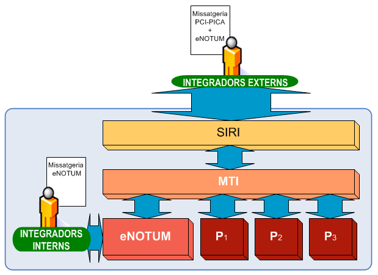
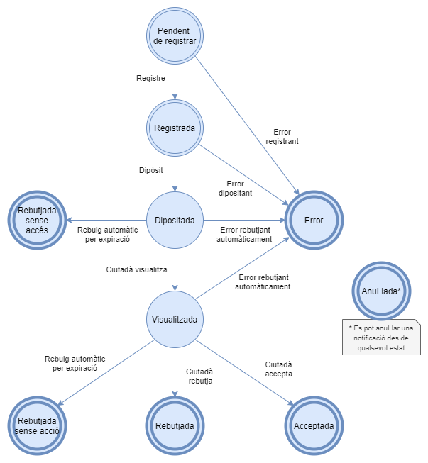
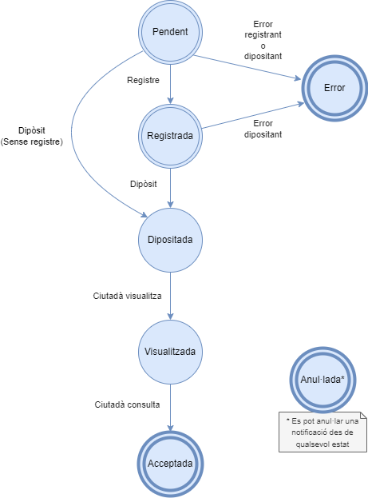
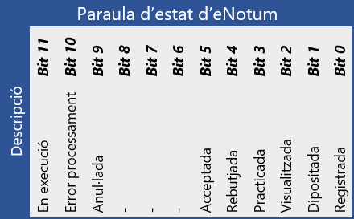

# 1. Introducció

A continuació és descriu el funcionament i les diferents modalitats de consum de la versió de missatgeria _3.2_ d'**eNotum**.

Les versions antigues de missatgeria segueixen sent compatibles i funcionen correctament, tot i que disposen de menys funcionalitats i són susceptibles de ser discontinuades en un futur, si comenceu ara la integració haurieu de fer-ho amb aquesta versió. 

De totes formes podeu consultar les versions antigues de missatgeria i altres documents d'integració a través del [nostre portal de suport a la integració](https://www.aoc.cat/portal-suport/e-notum-base-coneixement/idservei/enotum/#integracio).

## 1.1. Integració PCI

Tal i com es reflecteix a la següent figura, el Backend d'**eNotum** s'integra dins de l'arquitectura de la Plataforma de Col·laboració Interadministrativa (en endavant _PCI_) a mode d'un nou servei accessible a través de la MTI. 

Per tant els integradors que vulguin accedir a l'**eNotum** ho hauran de fer a través de la missatgeria de la _PCI_ utilitzant l'element `<DatosEspecificos>` d'aquesta, per a més informació podeu consultar [el document d'integració de la _PCI_ aqui](https://www.aoc.cat/knowledge-base/plataforma-de-col-laboracio-administrativa-2/idservei/enotum/)



## 1.2. Cicle de vida de les notificacions

Per tal de comprendre com utilitzar les operacions que estan publicades per a la integració amb
**eNotum** és recomanable entendre el cicle de vida de les notificacions. Això ens permetrà saber en
quins estats pot estar la notificació i l'efecte que tindrà l’execució de les operacions sobre l’estat
d’aquesta.

### 1.2.1. Diagrama de cicle de vida

En el següent diagrama d'estats es mostra els diferents estats possibles de la notificació i les
transicions que es poden donar.



### 1.2.2. Descripció dels estats de les notificacions

#### 1.2.2.1. Pendent de processar

L'estat _Pendent de processar_ és l'estat inicial de la notificació. La notificació està en aquest estat just en el moment en que l'integrador ha llançat la operació [_ProcessarTramesa_](#petici%C3%B3---peticioprocessartramesa) i el missatge de resposta de l'operació ha indicat un codi de notificació, o sigui, que no hi ha hagut cap error. En el cas que la petició de processar tramesa hagi produït algun error la notificació no es crea i, per tant, no està en aquest estat.

Si en el missatge de [_ProcessarTramesa_](#petici%C3%B3---peticioprocessartramesa) s'indica un número de registre i una data de registre la notificació passa directament a l'estat _Registrada_ sense passar per l'estat _Pendent de processar_.

Un cop en aquest estat el motor de **eNotum** s'encarrega de registrar la notificació. Si el registre es fa correctament es passa a l'estat _Registrada_. Si el registre falla el motor de **eNotum** programa un nou intent de registre de la notificació al cap d'un cert temps. L'execució pot reintentar-se un nombre determinat de cops. Quan s'exhaureixen els reintents la notificació passa a l'estat _Error_.

El temps d'espera entre intents d'execució així com el nombre de reintents és configurable mitjançant l'aplicació **eNotum** al portal EACATPL. Aquests camps es poden definir per fase del motor d'**eNotum** i per organisme/departament al que pertany la notificació.

#### 1.2.2.2. Registrada

La notificació està en aquest estat quan ja està registrada. S'arriba a aquest estat quan el motor registra una notificació en estat _Pendent de processar_ o quan s'envia un missatge a **eNotum** indicant que la tramesa ja està registrada. O sigui, informant la data de registre i el número de registre dins el node `/Notificacio/DadesRegistre` de la `<Tramesa>`.

Quan estem en aquest estat el motor d'**eNotum** dipositarà la notificació i crearà la evidència de dipòsit. Si aquest procés s'executa sense problemes es passarà a l'estat _Dipositada_. Com en l'estat anterior, si falla el procés es reintentarà un nombre definit de cops i, si finalment cap acaba correctament, la notificació passa a l'estat _Error_.

Igual que en el cas anterior el temps d'espera entre intents d'execució així com el nombre de reintents és configurable mitjançant l'aplicació **eNotum** al portal EACATPL. Aquests camps es poden definir per fase del motor d'**eNotum** i per organisme/departament al que pertany la notificació.

#### 1.2.2.3. Dipositada

La notificació passa a aquest estat quan s'ha efectuat el dipòsit de la notificació. Només s'arriba a aquest estat a partir de l'estat _Registrada_.

En aquest estat s'avisa als destinataris de la notificació que han rebut una notificació i que poden accedir a l'aplicació per tal de poder consultar les seves notificacions. Aquesta informació s'envia per correu electrònic i/o via un SMS al telèfon del destinatari. Ambdós camps s'agafaran dels nodes `/BustiesCorreu/BustiaCorreu` i `/Telefons/Telefon` respectivament del node `<PersonaFisica>` o `<PersonaJuridica>` que ve informat dins el node `/Notificacio/Destinatari` de la `<Tramesa>`. En aquest estat també s'enviaran els correus electrònics i missatges de text a les persones d'avís associades a cada destinatari. Les persones d'avís es diferencien dels destinataris de la notificació en el fet que no poden accedir a la notificació i només s'assabenten a través d'aquest avís de que el destinatari al que estan associades ha rebut una notificació.

L'integrador pot permetre que el ciutadà consulti les notificacions que ha rebut mitjançant l'operació de [_PeticióCerca_](#petici%C3%B3---peticiocerca). Les notificacions retornades per aquesta consulta passaran automàticament a l'estat _Visualitzada_.

Per altra banda, l'integrador pot permetre que els empleats encarregats de crear/gestionar les notificacions puguin consultar l'estat en que es troben les notificacions i diversa informació addicional amb les operacions [_PeticióCerca_](#petici%C3%B3---peticiocerca) i [_PeticióConsulta_](#petici%C3%B3---peticioconsulta). Aquestes al ser executades per a un perfil d'empleat públic no canvien l'estat de la notificació a _Visualitzada_ ja que no és el ciutadà qui ha visualitzat la notificació.

Si el ciutadà no visualitza la notificació aquesta es manté en aquest estat durant el temps de vigència de la notificació indicat al camp `<DiesExpiracio>`. Al expirar aquest període el sistema rebutja automàticament la notificació creant una evidència de rebuig i la notificació passa a l'estat _Rebutjada sense accés_. Com en els casos anteriors, si aquest procés falla es reintenta en funció dels paràmetres de configuració del gestor d’errors i si s'exhaureixen els reintents la notificació passa a l'estat _Error_.

#### 1.2.2.4. Visualitzada

Quan la notificació està en aquest estat el ciutadà pot decidir acceptar o rebutjar la notificació. Per tal que aquesta decisió tingui una validesa legal el ciutadà ha de realitzar una acció diferent en funció del tipus d'accés requerit per a la notificació. 

La practica de la notificació es pot realitzar:

1. Amb signatura del ciutadà:
* Per a notificacions creades amb `<TipusAcces>` _CERT_, s'ha de signar l'acceptació o rebuig amb el certificat digital vinculat a l'identitat de l'usuari. 
* Per a notificacions creades amb `<TipusAcces>` _PPAS_, es poden acceptar o rebutjar de dues formes:
	* Amb una _paraula de pas_ específica demanada per a realitzar la practica d'una notificació.
	* O si es delega l'autenticació del usuari a [_Valid_](https://www.aoc.cat/serveis-aoc/valid/) o una altre plataforma d'un tercer, tant sols indicant el `/Usuari/IdAutenticacio` per identificar aquest procés d'autorització.

En el cas d'accés amb _certificat digital_ Les dades a signar seran proporcionades per **eNotum** mitjançant la operació [_Practicar notificació_](#petici%C3%B3---peticiopracticar) indicant que la modalitat de l'operació a realitzar es _OBTENIR_DADES_.

La signatura del ciutadà ha de ser realitzada amb una eina de signatura que generi signatures digitals avançades en format XML (XAdES) com per exemple el servei del [_signador del Consorci AOC_](https://signador.aoc.cat). Per tal que la signatura sigui acceptada ha de tenir un format _XAdES-T_ o més elevat ja que és a partir d'aquest nivell que es garanteix l'autenticació del signatari, integritat de les dades i validesa de la signatura a llarg termini.

Un cop realitzada la signatura aquesta s'envia a **eNotum** amb l'operació [_Practicar notificació_](#petici%C3%B3---peticiopracticar) indicant que la modalitat de l'operació a realitzar es _SIGNAR_. Llavors, el sistema comprova la validesa de la signatura i, si aquesta és valida, l'estat de la notificació passa a ser _Acceptada_ o _Rebutjada_ en funció del que s'hagi especificat en l'element `<Decisio>` de l'operació de practicar.

2. Sense signatura per part del ciutadà

Utilitzant l’operació Practicar notificació indicant que la modalitat de l’operació a realitzar es SIGNAR. L’estat de la notificació passa a ser Acceptada o Rebutjada en funció del que s’hagi especificat en l’element <Decisio> de l’operació de practicar.

Es pot donar el cas que el ciutadà tot i que visualitzi la notificació no l'accepti ni la rebutgi amb cap dels dos mecanismes. En aquest cas la notificació es manté en l'estat _Visualitzada_ fins la finalització del temps de vigència. Exhaurit aquest període el sistema rebutja la notificació i aquesta passa a l'estat _Rebutjada sense acció_. Com en els casos anteriors, si aquest procés falla es reintenta en funció dels paràmetres de configuració del gestor d’errors i si s'exhaureixen els reintents la notificació passa a l'estat _Error_.

**Comentar també que la modalitat 1 és manté per compatibilitat amb clients ja integrats però que és susceptible de desapareixer en un futur, per tant totes les noves integracions que vulguin realitzar l'acceptació ho hauran de fer amb el segon mecanisme**

#### 1.2.2.5. Acceptada / Rebutjada / Rebutjada sense acció / Rebutjada sense accés

Un cop la notificació està en qualsevol d'aquests quatre estats - que es consideren tots estats finals ja que un cop la notificaciño asoleix un d'aquests estats el mateix ja no es modificarà - el ciutadà pot consultar les dades de la notificació. L'integrador pot recuperar aquestes dades amb la operació [_PeticióConsulta_](#petici%C3%B3---peticioconsulta). Aquesta operació només pot ser consultada amb el `<Rol>` _CIUTADA_ quan la notificació està en els estats _Acceptada_, _Rebutjada_, _Rebutjada sense acció_ o _Rebutjada sense accés_. 

Un cop es pot fer la consulta per ciutada perquè la notificació es troba en un d'aquests estats, la informació retornada serà la mateixa, és a dir, la informació sobre la notificació retornada no serà més o menys restrictiva en funció de l'estat. Remarquem aquest fet ja que en versions anteriors d'**eNotum** les dades recuperades per la consulta en cas de que l'estat de la notificació fos _Acceptada_ eren més que per qualsevol dels altres tres estats de _Rebutjada_.

#### 1.2.2.9. Error

Arriben a aquest estat les notificacions que han estat involucrades en l'execució d'algun procés del sistema que ha produït repetidament errors.

En aquest estat les notificacions no poden ser acceptades ni rebutjades ni pel ciutadà ni pel sistema.

Per l'operació [_PeticioCerca_](#petici%C3%B3---peticiocerca) de ciutadà no es mostren les notificacions en aquest estat. En canvi per aquesta mateixa operació amb `<Rol>` _EMPLEAT_ sí es mostren aquestes notificacions per tal que l'empleat sigui conscient de que la notificació està en error.

Quan una notificació està en aquest estat l'administrador del sistema pot rellançar manualment el procés on s'ha produït l'error.

#### 1.2.2.10. Anul·lada

Un cop en aquest estat la notificació no pot ser canviada d'estat a un estat anterior.

La notificació arriba a aquest estat quan l'ens que ha generat la notificació ens demana que aquesta s'anul·li. Hi ha diversos motius que poden motivar l'anul·lació d'una notificació: que aquesta contingui dades errònies, que l'expedient que la motiva ha estat declarat nul, etc.

L'anul·lació d'una notificació s'ha de demanar a través del formulari de Suport Tècnic i s'ha de proporcionar l'identificador de la notificació a anul·lar.

## 1.3. Cicle de vida de les comunicacions

En el cas de les comunicacions el cicle de vida és molt similar al de les notificacions excepte en el fet de que no es necessita validesa legal de que el destinatari ha practicat la notificació, i que a més a més les comunicacions no tenen un temps determinat de vigència i per tant no expiren, així doncs el cicle de vida es simplifica i queda de la següent manera:



### 1.3.1. Descripció dels estats de les comunicacions

Com es pot observar en el diagrama anterior hi ha poques diferències en els estats de les comunicacions respecte els de les notificacions. Aquestes comparteixen els estats inicials fins que el ciutadà visualitza la notificació. Un cop en aquest estat, la diferencia radica en l'absència de l'estat _Rebutjada_ i en la manera de fer la transició cap a l'estat _Acceptada_ des de l'estat _Visualitzada_. També es pot observar que no hi ha l'estat d'expiració al final de la vida de la comunicació donat que no tenen data de caducitat.

#### 1.3.1.1. Visualitzada

Quan la comunicació està en aquest estat el ciutadà pot directament consultar el contingut de la comunicació. A diferència de la notificació, no es necessita validesa legal de l'acceptació o rebuig d'aquesta i per tant no cal que el ciutadà signi digitalment la seva decisió.
Un cop consultada la comunicació amb l'operació [_Consultar_](#petici%C3%B3---peticioconsulta) una notificació aquesta realitzarà automàticament la transició a l’estat _Acceptada_.

#### 1.3.1.2. Altes estats

La resta d'estats són els mateixos respecte les notificacions i s'han de fer servir les mateixes operacions que amb aquestes.
Per crear-les s'ha d’informar el camp _TipusObjecte_ en el node `<Notificacio>` de l'operació	[_ProcessarTramesa_](#petici%C3%B3---peticioprocessartramesa) amb el valor _COMUNICACIO_.

## 1.4. Codificació dels estats de les notificacions a eNOTUM

La codificació dels estats de les notificacions a **eNotum** es fa mitjançant una paraula d'estats que permet tenir constància de l'estat actual així com traça dels diferents estats pels que ha passat una notificació.



# 2. Missatgeria

Com es comenta en [el punt 1 d'aquest document](#11-integració-pci) **eNotum** funciona com a servei dins de la _PCI_, serà per tant necessari treballar amb la missatgeria de la _PCI_, encapsulant la missatgeria específica de **eNotum** dins d'aquesta.

Específicament per a fer ús del servei d'**eNotum** dins de la missatgeria de la _PCI_ és necessari informar els següents elements del missatge _XML_:

* `//Peticion/Atributos/CodigoProducto` el _string_ ENOTUM
* `//Peticion/Atributos/CodigoCertificado` el _string_ ENOTUM
* `//Peticion/Solicitudes/SolicitudTransmision/DatosGenericos/Transmision/CodigoCertificado` el _string_ ENOTUM
* `//Peticion/Solicitudes/SolicitudTransmision/DatosEspecíficos` Petició _XML_ específica d'**eNotum**

Pel que fa a la resta del missatge _PCI_, cal que aquest compleixi amb els requisits definits [al document d'integració de la PCI aqui](https://www.aoc.cat/knowledge-base/plataforma-de-col-laboracio-administrativa-2/idservei/enotum/)

# 3. Missatgeria específica eNotum versió 3.2

A continuació es detallaran els elements comuns a totes les modalitats de consum:

## Petició

Totes les modalitats de consum _WS_ que ofereix **eNotum** extenen el següent esquema de petició:

```xml
<xs:complexType name="PeticioType" abstract="true">
	<xs:sequence>
		<xs:element name="Usuari" type="UsuariType"/>
		<xs:element name="Emissor" type="EmissorType"/>
	</xs:sequence>
</xs:complexType>
```

Per tant com és pot veure totes les peticions, a banda dels elements específics de cada modalitat de consum, tenen els següents elements:

* `//PeticioType/Usuari` Dades de l'usuari, es descriuen a continuació.
* `//PeticioType/Emissor` Dades de l'emissor. es descriuen a continuació.

[Aquí podeu veure la definició completa del esquema _Peticio.xsd_](https://github.com/ConsorciAOC/eNotum/blob/master/missatgeria/v3.2_xsds/Peticio.xsd)

### Usuari

La definició de l'element _UsuariType_, [la podeu trobar a _Usuari.xsd_](https://github.com/ConsorciAOC/eNotum/blob/master/missatgeria/v3.2_xsds/Usuari.xsd)

El tipus usuari està format pels següents elements:

#### Rol
```xml
<xs:element name="Rol">
	<xs:simpleType>
		<xs:restriction base="xs:string">
			<xs:enumeration value="EMPLEAT"/>
			<xs:enumeration value="CIUTADA"/>
		</xs:restriction>
	</xs:simpleType>
</xs:element>
```
Aquest camp és obligatori i contindrà la etiqueta del rol autoritzat de l'usuari que realitza la operació. Hi ha dos rols definits que es descriuen a continuació:
* *EMPLEAT* : L'empleat públic és el rol d'usuari autoritzat per a la creació de notificacions. A banda permet fer les operacions de modalitats de consum de Cerca, Consulta etc. A excepció de les operacions de Practicar i demanar Paraula de pas.
* *CIUTADA* : El ciutadà és el rol d'usuari autoritzat a cercar i acceptar notificacions vinculades al propi usuari.

#### Perfil
```xml
<xs:element name="Perfil" minOccurs="0">
	<xs:simpleType>
		<xs:restriction base="xs:string">
			<xs:enumeration value="PERSONA_JURIDICA"/>
			<xs:enumeration value="EMPRESA"/>
			<xs:enumeration value="PERSONA_FISICA"/>
		</xs:restriction>
	</xs:simpleType>
</xs:element>
```
Opcionalment en cas de `<Rol>` _CIUTADA_ i de que l'usuari presenti el NIF de persona física i el d'empresa, ja sigui al generar la paraula de pas, en el certificat, o indicant-ho en els camps amb autenticació delegada, es podrà indicar un perfil que afectarà directament a les cerques de notificacions. Els possibles valors que pot pendre aquest camp:
* *PERSONA_FISICA* : Cerca les notificacions per a la persona física.
* *EMPRESA* : Cerca les notificacions per a l'empresa.
* *PERSONA_JURIDICA* : Cerca les notificacions com a persona jurídica.

### Autenticació usuari

En cas de `<Rol>` amb valor CIUTADA, s'haurà d'informar només un dels següents blocs en funció del mecanisme d'autenticació emprat per l'usuari.

#### Certificat
```xml
<xs:element name="CertificatCiutada" type="xs:base64Binary"/>
```
En cas d'autenticació amb certificat aquest camp contindrà el certificat del ciutadà que realitza l'operació.

#### Paraula de pas
```xml
<xs:sequence>
	<xs:element name="IdParaulaPas" type="xs:string"/>
	<xs:element name="ParaulaPas" type="xs:string"/>
</xs:sequence>
```
Identificador i paraula de pas respectivament, emprades com a mecanisme d'autenticació del ciutadà que realitza l'operació.

#### Mecanisme d'autenticació extern (Valid o altres)
```xml
<xs:sequence>
	<xs:choice minOccurs="0">
		<xs:element name="NIF" type="NIF"/>
		<xs:element name="PASSAPORT" type="NoEmptyString"/>
	</xs:choice>
	<xs:element name="CIF" type="CIF" minOccurs="0"/>
	<xs:element name="IdAutenticacio" type="xs:string"/>
	<xs:element name="NivellAutenticacio">
		<xs:simpleType>
			<xs:restriction base="xs:string">
				<xs:enumeration value="ALT"/>
				<xs:enumeration value="SUBSTANCIAL"/>
				<xs:enumeration value="BAIX"/>
			</xs:restriction>
		</xs:simpleType>
	</xs:element>
</xs:sequence>
```
En aquest cas és l'aplicació integrada la que assumeix la responsabilitat d'autenticar el ciutadà utilizant p.e el servei de Valid o qualsevol altre servei extern. Els camps a informar són:

* `/Usuari/NIF` NIF de l'usuari.
* `/Usuari/PASSAPORT` Passaport de l'usuari.
* `/Usuari/CIF` CIF del usuari
* `/Usuari/IdAutenticacio` Identificador intern de l'aplicació integrada per al procés d'autenticació.
* `/Usuari/NivellAutenticacio` Nivell eIDAS del mecanisme d'autenticació emprat pel ciutadà. Els valors possibles son ALT, SUBSTANCIAL i BAIX.

#### NivellAutenticacio
```xml
<xs:element name="Perfil" minOccurs="0">
	<xs:simpleType>
		<xs:restriction base="xs:string">
			<xs:enumeration value="PERSONA_JURIDICA"/>
			<xs:enumeration value="EMPRESA"/>
			<xs:enumeration value="PERSONA_FISICA"/>
		</xs:restriction>
	</xs:simpleType>
</xs:element>
```
Opcionalment en cas de `<Rol>` _CIUTADA_ i de que l'usuari presenti el NIF de persona física i el d'empresa, ja sigui al generar la paraula de pas, en el certificat, o indicant-ho en els camps amb autenticació delegada, es podrà indicar un perfil que afectarà directament a les cerques de notificacions. Els possibles valors que pot pendre aquest camp:
* *PERSONA_FISICA* : Cerca les notificacions per a la persona física.
* *EMPRESA* : Cerca les notificacions per a l'empresa.
* *PERSONA_JURIDICA* : Cerca les notificacions com a persona jurídica.

## Emissor

La definició de l'element _EmissorType_, [la podeu trobar a _Emissor.xsd_](https://github.com/ConsorciAOC/eNotum/blob/master/missatgeria/v3.2_xsds/Emissor.xsd)

Els elements que conté el tipus Emissor són els següents:

### CodiOrganisme
```xml
<xs:element name="CodiOrganisme" type="xs:string"/>
```
Codi ENS de l'organisme emissor de la notificació

### CodiDepartament
```xml
<xs:element name="CodiDepartament" type="xs:string"/>
```
Codi ENS del departament emissor de la notificació.

### CodiBO
```xml
<xs:element name="CodiBO" type="xs:string" minOccurs="0"/>
```
Codi del Back Office de l'emissor

## Modalitats de consum del _WS_

A continuació és detallaran els elements específics per a les diferents peticions de les modalitats de consum que ofereix el _WS_ d'**eNotum**.

## Petició - PeticioProcessarTramesa

[Aquí podeu veure la definició completa del esquema _ProcessarTramesa.xsd_](https://github.com/ConsorciAOC/eNotum/blob/master/missatgeria/v3.2_xsds/PeticioProcessarTramesa.xsd)

Aquesta petició permet la creació de notificacions dins del sistema. La definició d'aquesta petició exten la _peticioType_ afegint l'element `<Tramesa>` que es descriu a continuació.

## Tramesa
```xml
<xs:element name="Tramesa">
	<xs:complexType>
		<xs:sequence>
			<xs:element name="DadesAvisos" minOccurs="0"/>
			<xs:element name="DadesOfici"/>
			<xs:element name="Documents" type="DocumentsType"/>
			<xs:element name="Notificacio" type="NotificacioType" maxOccurs="unbounded"/>
		</xs:sequence>
	</xs:complexType>
</xs:element>

```
La tramesa és l'estructura que permet la creació de notificacions i/o comunicacions i permet agrupar-les. Està formada per els elements que es descriuen a continuació:

### DadesAvisos
```xml
<xs:element name="DadesAvisos" minOccurs="0">
	<xs:complexType>
		<xs:all>
			<xs:element name="Plantilla" type="xs:string" minOccurs="0"/>
			<xs:element name="Email" minOccurs="0"/>
			<xs:element name="SMS" minOccurs="0"/>
			<xs:element name="DiesAvisos" type="DiesAvisosType" minOccurs="0"/>
			<xs:element name="URLs" minOccurs="0"/>
		</xs:all>
	</xs:complexType>
</xs:element>
```	
L'element `<DadesAvisos>` és opcional ja que **eNotum** disposa d'un comportament per defecte per als valors especificats en aquest element, en cas de que vinguin informats al missatge, aquests tindran prioritat per a ser utilitzats en comptes dels que hi hagi establers per defecte. `<DadesAvisos>` està format pels següents elements:
	
##### Plantilla
```xml
<xs:element name="Plantilla" type="xs:string" minOccurs="0"/>
```
Identificador de plantilles de correu i SMS d'avis a utilitzar per a aquesta notificació. Es condició que a **eNotum** existeixi aquest identificador amb les plantilles creades.

#### Email
```xml
<xs:element name="Email" minOccurs="0">
	<xs:complexType>
		<xs:all>
			<xs:element name="Emissor" type="xs:string" minOccurs="0"/>
			<xs:element name="Assumpte" minOccurs="0">
				<xs:simpleType>
					<xs:restriction base="xs:string">
						<xs:maxLength value="100"/>
					</xs:restriction>
				</xs:simpleType>
			</xs:element>
			<xs:element name="Missatge" type="xs:string" minOccurs="0"/>
		</xs:all>
	</xs:complexType>
</xs:element>
```
Aquest element permet canviar la configuració per defecte que rebran els destinataris de la notificació via correu electrònic. Concretament permet indicar els següents camps:

* `/Email/Emissor`
Aquest camp conté l'adreça de correu electrònic que s'utilitzarà com a remitent pels avisos als destinataris de les notificacions.
**eNotum** concatenarà el prefix *NORESPONEU_* al valor indicat per indicar al destinatari que no s'espera cap tipus de resposta de la seva part.
* `/Email/Assumpte`
Assumpte que s'utilitzarà per a l'avís del correu electrònic.
* `/Email/Missatge`
Cos del missatge del avis per correu electrònic. El missatge ha de ser en format de text pla. Aquest missatge s'embolcallarà dins de les plantilles definides al sistema, concretament a les plantilles s'espeficarà l'element `@@EMAIL_BODY@@` ([per més informació podeu veure documentació plantilles](https://www.aoc.cat/knowledge-base/document-dintegracio-e-notum-generacio-de-plantilles-de-correu-electronic/idservei/enotum/)) que serà substituit per aquest missatge en cas d'existir.

#### SMS
```xml
<xs:element name="SMS" minOccurs="0">
	<xs:complexType>
		<xs:all>
			<xs:element name="Missatge" minOccurs="0">
				<xs:simpleType>
					<xs:restriction base="xs:string">
						<xs:maxLength value="512"/>
					</xs:restriction>
				</xs:simpleType>
			</xs:element>
		</xs:all>
	</xs:complexType>
</xs:element>
```
* `/SMS/Missatge`
Aquest element conté un únic camp amb el cos del missatge que s'enviarà com a avis de la notificació.

#### DiesAvisos
```xml
<xs:element name="DiesAvisos" minOccurs="0"/>
	<xs:complexType>
		<xs:sequence>
			<xs:element name="DiaAvis" type="xs:positiveInteger" minOccurs="0" maxOccurs="unbounded"/>
		</xs:sequence>
	</xs:complexType>
</element>
```
* `/DiesAvisos/DiaAvis`
Llista d'elements d'aquest tipus amb els número de dies a comptar a partir del enviament per el qual s'enviaran recordatoris al/s destinatari/s de la notificació mentre aquesta no es trobi en un estat final.

#### URLs
```xml
<xs:element name="URLs" minOccurs="0">
	<xs:complexType>
		<xs:all>
			<xs:element name="AccesNotificacio" type="xs:string" minOccurs="0"/>
			<xs:element name="AccesLlistat" type="xs:string" minOccurs="0"/>
		</xs:all>
	</xs:complexType>
</xs:element>
```
Aquest element igual que la resta de tags de `<DadesAvisos>` són opcionals, ja que **eNotum** disposa de configuració per entitat i per defecte per a aquests camps, només s'han d'usar en cas de voler modificar aquests valors per notificacions concretes.
* `/URLs/AccesNotificacio` Permet informar l'enllaç d'accés directe que desprès es podrà utilitzar des de les plantilles d'avisos de notificacions.
* `/URLs/AccesLlistat` Permet informar l'enllaç d'accés genèric al llistat de notificacions per a l'organisme i departament de la notificació en concret, que desprès igual que en el cas anterior es podrà utilitzar des de les plantilles d'avisos de notificacions.

### DadesOfici

```xml
<xs:element name="DadesOfici">
	<xs:complexType>
		<xs:sequence>
			<xs:choice>
				<xs:element name="CosNotificacio">
					<xs:simpleType>
						<xs:restriction base="xs:string">
							<xs:maxLength value="4000"/>
						</xs:restriction>
					</xs:simpleType>
				</xs:element>
				<xs:element name="IdCosNotificacio" type="xs:integer"/>
			</xs:choice>
			<xs:choice>
				<xs:element name="PeuRecurs">
					<xs:simpleType>
						<xs:restriction base="xs:string">
							<xs:maxLength value="4000"/>
						</xs:restriction>
					</xs:simpleType>
				</xs:element>
				<xs:element name="IdPeuRecurs" type="xs:integer"/>
			</xs:choice>
			<xs:element name="OficinaRegistre" type="xs:string" minOccurs="0"/>
			<xs:element name="UnitatOrganitzativa" type="xs:string" minOccurs="0"/>
		</xs:sequence>
	</xs:complexType>
</xs:element>
```
Aquest element permet específicar les dades d'ofici vinculades a la notificació:

* `/DadesOfici/CosNotificacio`
Cos de la notificació
* `/DadesOfici/IdCosNotificacio` _Deprecat_
* `/DadesOfici/PeuRecurs`
Peu de recurs.
* `/DadesOfici/IdPeuRecurs` _Deprecat_
* `/DadesOfici/OficinaRegistre`
Codi d'oficina de registre a usar per registrar les notificacions. Aquest paràmetre no és obligatori ja que per defecte el sistema usarà la oficina de registre parametritzada per a l'entitat emissora de les notificacions (organisme\departament). Així, només cal informar aquest paràmetre en el cas que s'hagués de realitzar el registre contra una oficina diferent de la habitual.
* `/DadesOfici/UnitatOrganitzativa`
Codi d'unitat organitzativa a usar per registrar les notificacions. Aquest paràmetre no és obligatori ja que per defecte el sistema usarà la unitat organitzativa (codi organisme) parametritzada per a l'entitat emissora de les notificacions (organisme\departament). Així, només cal informar aquest paràmetre en el cas que s'hagués de realitzar el registre contra una oficina diferent de la habitual.

### Documents

`<Documents>` és una seqüencia de entre 1 i 5 elements de tipus `DocumentType`. Només un document de `<Tipus>Resolució</Tipus>` és obligatori, i opcionalment pot anar acompanyat de fins a 4 documents de `<Tipus>Annex</Tipus>`. La definició de `DocumentType` es pot veure a continuació:
```xml
<xs:complexType name="DocumentsType">
	<xs:sequence>
		<xs:element name="Document" maxOccurs="5">
			<xs:complexType>
				<xs:sequence>
					<xs:element name="Nom" type="xs:string"/>
					<xs:element name="SHA1Digest" type="xs:base64Binary" minOccurs="0"/>
					<xs:choice>
						<xs:element name="Dades" type="xs:base64Binary"/>
						<xs:element name="URLDescarrega" type="xs:anyURI"/>
						<xs:element name="Ruta" type="xs:string"/>
						<xs:element name="IdFicheroPCI" type="xs:string"/>
					</xs:choice>
					<xs:element name="Tipus">
						<xs:simpleType>
							<xs:restriction base="xs:string">
								<xs:enumeration value="Resolució"/>
								<xs:enumeration value="Annex"/>
							</xs:restriction>
						</xs:simpleType>
					</xs:element>
				</xs:sequence>
			</xs:complexType>
		</xs:element>
	</xs:sequence>
</xs:complexType>
```
* `/Documents/Document/Nom`
Nom del fitxer del document, amb extensió. E.g: _holaRepublica.pdf_
* `/Documents/Document/SHA1Digest`
Resum críptografic en [_SHA1_](https://en.wikipedia.org/wiki/SHA-1) del contingut del document com a string codificat en [_base64_](https://en.wikipedia.org/wiki/Base64).
* `/Documents/Document/URLDescarrega` >> :warning: ENCARA NO DISPONIBLE
Permet informar una URL on l'ens té penjada la resolució. Aquesta URL no hauria de ser pública i tenir accés securitzat per IP (TODO: parlar amb el CAOC per generar connectivitats per a la descàrrega + text formal per l'organisme en cas d'error)
* `/Documents/Document/Dades`
En cas que és vulgui incrustar el document dins del missatge en _base64_. S'ha de tenir en compte que per a documents on la mida superi **1MB**, no recomanem aquest mecanisme, donat que la _PCI_ té una restricció on el missatge _XML_ de la petició complet no pot superar els **2MB**. 
* `/Documents/Document/Ruta`
Ruta del document pujat al FTP. Aquesta ruta és la relativa dins el directori arrel de l'usuari que es connecta al FTP. Només disponible per als ens que s'han donat d'alta amb la integració per aquesta via.
* `/Documents/Document/IdFicheroPCI`
Permet adjuntar un document mitjançant _MTOM_. Aquest identificador s'ha de correspondre amb el `<Id>` del `<Fichero>` de les `<DatosGenericos>` de la missatgeria de la _PCI_ per a que **eNotum** pugui recuperar correctament el document. En aquest cas el document s'adjunta en la petició _XML_ i s'ha d'específicar mitjançant el tag `<Contendio>` del `<Fichero>` en fromat _MTOM_ dins de la missatgeria de la _PCI_. Per a més informació podeu consultar [la guia d'integració de la _PCI_](https://www.aoc.cat/knowledge-base/plataforma-de-col-laboracio-administrativa-2/)
* `/Documents/Document/Tipus`
Indica el tipus de documents adjuntat. Els possibles valors són:
	* *Resolució* : És obligatori adjuntar un document d'aquest tipus per tramesa.
	* *Annex* : Opcionalment és poden adjuntar fins a quatre documents d'aquest tipus.

### Notificació

```xml
<xs:complexType name="NotificacioType">
	<xs:all>
		<xs:element name="Titol">
			<xs:simpleType>
				<xs:restriction base="xs:string">
					<xs:maxLength value="100"/>
				</xs:restriction>
			</xs:simpleType>
		</xs:element>
		<xs:element name="Referencia">
			<xs:simpleType>
				<xs:restriction base="xs:string">
					<xs:maxLength value="250"/>
				</xs:restriction>
			</xs:simpleType>
		</xs:element>
		<xs:element name="DadesRegistre" minOccurs="0">
			<xs:complexType>
				<xs:sequence>
					<xs:element name="NumeroRegistre" type="NoEmptyString"/>
					<xs:element name="DataRegistre" type="xs:dateTime"/>
				</xs:sequence>
			</xs:complexType>
		</xs:element>
		<xs:element name="SenseRegistre" minOccurs="0">
			<xs:simpleType>
				<xs:restriction base="xs:string">
					<xs:maxLength value="0"/>
				</xs:restriction>
			</xs:simpleType>
		</xs:element>
		<xs:element name="TipusObjecte" type="TipusObjecteType"/>
		<xs:element name="TipusAcces" type="TipusAccesType" minOccurs="0"/>
		<xs:element name="NivellCertificat" type="xs:string" minOccurs="0"/>
		<xs:element name="DiesExpiracio" type="xs:positiveInteger" minOccurs="0"/>
		<xs:element name="Destinataris" type="DestinatarisType"/>
		<xs:element name="Etiquetes" type="EtiquetesType" minOccurs="0"/>
		<xs:element name="AmbitObjecte" type="xs:string" minOccurs="0"/>
		<xs:element name="Idioma" type="Idioma" minOccurs="0"/>
		<xs:element name="IdNotificacioEmissor" type="xs:string" minOccurs="0"/>
		<xs:element name="Canal" type="CanalType" minOccurs="0"/>
		<xs:element name="Expedient" minOccurs="0">
			<xs:simpleType>
				<xs:restriction base="xs:string">
					<xs:maxLength value="50"/>
				</xs:restriction>
			</xs:simpleType>
		</xs:element>
		<xs:element name="Tramit" minOccurs="0">
			<xs:simpleType>
				<xs:restriction base="xs:string">
					<xs:maxLength value="50"/>
				</xs:restriction>
			</xs:simpleType>
		</xs:element>
		<xs:element name="NumeroCas" minOccurs="0">
			<xs:simpleType>
				<xs:restriction base="xs:string">
					<xs:maxLength value="50"/>
				</xs:restriction>
			</xs:simpleType>
		</xs:element>
	</xs:all>
</xs:complexType>	
```

* `/Notificacio/Titol`
Títol de la notificació, màxim 100 caràcters
* `/Notificacio/Referencia`
Cadena d'identificació de la notificació. Tot i que no cal que aquesta sigui única respecte a les demés notificacions existents al sistema, es recomanable utilitzar seqüències úniques de caràcters per facilitar la localització posterior a les cerques.
* `/Notificacio/DadesRegistre/NumeroRegistre`
Número de registre (opcional) pel cas de notificacions que vinguin pre-registrades. Si el paràmetre ve informat, eNOTUM no realitzarà el registre de la notificació corresponent i la dipositarà usant com a dades d'assentament les proporcionades a la petició.
* `/Notificacio/DadesRegistre/DataRegistre`
Data de l'assentament (opcional) pel cas de notificacions que vinguin pre-registrades. Si el paràmetre ve informat, junt amb el de número de registre, eNOTUM no realitzarà el registre de la notificació corresponent i la dipositarà usant com a dades d'assentament les proporcionades a la petició.
* `/Notificacio/SenseRegistre`
De forma també opcional, només en el cas d'estar creant una COMUNICACIO, mitjançant aquest element es pot indicar que no es vol crear registre de sortida per a aquest enviament concret.
* `/Notificacio/TipusObjecte`
Indica si es tracta d'una notificació o d'una comunicació. Els valors possibles per aquest paràmetre son:
	* *NOTIFICACIO* : Indica que l'enviament serà de tipus notificació.
	* *COMUNICACIO* : Indica que l'enviament serà de tipus comunicació.
* `/Notificacio/TipusAcces`
Indica el nivell d'autenticació requerit al ciutadà per tal de poder accedir a la notificació. Els possibles valors són:
	* *BAIX*
	* *SUBSTANCIAL*
	* *ALT*
	* *PPAS*: _Suportat temporalment per compatibilitat amb versions anteriors. S'eliminarà en properes versions._
	* *CERT*: _Suportat temporalment per compatibilitat amb versions anteriors. S'eliminarà en properes versions._
* `/Notificacio/NivellCertificat`
En cas d'accés requerit amb certificat, és pot ajustar el nivell d'aquest per l'accés a la notificació.
* `/Notificacio/DiesExpiracio`
Dies a partir dels quals la notificació exiprarà, a contar a partir de la data de dipòsit. El màxim valor establert per a aquest camp és de _500_ dies.	
* `/Notificacio/Destinataris`
Dades dels destinataris de la notificació.
* `/Notificacio/Etiquetes`
Etiquetes per a agrupar la notificació.
* `/Notificacio/AmbitObjecte` _Deprecat_
* `/Notificacio/Idioma`
Idioma de la notificació. Els possibles valors són:
	* *ca* : Indica que l'idioma de la notificació és català.
	* *es* : Indica que l'idioma de la notificació és castellà.
	* *oc* : Indica que l'idioma de la notificació és aranés.
	* *en* : Indica que l'idioma de la notificació és anglés.
* `/Notificacio/IdNotificacioEmissor`
Identificador de la notificació propi del emissor. Serveix en les peticions de lots asíncrones per a que el emissor pugui associar el seu identificador intern amb l'identificador de notificació retornat per eNotum.
* `/Notificacio/Canal`
Canal d'enviament per al que s'envia originalment la notificació. Els possibles valors són:
	* *DIGITAL* : La notificació s'envia únicament per via telemàtica.
	* *PAPER* : La notificació s'envia per via telemàtica i pot ser enviada en format paper en cas de que no sigui accedida per via telemàtica.
* `/Notificacio/Expedient`
Opcionalment es pot indicar l'expedient amb el que està relacionada la notificació. 50 caràcters.
* `/Notificacio/Tramit`
Opcionalment es pot indicar el tràmit amb el que està relacionada la notificació. 50 caràcters.
* `/Notificacio/NumeroCas`
Opcionalment es pot indicar el numero de cas amb el que està relacionada la notificació. 50 caràcters.

### Destinataris

```xml
<xs:complexType name="DestinatarisType">
	<xs:sequence>
		<xs:element name="Destinatari" maxOccurs="100">
			<xs:complexType>
				<xs:sequence>
					<xs:choice>
						<xs:element name="PersonaFisica" type="PersonaFisicaType"/>
						<xs:element name="PersonaJuridica" type="PersonaJuridicaType"/>
					</xs:choice>
					<xs:element name="Idioma" type="Idioma" minOccurs="0"/>
			<xs:element name="Obligat" type="xs:boolean" minOccurs="0"/>
				</xs:sequence>
			</xs:complexType>
		</xs:element>
	</xs:sequence>
</xs:complexType>
```

Aquest element defineix els destinataris de les notificacions de la tramesa.

* `/Destinatari/PersonaFisica`
Dades del destinatari en cas de que es tracti d'una persona física.
* `/Destinatari/PersonaJuridica`
Dades del destinatari en cas de que es tracti d'una persona jurídica.
* `/Destinatari/Idioma`
Opcionalment permet indicar l'idioma específic de l'usuari entre del següents valors:
	* *ca* : Indica que l'idioma de la notificació és català.
	* *es* : Indica que l'idioma de la notificació és castellà.
	* *oc* : Indica que l'idioma de la notificació és aranés.
	* *en* : Indica que l'idioma de la notificació és anglés.
* `/Destinatari/Obligat`
Camp opcional, que permet indicar en cas de notificacions en `<Canal>Paper</Canal>`, si el destinatari en cas de ser persona física, està obligat a relacionar-se amb l'administració per via electrònica.

### PersonaFisica

```xml
<xs:complexType name="PersonaType" abstract="true">
	<xs:sequence>
		<xs:element name="BustiesCorreu" type="BustiesCorreuType" minOccurs="0"/>
		<xs:element name="Telefons" type="TelefonsType" minOccurs="0"/>
		<xs:element name="PersonesAvis" type="PersonesAvis" minOccurs="0"/>
	</xs:sequence>
</xs:complexType>

<xs:complexType name="PersonaFisicaType">
	<xs:complexContent>
		<xs:extension base="PersonaType">
			<xs:sequence>
				<xs:element name="DocumentIdentificatiu" type="DocumentPersonaFisicaType"/>
				<xs:element name="Nom" type="NoEmptyString"/>
				<xs:element name="PrimerCognom" type="NoEmptyString"/>
				<xs:element name="SegonCognom" type="xs:string" minOccurs="0"/>
			</xs:sequence>
		</xs:extension>
	</xs:complexContent>
</xs:complexType>
```
Per a l'element `PersonaFisica` si el `/Notificacio/Canal` és DIGITAL, serà obligatori informar una bústia de correu o un telèfon, si per el contrari el `/Notificacio/Canal` és PAPER no es realitzarà aquesta comprovació i aquests camps seran opcionals.

* `/PersonaFisica/BustiesCorreu/BustiaCorreu`
Adreça de correu electrònic del destinatari.
* `/PersonaFisica/Telefons/Telefon`
Telèfon mòbil del destinatari. A nivell de missatgeria no existeix restricció al respecte del camp, però al servidor es comprova i normalitza el format del telèfon.
* `/PersonaFisica/PersonesAvis`
Dades de les persones que rebran l'avís de la notificació però que no podràn accedir a la mateixa.
* `/PersonaFisica/DocumentIdentificatiu/NIF`
NIF o NIE del destinatari de la notificació. A nivell de missatgeria es valida la següent expressió regular `[XYZ]?[0-9]{7,8}[A-Z]`. A nivell de servidor també es comprova el [codi de control](https://es.wikipedia.org/wiki/N%C3%BAmero_de_identificaci%C3%B3n_fiscal#C%C3%B3digo_de_control_para_n%C3%BAmeros_de_DNI_o_NIE) del mateix.
* `/PersonaFisica/DocumentIdentificatiu/PASSPORT`
Si la notificació és per a un destinatari estranger en comptes del NIF o NIE es pot informar el passaport. L'única restricció d’aquest camp és que en cas de venir informat, no pot ser buit.
* `/PersonaFisica/Nom`
Nom del destinatari.
* `/PersonaFisica/PrimerCognom`
Primer cognom del destinatri.
* `/PersonaFisica/SegonCognom`
Segon cognom del destinatari.

### PersonaJuridica
```xml
<xs:complexType name="PersonaType" abstract="true">
	<xs:sequence>
		<xs:element name="BustiesCorreu" type="BustiesCorreuType" minOccurs="0"/>
		<xs:element name="Telefons" type="TelefonsType" minOccurs="0"/>
		<xs:element name="PersonesAvis" type="PersonesAvis" minOccurs="0"/>
	</xs:sequence>
</xs:complexType>

<xs:complexType name="PersonaJuridicaType">
	<xs:complexContent>
		<xs:extension base="PersonaType">
			<xs:sequence>
				<xs:element name="DocumentIdentificatiu" type="DocumentPersonaJuridicaType"/>
				<xs:element name="RaoSocial" type="NoEmptyString" nillable="false" />
				<xs:element name="PersonaVinculada" type="PersonaVinculadaType" minOccurs="0"/>
			</xs:sequence>
		</xs:extension>
	</xs:complexContent>
</xs:complexType>
```
Per a l'element `PersonaJuridica` informar la bústia de correu o el telèfon serà opcional.

* `/PersonaJuridica/BustiesCorreu/BustiaCorreu`
Aquests camp, té la mateixa definició que l'equivalent de `PersonaFisica`
* `/PersonaJuridica/Telefons/Telefon`
Aquests camp, té la mateixa definició que l'equivalent de `PersonaFisica`
* `/PersonaJuridica/PersonesAvis`
Aquests camp, té la mateixa definició que l'equivalent de `PersonaFisica`
* `/PersonaJuridica/DocumentIdentificatiu/CIF`
NIF de l'empresa destinataria de la notificació. A nivell de missatgeria es valida la següent expressió regular `[A-Z][0-9]{7}[A-J,0-9]`. A nivell de servidor també es comprova el [digit de control](https://es.wikipedia.org/wiki/N%C3%BAmero_de_identificaci%C3%B3n_fiscal#C%C3%B3digo_de_control_para_otros_NIF).
* `/PersonaJuridica/DocumentIdentificatiu/VAT`
VAT de l'empresa estrangera destinataria de la notificació. L'única validació que es realitza sobre aquest camp és a nivell de missatgeria comprovant que en cas de ser informat, el camp no sigui buit.
* `/PersonaJuridica/DocumentIdentificatiu/RaoSocial`
Raó social de l'empresa.
* `/PersonaJuridica/DocumentIdentificatiu/PersonaVinculada`
Persona vinculada de l'empresa destinataria

### PersonaVinculada

```xml
<xs:complexType name="PersonaVinculadaType">
		<xs:sequence>
			<xs:element name="DocumentIdentificatiu" type="DocumentPersonaFisicaType"/>
			<xs:element name="Nom" type="xs:string"/>
			<xs:element name="PrimerCognom" type="xs:string"/>
			<xs:element name="SegonCognom" type="xs:string" minOccurs="0"/>
		</xs:sequence>
</xs:complexType>
```

Persona vinculada amb l'empresa, que podrà accedir a la notificació.
* `/PersonaVinculada/DocumentIdentificatiu/NIF`
NIF o NIE de la persona vinculada amb l'empresa receptora de la notificació.
* `/PersonaVinculada/DocumentIdentificatiu/PASSPORT`
PASSAPORT de la persona vinculada amb l'empresa receptora de la notificació en cas d'empresa estrangera
* `/PersonaVinculada/Nom`
Nom de la persona vinculada de l'empresa.
* `/PersonaVinculada/PrimerCognom`
Primer cognom de la persona vinculada de l'empresa.
* `/PersonaVinculada/SegonCognom`
Segon cognom de la persona vinculada de l'empresa.

### PersonesAvis

```xml
<xs:complexType name="PersonesAvis">
	<xs:sequence>
		<xs:element name="PersonaAvis" type="PersonaAvisType" maxOccurs="unbounded"/>
	</xs:sequence>
</xs:complexType>

<xs:complexType name="PersonaAvisType">
		<xs:sequence>
			<xs:element name="NomComplet" type="xs:string"/>
			<xs:element name="BustiaCorreu" type="xs:string"/>
			<xs:element name="Telefon" type="xs:string" minOccurs="0"/>
		</xs:sequence>
</xs:complexType>
```

* `/PersonesAvis/PersonaAvis/NomComplet`
Nom complet de les persones que rebran l’avís.
* `/PersonesAvis/PersonaAvis/BustiaCorreu`
Bústia de correu de les persones que rebran l’avís.
* `/PersonesAvis/PersonaAvis/Telefon`
Telèfon de les persones que rebran l’avís.

### Etiquetes

```xml
<xs:complexType name="EtiquetesType">
	<xs:sequence>
		<xs:element name="Etiqueta" type="EtiquetaType" maxOccurs="unbounded"/>
	</xs:sequence>
</xs:complexType>

<xs:complexType name="EtiquetaType">
	<xs:simpleContent>
		<xs:extension base="xs:string">
			<xs:attribute name="Idioma" type="Idioma"/>
		</xs:extension>
	</xs:simpleContent>
</xs:complexType>
```

Cada ens pot definir-se etiquetes per al seu organisme. Aquestes etiquetes es gestionen a través de l'aplicació d'eNotum dins d'*EACAT*. Aquestes etiquetes no són obligatories i estàn a disposició de tots els ens que vulguin o necessitin crear algun concepte d'agrupació de notificacions per tal de desprès poder-les recuperar a partir d'aquest concepte. En definitiva aquestes etiquetes són arbitraries i opcionalment es poden usar per a classificar la notificació. L'únic requeriment per tal de poder-les utilitzar a la petició de `processarTramesa` és que s'hagin creat previament per l'ens en particular, en cas que l'etiqueta informada no existeixi es tornarà el codi _1100_ amb el corresponent missatge d'error *L'etiqueta indicada no existeix*. Addicionalment comentar que es permeten les cerques per a aquest concepte.

* `/Etiquetes/Etiqueta`
Nom de l'etiqueta.
* `/Etiquetes/Etiqueta@Idioma`
Idioma de la etiqueta, els possibles valors són:
	* *ca* : Indica que l'idioma de la notificació és català.
	* *es* : Indica que l'idioma de la notificació és castellà.
	* *oc* : Indica que l'idioma de la notificació és aranés.

## Petició - PeticioResum

[Aquí podeu veure la definició completa del esquema _PeticioResum.xsd_](https://github.com/ConsorciAOC/eNotum/blob/master/missatgeria/v3.2_xsds/PeticioResum.xsd)

Aquesta petició permet recuperar el resum de totes les notificacions de l'usuari té per a ens diferents a l'actual. La definició d'aquesta petició exten la _peticioType_ afegint la sequéncia amb els elements que es descriuen a continuació:

```xml
<xs:sequence>
	<xs:element name="TipusAcces" type="TipusAccesType" minOccurs="0"/>
	<xs:element name="TipusObjecte" type="TipusObjecteType" minOccurs="0"/>
	<xs:element name="MostrarTotesNotificacions" type="xs:boolean" default="false" minOccurs="0"/>
</xs:sequence>
```

* `/PeticioResum/TipusAcces` 
Indica el nivell d'autenticació requerit al ciutadà per les notificacions que es volen recuperar:
	* *BAIX*
	* *SUBSTANCIAL*
	* *ALT*
	* *PPAS*: Paraula de pas. _Suportat temporalment per compatibilitat amb versions anteriors. S'eliminarà en properes versions._
	* *CERT*: Certificat. _Suportat temporalment per compatibilitat amb versions anteriors. S'eliminarà en properes versions._
* `/PeticioResum/TipusObjecte`
Indica si es volen recuperar notificacions o comunicacions en la petició de resum:
	* *NOTIFICACIO*
	* *COMUNICACIO*
* `/PeticioResum/MostrarTotesNotificacions`
Indica si s'han de mostrar o no totes les notificacions per a un usuari concret tenint en compte la combinació del seu NIF amb totes les seves possibles credencials (diferents tlfs/emails). Només aplica amb autenticació amb paraula de pas.

## Petició - PeticioEvidencia

[Aquí podeu veure la definició completa del esquema _PeticioEvidencia.xsd_](https://github.com/ConsorciAOC/eNotum/blob/master/missatgeria/v3.2_xsds/PeticioEvidencia.xsd)

Aquesta petició permet recuperar les evidencies de diposit i pràctica en format _XML_ així com el justificant en format _PDF_ d'una notificació. La definició d'aquesta petició exten la _peticioType_ afegint la sequéncia amb els elements que es descriuen a continuació:

```xml
<xs:sequence>
	<xs:element name="IdNotificacio" type="xs:integer"/>
	<xs:element name="TipusEvidencia" type="TipusEvidenciaType"/>
	<xs:element name="IdiomaEvidenciaPDF" type="Idioma" minOccurs="0" />
</xs:sequence>
```

* `/PeticioEvidencia/IdNotificacio`
Identificador de la notificació per la que es vol recuperar l'evidència.
* `/PeticioEvidencia/TipusEvidencia`
Indica el tipus d'evidència a recuperar:
	* *XML* : Retornarà l'evidència de dipòsit i l'evidència d’acceptació o rebuig de la notificació en format _XML_
	* *PDF* : Retornarà la URL d'on descarregar el justificant electrònic de validesa en format _PDF_
* `/PeticioEvidencia/IdiomaEvidenciaPDF`
Idioma en el que es retornarà el document d’evidències, només aplica per a peticions amb `<Rol>` CIUTADA i quan el camp `<TipusEvidencia>` agafa el valor _PDF_. En caso de no venir informat o de peticions amb `<Rol>` EMPLEAT, el _PDF_ es retornarà en català.

## Petició - PeticioPracticar

[Aquí podeu veure la definició completa del esquema _PeticioPracticar.xsd_](https://github.com/ConsorciAOC/eNotum/blob/master/missatgeria/v3.2_xsds/PeticioPracticar.xsd)

Aquesta petició permet practicar una notificació per part del destinatari de la mateixa amb els diferents mètodes d'autenticació: _paraula de pas_, _certificat_ o mitjançant autenticació amb _valid_. En cas de peticions amb `<Rol>` EMPLEAT, permet indicar dades sobre l'acceptació en cas de notificacions acceptades en format _paper_. La definició d'aquesta petició exten la _peticioType_ afegint la sequéncia amb els elements que es descriuen a continuació:

```xml
<xs:sequence>
	<xs:element name="IdNotificacio" type="xs:integer"/>
	<xs:element name="Operacio" type="OperacioPracticarType"/>
	<xs:element name="Decisio" type="DecisioPracticarType"/>
	<xs:choice minOccurs="0">
		<xs:element name="Signatura">
			<xs:annotation>
				<xs:documentation>XML de la signatura.</xs:documentation>
			</xs:annotation>
			<xs:complexType>
				<xs:sequence>
					<xs:element ref="ds:Signature"/>
				</xs:sequence>
			</xs:complexType>
		</xs:element>
		<xs:element name="DadesPracticarCanalPaper" type="DadesPracticarCanalPaperType"/>
	</xs:choice>
	<xs:element name="CanviCanal" type="DadesCanviCanalType" minOccurs="0">
	<xs:annotation>
		<xs:documentation>Només aplica per a notificacions en canal "paper", per els quals es vol fer un canvi de canal. En cas de no aplicar, s'ignorarà l'element.</xs:documentation>
	</xs:annotation>
	</xs:element>
</xs:sequence>
```

* `/PeticioPracticar/IdNotificacio`
Id de la notificació que es vol practicar.
* `/PeticioPracticar/Operacio`
Hi ha dues operacions possibles:
	* *OBTENIR_DADES* : Serveix per obtenir el resum criptogràfic que haurà de signar el ciutadà, només aplica a operacions autenticades amb certificat.
	* *SIGNAR* : Confirma l'operació d'acceptació o rebuig per part del ciutada.
* `/PeticioPracticar/Decisio`
Marca la decisió del ciutadà sobre la notificació, els possibles valors són:
	* *ACCEPTAR* 
	* *REBUTJAR*
* `/PeticioPracticar/Signatura`
Signatura en format [XAdES T detached](https://www.w3.org/TR/XAdES/) sobre el resum critpogràfic obtingut amb la `<Operacio>` _OBTENIR_DADES_. Només aplica en cas d'autenticació amb certificat. 
* `/PeticioPracticar/DadesPracticarCanalPaper`
En cas de notificacions complementaries, si aquestes s'han practicat en paper però és vol informar de dades relacionades amb aquesta acció, el funcionari amb `<Rol>` _EMPLEAT_ ho pot fer mitjançant aquest camp que es descriu en més detall en el següent punt.
* `/PeticioPracticar/CanviCanal`
En cas de notificacions complementaries, que l'usuari practica de forma activa en digital, pot donar el seu consentiment a ser notificat digitalment les pròperes notificacions així com la bústia i/o correu electrònic on fer les notificacions.

### DadesPracticarCanalPaper

```xml
<xs:complexType name="DadesPracticarCanalPaperType">
	<xs:sequence>
		<xs:element name="NIF" type="NIF"/>
		<xs:element name="Data" type="xs:dateTime"/>
		<xs:element name="Referencia" type="xs:string"/>
	</xs:sequence>
</xs:complexType>
```
* `/DadesPracticarCanalPaper/NIF`
NIF del funcionari que informa que la notificació s'ha practicat en format paper.
* `/DadesPracticarCanalPaper/Data`
Data en la qual el ciutadà va practicar la notificació en format paper.
* `/DadesPracticarCanalPaper/Referencia`
Camp de text amb la referència de la practica en paper.


### CanviCanal

```xml
<xs:complexType name="DadesCanviCanalType">
	<xs:sequence>
		<xs:element name="Canal" type="CanalType"/>
		<xs:element name="BustiaCorreu" type="xs:string" minOccurs="0"/>
		<xs:element name="Telefon" type="xs:string" minOccurs="0"/>
	</xs:sequence>
</xs:complexType>
```

En cas de practicar una notificació complementaria per part del ciutadà, permet indicar a l'usuari de forma opcional si desitja o no rebre les futures notificacions en paper.
* `/CanviCanal/Canal`
Indica com vol rebre les futures notificacions:
	* *PAPER* : En format paper.
	* *DIGITAL* : En format digital.

## Petició - PeticioRecuperarReport

[Aquí podeu veure la definició completa del esquema _PeticioRecuperarReport.xsd_](https://github.com/ConsorciAOC/eNotum/blob/master/missatgeria/v3.2_xsds/PeticioRecuperarReport.xsd)

Aquesta petició permet recuperar el report amb el resum de dades d'una notificació concreta, o el report de totes les notificacions que han canviat d'estat per un departament en una data concreta. La definició d'aquesta petició exten la _peticioType_ afegint la sequéncia amb els elements que es descriuen a continuació:

```xml
<xs:sequence>
	<xs:choice>
		<xs:element name="IdNotificacio" type="xs:integer">
			<xs:annotation>
				<xs:documentation>Identificador de la notificació a consultar.</xs:documentation>
			</xs:annotation>
		</xs:element>
		<xs:element name="DataReport" type="xs:date">
			<xs:annotation>
				<xs:documentation>Data del dia del qual es vol obtenir el report.</xs:documentation>
			</xs:annotation>
		</xs:element>
	</xs:choice>
</xs:sequence>
```

* `/PeticioRecuperarReport/IdNotificacio`
Identificador de la notificació de la que es vol recuperar el report.
* `/PeticioRecuperarReport/DataReport`
Data del dia del qual es vol obtenir el report. El format de la data ha de ser: `yyyy '-' mm '-' dd zzzzzz?`. De manera que unes dates vàlides serien: _2002-10-10+05:00_ o _2002-10-09Z_ o _2002-10-09_.

## Petició - PeticioConsulta

[Aquí podeu veure la definició completa del esquema _PeticioConsulta.xsd_](https://github.com/ConsorciAOC/eNotum/blob/master/missatgeria/v3.2_xsds/PeticioConsulta.xsd)

Aquesta petició permet consultar les dades d'una notificació concreta. La definició d'aquesta petició exten la _peticioType_ afegint la sequéncia amb els elements que es descriuen a continuació:

```xml
<xs:sequence>
	<xs:element name="IdNotificacio" type="xs:integer"/>
</xs:sequence>
```
* `/PeticioConsulta/IdNotificacio`
Id de la notificació que es desitja consultar.

## Petició - PeticioParaulaPas

[Aquí podeu veure la definició completa del esquema _PeticioParaulaPas.xsd_](https://github.com/ConsorciAOC/eNotum/blob/master/missatgeria/v3.2_xsds/PeticioParaulaPas.xsd)

Aquesta petició permet obtenir paraules de pas per a que el ciutadà pugui realitzar operacions de consulta/cerca etc., i paraula de pas per a practicar una notificació en concret. La definició d'aquesta petició exten la _peticioType_ afegint la sequéncia amb els elements que es descriuen a continuació:

```xml
<xs:sequence>
	<xs:choice minOccurs="0">
		<xs:element name="IdNotificacio" type="xs:integer"/>
		<xs:element name="NumeroRegistre" type="xs:string"/>
	</xs:choice>
	<xs:element name="DocumentIdentificatiuPersonaFisica" type="DocumentPersonaFisicaType" minOccurs="0"/>
	<xs:element name="DocumentIdentificatiuPersonaJuridica" type="DocumentPersonaJuridicaType" minOccurs="0"/>
	<xs:element name="DadesEnviament">
		<xs:complexType>
			<xs:choice>
				<xs:element name="BustiaCorreu" type="xs:string"/>
				<xs:element name="Telefon" type="xs:string"/>
			</xs:choice>
		</xs:complexType>
	</xs:element>
</xs:sequence>
```
* `/PeticioParaulaPas/IdNotificacio`
Camp opcional, en cas de voler practicar una notificació en concret, s'ha d'informar el id de la notificació mitjançant aquest camp.
* `/PeticioParaulaPas/NumeroRegistre`
Igual que en el cas de id notificació, però identificant la notificació mitjançant el seu número de registre.
* `/PeticioParaulaPas/DocumentIdentificatiuPersonaFisica`
Identificador de la persona física, que vol fer l'operació. El tipus d'aquest element es defineix amb més detall al següent punt.
* `/PeticioParaulaPas/DocumentIdentificatiuPersonaJuridica`
Identificador de la persona jurídica, que vol fer l'operació. El tipus d'aquest element es defineix amb més detall al següent punt.
* `/PeticioParaulaPas/DadesEnviament/BustiaCorreu`
Adreça correu electrònic vinculada al destinatari.
* `/PeticioParaulaPas/DadesEnviament/Telefon`
Número de telèfon mòbil vinculat al destinatari.

### DocumentIdentificatiuPersonaFisica

El DocumentIdentificatiuPersonaFisica és del tipus _DocumentPersonaFisicaType_ i permet identificar la persona física que vol demanar la paraula de pas, mitjançant el seu _NIF/NIE_ o el seu _passaport_

```xml
<xs:complexType name="DocumentPersonaFisicaType">
	<xs:choice>
		<xs:element name="NIF" type="NIF"/>
		<xs:element name="PASSAPORT" type="NoEmptyString"/>
	</xs:choice>
</xs:complexType>
```
* `/PeticioParaulaPas/DocumentIdentificatiuPersonaFisica/NIF`
NIF o NIE del ciutadà que vol demanar la paraula de pas per tal d'interactuar amb **eNotum**
* `/PeticioParaulaPas/DocumentIdentificatiuPersonaFisica/PASSAPORT`
Passaport del ciutadà que vol demanar la paraula de pas per tal d'interactuar amb **eNotum**

### DocumentIdentificatiuPersonaJuridica

El DocumentIdentificatiuPersonaJuridica és del tipus _DocumentPersonaJuridicaType_ i permet identificar la persona jurídica que vol demanar la paraula de pas, mitjançant el seu _NIF d'empresa_ o el seu _VAT number_ en cas d'empreses extrangeres.

```xml
<xs:complexType name="DocumentPersonaJuridicaType">
	<xs:choice>
		<xs:element name="CIF" type="CIF"/>
		<xs:element name="VAT" type="NoEmptyString"/>
	</xs:choice>
</xs:complexType>
```

* `/PeticioParaulaPas/DocumentIdentificatiuPersonaJuridica/CIF`
NIF de l'empresa de la que la persona jurídica vol demanar la paraula de pas per tal d'interactuar amb **eNotum**
* `/PeticioParaulaPas/DocumentIdentificatiuPersonaJuridica/VAT`
VAT number de l'empresa extrangera de la que la persona jurídica vol demanar la paraula de pas per tal d'interactuar amb **eNotum**

## Petició - PeticioCerca

[Aquí podeu veure la definició completa del esquema _PeticioCerca.xsd_](https://github.com/ConsorciAOC/eNotum/blob/master/missatgeria/v3.2_xsds/PeticioCerca.xsd)

Aquesta petició permet realitzar cerques sobre les notificacions aplicant diferents criteris de cerca. A grans trets La definició d'aquesta petició exten la _peticioType_ afegint la sequéncia amb els elements que es descriuen a continuació:

```xml
<xs:sequence>
	<xs:element name="DadesCerca">
		<xs:complexType>
			<xs:all>
				<xs:element name="CriterisEntitat" minOccurs="0"/>
				<xs:element name="CriterisDestinatari" minOccurs="0"/>
				<xs:element name="CriterisNotificacio" minOccurs="0"/>
				<xs:element name="CriterisData" minOccurs="0">
				<xs:element name="Paginacio"/>
		</xs:complexType>
	</xs:element>
</xs:sequence>
```

* `/DadesCerca/CriterisEntitat` 
Criteris de cerca relacionats amb l'entitat que ha emés les notificacions.
* `/DadesCerca/CriterisDestinatari`
Criteris de cerca relacionats amb els destinataris receptors de les notificacions.
* `/DadesCerca/CriterisNotificacio`
Criteris de cerca sobre les propietats de les notificacions creades.
* `/DadesCerca/CriterisData`
Criteris de dates de les diferents etapes del procés de notificació.
* `/DadesCerca/Paginacio`
Permet específicar la pàginació de la cerca.

### CriterisEntitat

```xml
<xs:element name="CriterisEntitat" minOccurs="0">
	<xs:complexType>
		<xs:all>
			<xs:element name="CodiOrganisme" type="xs:string" minOccurs="0"/>
			<xs:element name="CodiDepartament" type="xs:string" minOccurs="0"/>
			<xs:element name="CodiBO" type="xs:string" minOccurs="0"/>
		</xs:all>
	</xs:complexType>
</xs:element>
```

Aquest element permet filtrar les notificacions en funció de les següents elements vinculats a les entitats de les mateixes:
* `/CriterisEntitat/CodiOrganime`
Codi ENS de l'organisme emissor de les notificacions.
* `/CriterisEntitat/CodiDepartament`
Codi ENS del departament emissor de les notificacions.
* `/CriterisEntitat/CodiBO`
Codi del backoffice emissor de les notificacions.

### CriterisDestinatari

```xml
<xs:element name="CriterisDestinatari" minOccurs="0">
	<xs:complexType>
		<xs:sequence>
			<xs:choice minOccurs="0">
				<xs:element name="Persona" type="FiltrePersonaType"/>
				<xs:element name="PersonaFisica" type="FiltrePersonaFisicaType"/>
				<xs:element name="PersonaJuridica" type="FiltrePersonaJuridicaType"/>
			</xs:choice>
			<xs:element name="Idioma" type="Idioma" minOccurs="0"/>
			<xs:element name="CanviCanal" type="xs:boolean" minOccurs="0" default="false"/>
		</xs:sequence>
	</xs:complexType>
</xs:element>
```

* `/CriterisDestinatari/Persona`
Aquest element permet filtrar bàsicament per les bústies de correu i/o telefons dels destinataris de les notificacions, es descriu amb més detall a [continuació](#persona)
* `/CriterisDestinatari/PersonaFisica`
Aquest element permet cercar per els mateixos camps que el camp anterior `/Persona`, i a més a més permet afegir criteris vinculats a la identificació de la persona física destinataria de la notificació. Aquest camp es descriu amb més detall a [continuació](#personafisica)
* `/CriterisDestinatari/PersonaJuridica`
Aquest element permet cercar per els mateixos camps que el camp anterior `/Persona`, i a més a més permet afegir criteris vinculats a la identificació de la persona jurídica destinataria de la notificació. Aquest camp es descriu amb més detall a [continuació](#personajuridica)
* `/CriterisDestinatari/Idioma`
Permet cerca les notificacions creades en un idioma concret. Els possibles valors d'aquest camp són:
	* *ca* : Indica que l'idioma de les notificacions a cercar és català.
	* *es* : Indica que l'idioma de les notificacions a cercar és castellà.
	* *oc* : Indica que l'idioma de les notificacions a cercar és aranés.
	* *en* : Indica que l'idioma de les notificacions a cercar és anglés.
* `/CriterisDestinatari/CanviCanal`
És un booleà que permet indicar si s'han de cercar notificacions que hagin canviat de canal, el camp és opcional i en cas de no venir informat no s'aplicarà cap criteri, es a dir no informar el camp és diferent que informar-lo amb el valor `false`. Els possibles valors són:
	* *true* : Indica explicitament que s'han de cercar notificacions per les quals l'usuari hagi decidit fer un canvi de canal a digital i hagi donat les dades de contacte electrònic.
	* *false* : Indica explicitament que s'han de cercar notificacions per les quals l'usuari no hagi demanat un canvi de canal.

#### Persona

```xml
<xs:complexType name="FiltrePersonaType">
	<xs:sequence>
		<xs:element name="BustiesCorreu" type="BustiesCorreuType" minOccurs="0"/>
		<xs:element name="Telefons" type="TelefonsType" minOccurs="0"/>
	</xs:sequence>
</xs:complexType>
```

* `/Persona/BustiesCorreu/BustiaCorreu`
Adreça de correu electrònic del destinatari que es vol cercar. Cercarà tots els destinataris llur adreça de correu contingui la cadena passada com a valor per aquest criteri de cerca.
* `/Persona/Telefons/Telefon`
Número de telèfon del destinatari que es vol cercar. Cercarà tots els destinataris llur número de telèfon contingui la cadena numèrica passada com a valor per aquest criteri de cerca.

#### PersonaFisica

```xml
<xs:complexType name="FiltrePersonaFisicaType">
	<xs:complexContent>
		<xs:extension base="FiltrePersonaType">
			<xs:sequence>
				<xs:element name="DocumentIdentificatiu" type="DocumentPersonaFisicaType" minOccurs="0"/>
				<xs:element name="Nom" type="xs:string" minOccurs="0"/>
				<xs:element name="PrimerCognom" type="xs:string" minOccurs="0"/>
				<xs:element name="SegonCognom" type="xs:string" minOccurs="0"/>
			</xs:sequence>
		</xs:extension>
	</xs:complexContent>
</xs:complexType>
```

Aquest element extent de `FiltrePersonaType` per tant permet cercar per els mateixos camps que l'element [`FiltrePersonaType`](#persona) però addicionalment cerca pels següents camps:

* `/PersonaFisica/DocumentIdentificatiu/NIF`
NIF/NIE del destinatari de les notificacions a cercar.
* `/PersonaFisica/DocumentIdentificatiu/PASSPORT`
Passaport del destinatari de les notificacions a cercar.
* `/PersonaFisica/Nom`
Nom de pila del destinatari de les notificacions a cercar. Cercarà tots els destinataris llur nom contingui la cadena passada com a valor per aquest criteri de cerca.
* `/PersonaFisica/PrimerCognom`
Primer cognom del destinatari de les notificacions a cercar. Cercarà tots els destinataris llur primer cognom contingui la cadena passada com a valor per quest criteri de cerca.
* `/PersonaFisica/SegonCognom`
Primer cognom del destinatari de les notificacions a cercar. Cercarà tots els destinataris llur primer cognom contingui la cadena passada com a valor per quest criteri de cerca.

#### PersonaJuridica

```xml
<xs:complexType name="FiltrePersonaJuridicaType">
	<xs:complexContent>
		<xs:extension base="FiltrePersonaType">
			<xs:sequence>
				<xs:element name="DocumentIdentificatiu" type="DocumentPersonaJuridicaType" minOccurs="0"/>
				<xs:element name="RaoSocial" type="xs:string" minOccurs="0"/>
				<xs:element name="PersonaVinculada" type="FiltrePersonaVinculadaType" minOccurs="0"/>
			</xs:sequence>
		</xs:extension>
	</xs:complexContent>
</xs:complexType>
```

Aquest element extent de `FiltrePersonaType` per tant permet cercar per els mateixos camps que l'element [`FiltrePersonaType`](#persona) però addicionalment cerca pels següents camps:

* `/PersonaJuridica/DocumentIdentificatiu/CIF`
NIF d'empresa del destinatari de les notificacions a cercar.
* `/PersonaJuridica/DocumentIdentificatiu/VAT`
VAT number de l'empresa extrangera del destinatari de les notificacions a cercar.
* `/PersonaJuridica/RaoSocial`
Raó social, en el cas de perfils de persona jurídica, del destinatari que es vol cercar. Cercarà tots els destinataris que disposin de raó social informada que contingui la cadena passada com a valor per aquest criteri de cerca.
* `/PersonaJuridica/PersonaVinculada`
Permet filtrar per els mateixos camps que `FiltrePersonaFisicaType` (NIF/NIE,passaport,nom i cognoms) però en aquest cas de persona vinculada a la persona jurídica destinataria de la notificació.

### CriterisNotificacio

```xml
<xs:element name="CriterisNotificacio" minOccurs="0">
	<xs:complexType>
		<xs:all>
			<xs:element name="Titol" type="xs:string" minOccurs="0"/>
			<xs:element name="IdNotificacio" type="IntervalValorsEnters" minOccurs="0"/>
			<xs:element name="Referencia" type="IntervalValors" minOccurs="0"/>
			<xs:element name="NumeroRegistre" type="IntervalValors" minOccurs="0"/>
			<xs:element name="Estat" type="xs:string" minOccurs="0"/>
			<xs:element name="TipusAcces" type="TipusAccesType" minOccurs="0"/>
			<xs:element name="Etiquetes" type="EtiquetesType" minOccurs="0"/>
			<xs:element name="AmbitObjecte" type="xs:string" minOccurs="0"/>
			<xs:element name="TipusObjecte" type="TipusObjecteType" minOccurs="0"/>
			<xs:element name="Canal" type="CanalType" minOccurs="0"/>
			<xs:element name="Expedient" type="xs:string" minOccurs="0"/>
			<xs:element name="Tramit" type="xs:string" minOccurs="0"/>
			<xs:element name="NumeroCas" type="xs:string" minOccurs="0"/>
		</xs:all>
	</xs:complexType>
</xs:element>
```

Aquest element permet filtrar les notificacions en funció d'alguns dels valors informats a les mateixes:
* `/CriterisNotificacio/Titol`
Títol de la notificació que es vol cercar. Cercarà totes les notificacions llur títol contingui la cadena passada com a valor per aquest criteri de cerca.
* `/CriterisNotificacio/IdNotificacio`
Permet indicar un rang de cerca de identificadors de notificacions.
	* `/CriterisNotificacio/IdNotificacio/ValorSuperior`
	Valor de tall superior pel interval de cerca.
	* `/CriterisNotificacio/IdNotificacio/ValorInferior`
	Valor de tall inferior pel interval de cerca.
	* En cas de voler buscar per un identificador de notificació en concret, s'ha d'indicar el mateix identificador per el valor inferior i el superior.
* `/CriterisNotificacio/Referencia`
Permet indicar un rang de cerca dels valors de la referencia, així com un valor absolut del mateix.
	* `/CriterisNotificacio/Referencia/ValorSuperior`
	Valor de tall superior pel interval de cerca.
	* `/CriterisNotificacio/Referencia/ValorInferior`
	Valor de tall inferior pel interval de cerca.
	* `/CriterisNotificacio/Referencia/ValorAbsolut`
	Cadena de text sobre la que es farà la cerca. Aquesta cadena es buscarà com a prefix de qualsevol referència existent, en mode case insensitive. Per example el valor "Ref" retornarà "referència","Referència","referendum","Reflexió" o "referència dia 27/10/2017".

* `/CriterisNotificacio/NumeroRegistre`
Número de registre de la notificació a cerca, igual que en els casos anteriors permet indicar un rang de cerca de valors així com un valor absolut del mateix.
	* `/CriterisNotificacio/NumeroRegistre/ValorSuperior`
	Valor de tall superior pel interval de cerca.
	* `/CriterisNotificacio/NumeroRegistre/ValorInferior`
	Valor de tall inferior pel interval de cerca.
	* `/CriterisNotificacio/NumeroRegistre/ValorAbsolut`
	Valor absolut del número de registre.
	
* `/CriterisNotificacio/Estat`
Cerca per l'estat en el que es troben les notificacions. Els estats en el que es poden trobar i pels quals es pot cercar són els següents:
	* _Pendent de registrar_ : La notificació ha entrat al sistema i està pendent de començar a processar-se.
	* _Registrada_: La notificació ha estat registrada. El registre el pot haver fet eNOTUM o bé es pot tractar d'una notificació registrada abans d'haver estat introduïda al sistema.
	* _Dipositada_: La notificació ha estat dipositada i per tant ja és accessible als ciutadans.
	* _Visualitzada_: El ciutadà ha visualitzat la notificació.
	* _Rebutjada_: El ciutadà ha rebutjat la notificació.
	* _Acceptada_: El ciutadà ha acceptat la notificació.
	* _Rebutjada sense accés_: El sistema ha rebutjat la notificació sense que l'usuari l’hagi visualitzat.
	* _Rebutjada sense acció_: El sistema ha rebutjat la notificació però l'usuari havia visualitzat la notificació.
	* _Error_: S'ha produït un error irrecuperable en el tractament de la notificació i el seu processament ha quedat aturat.
	
	Ha més d'aquests estats, existeixen un seguits de meta estats de cerca no directament relacionats amb un estat de la notificació, però que permet cercar per aquest valor:
	* _Transit_: La notificació és troba pendent de la fase de registre.
	* _Oberta_: Es troba en un estat no final, és a dir encara no està practicada per el ciutadà i no ha expirat.
	* _Rebutjada jurídicament_: La notificació ha estat rebutjada, ja sigui per el ciutadà o per el sistema al haver expirat.
	* _Tancada_: Es troba en un estat final, ja sigui per que el ciutadà l'ha practicat o perquè la notifiació ha expirat.
 
* `/CriterisNotificacio/TipusAcces`
Permet cercar per el tipus d'accés configurat a la notificació, els possibles valors són:
	* *BAIX*
	* *SUBSTANCIAL*
	* *ALT*
	* *PPAS*_Suportat temporalment per compatibilitat amb versions anteriors. S'eliminarà en properes versions._
	* *CERT*_Suportat temporalment per compatibilitat amb versions anteriors. S'eliminarà en properes versions._
	
* `/CriterisNotificacio/Etiquetes`
Aquest element permet filtrar per una etiqueta arbitrària que s'ha informat a l'hora de crear la notificació, es descriu amb més detall a [continuació](#etiquetes)

* `/CriterisNotificacio/AmbitObjecte` _Deprecat_

* `/CriterisNotificacio/TipusObjecte`
Tipus de les notificacions a cercar:
	* _NOTIFICACIO_
	* _COMUNICACIO_

* `/CriterisNotificacio/Canal`
Canal en el que s'ha generat la notificació:
	* _PAPER_ Retorna només les notificacions complementaries generades en paper.
	* _DIGITAL_ Retorna només les notificacions generades unicament en format digital.
	
* `/CriterisNotificacio/Expedient`
Cerca per camp expèdient informat en la creació de la notificació.

* `/CriterisNotificacio/Tramit`
Cerca per camp tràmit informat en la creació de la notificació.

* `/CriterisNotificacio/NumeroCas`
Cerca per camp numero de cas informat en la creació de la notificació.

#### Etiquetes

```xml
<xs:complexType name="EtiquetesType">
	<xs:sequence>
		<xs:element name="Etiqueta" type="EtiquetaType" maxOccurs="unbounded"/>
	</xs:sequence>
</xs:complexType>

<xs:complexType name="EtiquetaType">
	<xs:simpleContent>
		<xs:extension base="xs:string">
			<xs:attribute name="Idioma" type="Idioma"/>
		</xs:extension>
	</xs:simpleContent>
</xs:complexType>
```

Permet cercar les notificacions amb un o varis camps de tipus text amb l'idioma vinculat, amb el mateix contingut que s'ha informat durant la creació de la notificació.

* `/Etiquetes/Etiqueta`
Nom de la etiqueta.
* `/Etiquestes/Etiqueta@Idioma`
Possibles idiomes de l'etiqueta:
	* _ca_ Català 
	* _es_ Castellà
	* _oc_ Occità

### CriterisData

```xml
<xs:element name="CriterisData" minOccurs="0">
	<xs:complexType>
		<xs:all>
			<xs:element name="DataRegistre" type="PeriodeDataTemps" minOccurs="0"/>
			<xs:element name="DataPublicacio" type="PeriodeDataTemps" minOccurs="0"/>
			<xs:element name="DataAcceptacioRebuig" type="PeriodeDataTemps" minOccurs="0"/>
			<xs:element name="DataExpiracio" type="PeriodeData" minOccurs="0"/>
			<xs:element name="DiesPublicada" type="xs:integer" minOccurs="0"/>
		</xs:all>
	</xs:complexType>
</xs:element>
```

Aquest element permet filtrar per les diferents dates dels estats per els quals passa la notificació.

Tots els elements de cerca per data permeten fer-ho per un interval de temps, indicant una data inferior i una data superior per als diferents criteris tal i com es pot veure pel tipus de l'element:

```xml
<xs:complexType name="PeriodeDataTemps">
	<xs:all>
	 <xs:element name="DataInferior" type="xs:dateTime"/>
	 <xs:element name="DataSuperior" type="xs:dateTime"/>
	</xs:all>
</xs:complexType>
<xs:complexType name="PeriodeData">
	<xs:all>
		<xs:element name="DataInferior" type="xs:date"/>
		<xs:element name="DataSuperior" type="xs:date"/>
	</xs:all>
</xs:complexType>
```

* `/CriterisData/DataRegistre`
Permet cercar per els intervals de la data de registre.
* `/CriterisData/DataPublicacio`
Permet cercar per els intervals de la data de publicació.
* `/CriterisData/DataAcceptacioRebuig`
Permet cercar per els intervals per la data de practicar.
* `/CriterisData/DataExpiracio`
Permet cercar per els intervals per la data d'expiració.
* `/CriterisData/DiesPublicada`
Aquest camp a diferència dels altres no funciona per intervals de dates, sinó que mitjançant un número sencer és busquen les notificacions/comunicacions que porten aquell número de dies indicat publicades.

### Paginacio

```xml
<xs:element name="Paginacio">
	<xs:complexType>
		<xs:all>
			<xs:element name="NumeroPagina">
				<xs:simpleType>
					<xs:restriction base="xs:integer">
						<xs:minExclusive value="0"/>
					</xs:restriction>
				</xs:simpleType>
			</xs:element>
			<xs:element name="ResultatsPerPagina">
				<xs:simpleType>
					<xs:restriction base="xs:integer">
						<xs:minExclusive value="0"/>
						<xs:maxExclusive value="51"/>
					</xs:restriction>
				</xs:simpleType>
			</xs:element>
			<xs:element name="CampOrdenacio" type="xs:string" minOccurs="0"/>
			<xs:element name="SentitOrdenacio" minOccurs="0">
				<xs:simpleType>
					<xs:restriction base="xs:string">
						<xs:enumeration value="Ascendent"/>
						<xs:enumeration value="Descendent"/>
					</xs:restriction>
				</xs:simpleType>
			</xs:element>
		</xs:all>
	</xs:complexType>
</xs:element>
```
Aquest element permet definir la pàginació de les cerques realitzades.
* `/Paginacio/NumeroPagina`
Camp obligatori que indica el número de pagina que retorna la cerca
* `/Paginacio/ResultatsPerPagina`
Camp obligatori entre 1 i 50 que permet indicar el número de registres que es tornen per cada pàgina.
* `/Paginacio/CampOrdenacio`
Permet indicar el camp d'ordenació per el qual es retornaran els resultats de la cerca, els valors permesos per a l'ordenació són els següent:
	* _CodiNotificacio_
	* _NumeroRegistre_
	* _DataCreacio_
	* _DataRegistre_
	* _DataPublicacio_
	* _DataVisualitzacio_
	* _DataAcceptarRebutjar_
	* _DataReintent_
	* _Estat_
	* _Titol_
	
* `/Paginacio/SentitOrdenacio`
Indica el sentit de l'ordenació dels camps retornats en cas que s'hagi indicat un camp d'ordenació:
	* _Ascendent_ Sentit d'ordenació ascendent.
	* _Descendent_ Sentit d'ordenació descendent.
 
## Resposta

Totes les respostes a les modalitats de consum _WS_ que ofereix **eNotum** extenen el següent esquema de petició:

```xml
<xs:include schemaLocation="Errors.xsd"/>

<xs:complexType name="RespostaType" abstract="true">
</xs:complexType>
```

Per defecte en aquest cas, _RespostaType_ no incorpora cap element a la petició, però inclou els elements definits a [_Errors.xsd_](https://github.com/ConsorciAOC/eNotum/blob/master/missatgeria/v3.2_xsds/Errors.xsd) per tal de que per defecte, totes les respostes puguin incloure l'estructura definida en aquest esquema.

[Aquí podeu veure la definició completa del esquema _Resposta.xsd_](https://github.com/ConsorciAOC/eNotum/blob/master/missatgeria/v3.2_xsds/Resposta.xsd)

## Errors

[Aquí podeu veure la definició completa del esquema _Errors.xsd_](https://github.com/ConsorciAOC/eNotum/blob/master/missatgeria/v3.2_xsds/Errors.xsd)

Tot i que l'estructura definida dins de l'esquema _Errors.xsd_ és més complexe, ja que s'utilitza internament per a altres operacions, l'esquema simplificat que s'usarà per afegir a qualsevol resposta en cas de detectar un error serà la següent. Totes les respostes de les modalitats de consum, seran un `choice` entre un element amb la seqüencia dels possibles errors o en cas de funcionar correctament els elements propis de la missatgeria d'aquella modalitat de consum:

```xml
<xs:complexContent>
	<xs:extension base="RespostaType">
		<xs:choice>
			<xs:element name="Errors" type="ErrorsType" />
			<xs:sequence>
				 <!-- Seqüencia pròpia de la resposta de la modalitat de consum -->
			</xs:sequence>
		</xs:choice>
	</xs:extension>
</xs:complexContent>
```

L'element `<Errors>` serà una seqüencia amb els possibles errors de la petició retornats:

```xml
<xs:complexType name="ErrorsType">
	<xs:sequence>
		<xs:element name="Error" maxOccurs="unbounded">
			<xs:complexType>
				<xs:all>
					<xs:element name="CodiError" type="xs:integer"/>
					<xs:element name="MissatgeError" type="xs:string"/>
					<xs:element name="DadesNotificacio" type="DadesNotificacioErrorType" minOccurs="0"/>
					<xs:element name="FaseError" type="xs:string" minOccurs="0"/>
					<xs:element name="TipusError" type="xs:string" minOccurs="0"/>
				</xs:all>
			</xs:complexType>
		</xs:element>
	</xs:sequence>
</xs:complexType>
```

Com comentavem, a la practica, les respostes de les modalitats de consum amb elements `<Error>`, només tindran informat els elements obligatoris: `<CodiError>` i `<MissatgeError>`. Els tres elements opcionals restants mai vindran informat en aquests casos. Podeu veure els possibles [codis i missatges d'error en aquest apartat](#4-codis-derror-denotum).

## Resposta - RespostaProcessarTramesa

[Aquí podeu veure la definició completa del esquema _RespostaProcessarTramesa.xsd_](https://github.com/ConsorciAOC/eNotum/blob/master/missatgeria/v3.2_xsds/RespostaProcessarTramesa.xsd)

Aquest esquema de petició és la resposta a la creació de les notificacions que ens retorna els identificadors per a les notificacions creades, exten el tipus _RespostaType_ i fa un `<choice>` que permet triar entre retoranar una llista d'errors produïts durant l'execució de la petició o el següent element amb la resposta de l'operació:

```xml
<xs:sequence>
	<xs:element name="NotificacionsCreades">
			<xs:complexType>
					<xs:sequence>
							<xs:element name="IdNotificacio" type="xs:integer" maxOccurs="unbounded"/>
					</xs:sequence>
			</xs:complexType>
	</xs:element>
</xs:sequence>
```

* `/RespostaProcessarTramesa/NotificacionsCreades/IdNotificacio`
Identificador/s de les notificacions creades.

## Resposta - RespostaResum

[Aquí podeu veure la definició completa del esquema _RespostaResum.xsd_](https://github.com/ConsorciAOC/eNotum/blob/master/missatgeria/v3.2_xsds/RespostaResum.xsd)

Aquesta modalitat de consum permet obtenir un resum de les notificacions pendents (actives i no practicades per un usuari) agrupades per l'ens emissor de la notificació.

```xml
<xs:sequence>
	<xs:element name="NotificacionsEntitat" minOccurs="0" maxOccurs="unbounded"/>
	<xs:element name="TotalNotificacionsPendents" type="xs:integer"/>
	<xs:element name="NotificacionsPendentsAmbCertificat" type="xs:boolean" minOccurs="0"/>
</xs:sequence>
```

* `/RespostaResum/NotificacionsEntitat`
Resum de notificacions pendents per aquest usuari agrupat per ens, aquest element es descriu amb més detall a [continuació](#notificacionsentitat).
* `/RespostaResum/TotalNotificacionsPendents`
Número total de notificacions pendents de l'usuari per a tots els ens.
* `/RespostaResum/NotificacionsPendentsAmbCertificat`
Indica si hi ha notificacions pendents per ser practicades amb certificat digital per part de l'usuari. Aquest camp només s'informa si la petició de resum de notificacions es fa amb tipus d'accés corresponent a paraula de pas.

### NotificacionsEntitat

```xml
<xs:element name="NotificacionsEntitat" minOccurs="0" maxOccurs="unbounded">
	<xs:complexType>
		<xs:all>
			<xs:element name="NomOrganisme" type="xs:string"/>
			<xs:element name="CodiOrganisme" type="xs:string"/>
			<xs:element name="NomDepartament" type="xs:string"/>
			<xs:element name="CodiDepartament" type="xs:string"/>
			<xs:element name="UrlAcces" type="xs:anyURI"/>
			<xs:element name="NotificacionsPendents" type="xs:integer"/>
		</xs:all>
	</xs:complexType>
</xs:element>
```
* `/NotificacionsEntitat/NomOrganisme`
Nom de l'organisme al que pertanyen les notificacions pendents.
* `/NotificacionsEntitat/CodiOrganisme`
Codi de l'organisme al que pertanyen les notificacions pendents.
* `/NotificacionsEntitat/NomDepartament`
Nom del departament al que pertanyen les notificacions pendents.
* `/NotificacionsEntitat/CodiDepartament`
Codi del departament al que pertanyen les notificacions pendents.
* `/NotificacionsEntitat/UrlAcces`
URL d'accés a la web de l'organisme de les notificacions pendents.
* `/NotificacionsEntitat/NotificacionsPendents`
Numero de notificacions pendents per part de l'usuari en aquesta entitat.

## Resposta - RespostaEvidencia

[Aquí podeu veure la definició completa del esquema _RespostaEvidencia.xsd_](https://github.com/ConsorciAOC/eNotum/blob/master/missatgeria/v3.2_xsds/RespostaEvidencia.xsd)

Retorna les evidències relacionades amb el procés de la notificació, tant els _XML_ amb l'evidència de dipósit i de practicar, com el PDF amb el justificant del procés de la notificació generat pel sistema.

```xml
<xs:sequence>
	<xs:element name="IdNotificacio" type="xs:integer" />
	<xs:element name="TipusEvidencia" type="TipusEvidenciaType" />
	<xs:element name="Diposit" type="xs:string" minOccurs="0">
		<xs:annotation>
			<xs:documentation>Evidència del dipòsit de la notificació.</xs:documentation>
		</xs:annotation>
	</xs:element>
	<xs:element name="AcceptacioRebuig" type="xs:string" minOccurs="0">
		<xs:annotation>
			<xs:documentation>Evidència de l'acceptació o rebuig de la notificació.</xs:documentation>
		</xs:annotation>
	</xs:element>
	<xs:element name="EvidenciaPDF" type="xs:anyURI" minOccurs="0">
		<xs:annotation>
			<xs:documentation>URL de descàrrega de l'evidència de la notificacio</xs:documentation>
		</xs:annotation>
	</xs:element>
</xs:sequence>
```

* `/RespostaEvidenciaType/IdNotificacio`
Identificador de la notificació per la qual es retorna l'evidència.
* `/RespostaEvidenciaType/TipusEvidencia`
Tipus d’evidència retornada:
	* _XML_ : Per a les evidències de dipósit i practica.
	* _PDF_ : Per al justificant en format PDF.
* `/RespostaEvidenciaType/Diposit`
Evidència del dipòsit de la notificació.
* `/RespostaEvidenciaType/AcceptacioRebuig`
Evidència de l'acceptació o rebuig de la notificació.
* `/RespostaEvidenciaType/EvidenciaPDF`
URL de descàrrega de l'evidència de la notificació en format _PDF_.

## Resposta - RespostaPracticar

[Aquí podeu veure la definició completa del esquema _RespostaPracticar.xsd_](https://github.com/ConsorciAOC/eNotum/blob/master/missatgeria/v3.2_xsds/RespostaPracticar.xsd)

Resposta a les peticions explícites de l'usuari vinculades amb la pràctica de les notificacions.

```xml
<xs:sequence>
	<xs:element name="IdNotificacio" type="xs:integer"/>
	<xs:element name="Operacio" type="OperacioPracticarType"/>
	<xs:element name="Decisio" type="DecisioPracticarType"/>
	<xs:element name="DadesNotificacio" type="xs:anyType" minOccurs="0">
		<xs:annotation>
				<xs:documentation>Dades de la notificació per ser mostrades.</xs:documentation>
		</xs:annotation>
	</xs:element>
	<xs:element name="DigestDades" type="xs:base64Binary" minOccurs="0">
		<xs:annotation>
				<xs:documentation>Digest SHA-1 de l'element DadesNotificacio que ha de ser utilitzat per realitzar una signatura XAdES-T Detached.</xs:documentation>
		</xs:annotation>
	</xs:element>
</xs:sequence>
```

* `/RespostaPracticar/IdNotificacio`
Identificador de la notificació sobre la que s'està operant.
* `/RespostaPracticar/Operacio`
Identificador de la operació a realitzar:
	* _OBTENIR_DADES_ : En el cas de notificacions que s'han de practicar amb certificat és la resposta a la primera crida on es retorna el hash a signar.
	* _SIGNAR_ : Indica que l'operació ja era definitiva d'acceptació o rebuig.
* `/RespostaPracticar/Decisio`
Indica la decisió que ha prés l'usuari sobre la notificació:
	* _Acceptar_ : L'usuari a acceptat la notificació.
	* _Rebutjar_ : L'usuari a rebutjat la notificació.
* `/RespostaPracticar/DadesNotificacio`
Dades de la notificació per ser mostrades.
* `/RespostaPracticar/DigestDades`
Digest _SHA-1_ de l'element `<DadesNotificacio>` que ha de ser utilitzat per realitzar una signatura _XAdES-T Detached_, en cas de que la petició `<Operacio>OBTENIR_DADES</Operacio>` per a practicar amb certificat.

## Resposta - RespostaRecuperarReport

[Aquí podeu veure la definició completa del esquema _RespostaRecuperarReport.xsd_](https://github.com/ConsorciAOC/eNotum/blob/master/missatgeria/v3.2_xsds/RespostaRecuperarReport.xsd)

Retorna el report amb el resum de dades d'una notificació concreta, o el report de totes les notificacions que han canviat d'estat per un departament en una data concreta.

```xml
<xs:sequence>
	<xs:element name="Report" type="ReportType" minOccurs="0"/>
</xs:sequence>
```

[El detall del _ReportType_ explicitament es troba en el següent esquema](https://github.com/ConsorciAOC/eNotum/blob/master/missatgeria/v3.2_xsds/Report.xsd)

```xml
<xs:complexType name="ReportType">
	<xs:sequence>
		<xs:element name="Capcalera" type="ReportCapcaleraType"/>
		<xs:element name="Dades" type="ReportDadesType" maxOccurs="unbounded" minOccurs="0"/>
	</xs:sequence>
</xs:complexType>
```

* `/Report/Capcalera`
Capçalera amb el resum de les dades del report. És descriu amb més detall a [continuació](#capcalera).
* `/Report/Dades`
Llistat de dades del report. És descriu amb més detall a [continuació](#dades).

### Capcalera

```xml
<xs:complexType name="ReportCapcaleraType">
	<xs:sequence>
		<xs:element name="CodiOrganisme" type="xs:string"/>
		<xs:element name="CodiDepartament" type="xs:string"/>
		<xs:element name="NomOrganisme" type="xs:string"/>
		<xs:element name="NomDepartament" type="xs:string"/>
		<xs:element name="DataInforme" type="xs:date"/>
		<xs:element name="TipusInforme" type="TipusInformeType"/>
	</xs:sequence>
</xs:complexType>
```

* `/Capcalera/CodiOrganisme`
Codi de l'organisme al que pertanyen les notificacions pendents.
* `/Capcalera/CodiDepartament`
Codi del departament al que pertanyen les notificacions pendents.
* `/Capcalera/NomOrganisme`
Nom de l'organisme al que pertanyen les notificacions pendents.
* `/Capcalera/NomDepartament`
Nom del departament al que pertanyen les notificacions pendents.
* `/Capcalera/DataInforme`
Data de l'informe.
* `/Capcalera/TipusInforme`
Tipus d'informe.
	* _Diari_
	* _Online_

### Dades

Cadascuna de les notificacions retornades per el report retorna un element del tipus `ReportDadesType`:

```xml
<xs:complexType name="ReportDadesType">
	<xs:sequence>
		<xs:element name="DadesEstat">
			<xs:complexType>
				<xs:sequence>
					<xs:element name="Estat" type="xs:integer"/>
					<xs:element name="DescripcioEstat" type="xs:string"/>
					<xs:element name="DataActualitzacio" type="xs:dateTime"/>
				</xs:sequence>
			</xs:complexType>
		</xs:element>
		<xs:element name="DadesNotificacio">
			<xs:complexType>
				<xs:sequence>
					<xs:element name="Referencia" type="xs:string"/>
					<xs:element name="IdNotificacio" type="xs:integer"/>
					<xs:element name="TipusObjecte" type="TipusObjecteType"/>
					<xs:element name="AmbitObjecte" type="xs:string" minOccurs="0"/>
					<xs:element name="DiesExpiracio" type="xs:integer" minOccurs="0"/>
					<xs:element name="IdNotificacioEmissor" type="xs:string" minOccurs="0"/>
					<xs:element name="Canal" type="CanalType" minOccurs="0"/>
				</xs:sequence>
			</xs:complexType>
		</xs:element>
		<xs:element name="DadesRegistre">
			<xs:complexType>
				<xs:sequence>
					<xs:element name="DataRegistre" type="xs:dateTime" nillable="true"/>
					<xs:element name="NumeroRegistreSortida" type="xs:string" nillable="true"/>
				</xs:sequence>
			</xs:complexType>
		</xs:element>
		<xs:element name="DadesActor">
			<xs:complexType>
				<xs:sequence>
					<xs:choice>
						<xs:element name="PracticadaPaper" type="DadesPracticarCanalPaperType"/>
						<xs:element name="PersonaFisica">
							<xs:complexType>
								<xs:sequence>
									<xs:element name="DocumentIdentificatiu" type="DocumentPersonaFisicaType"/>
									<xs:element name="NomComplet" type="xs:string"/>
								</xs:sequence>
							</xs:complexType>
						</xs:element>
						<xs:element name="PersonaJuridica">
							<xs:complexType>
								<xs:sequence>
									<xs:element name="DocumentIdentificatiu" type="DocumentPersonaJuridicaType"/>
									<xs:element name="RaoSocial" type="xs:string"/>
								</xs:sequence>
							</xs:complexType>
						</xs:element>
					</xs:choice>
					<xs:element name="CanviCanal" type="DadesCanviCanalType" minOccurs="0"/>
				</xs:sequence>
			</xs:complexType>
		</xs:element>
		<xs:element name="CodiBackOffice" type="xs:string" minOccurs="0"/>
	</xs:sequence>
</xs:complexType>
```

* `/DadesEstat/Estat`
Identificador de l'estat de la notificació.
* `/DadesEstat/DescripcioEstat`
Descripció de l'estat de la notificació.
* `/DadesEstat/DataActualitzacio`
Data de l'últim canvi d'estat de la notificació
* `/DadesNotificacio/Referencia`
Referència de la notificació. És el valor que s’ha introduït al crear la notificació.
* `/DadesNotificacio/IdNotificacio`
Identificador de la notificació.
* `/DadesNotificacio/TipusObjecte`
Indica si és una notificació o és una comunicació. Els valors que pot retornar són:
	* _NOTIFICACIO_
	* _COMUNICACIO_
* `/DadesNotificacio/AmbitObjecte` _Deprecat_
* `/DadesNotificacio/DiesExpiracio`
Dies per l'expiració a partir de la data de dipòsit.
* `/DadesNotificacio/IdNotificacioEmissor`
Codi de la notificació informat per l'emissor de la notificació
* `/DadesNotificacio/Canal`
Canal per al que s'ha generat la notificació:
	* _PAPER_
	* _DIGITAL_
* `/DadesRegistre/DataRegistre`
Data en que s'ha registrat la notificació.
* `/DadesActor/PracticadaPaper`
Retorna la informació vinculada amb la practica de les notificacions en paper en cas que aquestes s'hagin omplert en la petició de practicar, per a més detall es pot veure la definició [aqui](#dadespracticarcanalpaper).
* `/DadesActor/PersonaFisica`
Dades de la persona que ha causat el canvi d'estat de la notificació.
* `/DadesActor/PersonaJuridica`
Dades de la persona jurídica que ha causat el canvi d'estat de la notificació.
* `/DadesActor/CanviCanal`
Retorna la informació vinculada durant la practica de la notificació en cas que s'hagin omplert en la petició de practicar, per a més detall es pot veure la definició [aqui](#canvicanal).
* `/DadesActor/CodiBackOffice`
L'identificador del backoffice que ha creat la notificació.

## Resposta - RespostaConsulta

[Aquí podeu veure la definició completa del esquema _RespostaConsulta.xsd_](https://github.com/ConsorciAOC/eNotum/blob/master/missatgeria/v3.2_xsds/RespostaConsulta.xsd)

Aquesta modalitat retorna una resposta detallada de totes les dades vinculades amb una notificació concreta.

```xml
<xs:sequence>
	<xs:element name="IdNotificacio" type="xs:integer"/>
	<xs:element name="Emissor" type="EmissorType"/>
	<xs:element name="DadesOfici" minOccurs="0"/>
	<xs:element name="Documents" type="DocumentsType" minOccurs="0"/>
	<xs:element name="DadesNotificacio"/>
	<xs:element name="DadesRegistre"/>
	<xs:element name="DadesSignador" minOccurs="0"/>
	<xs:element name="DadesAvisos" minOccurs="0"/>
	<xs:element name="Destinataris" minOccurs="0"/>
</xs:sequence>
```

* `/RespostaConsulta/IdNotificacio`
Identificador de la notificació consultada.
* `/RespostaConsulta/Emissor`
Dades de l'emissor de la notificació consultada, podeu consultar els detalls d'aquest element [aqui](#emissor)
* `/RespostaConsulta/DadesOfici`
Dades d'ofici de la notficiació consulta, es descriu amb més detall a [continuació](#dadesofici-1)
* `/RespostaConsulta/Documents`
Documents vinculats amb la notificació consultada, aquest tipus d'element es descriu amb més detall [aqui](#documents)
* `/RespostaConsulta/DadesNotificacio`
Dades de la notificació consultada, es descriuen amb més detall a [continuació](#dadesnotificacio)
* `/RespostaConsulta/DadesRegistre`
Dades de registre de la notificació consultada, es descriuen amb més detall a [continuació](#dadesregistre)
* `/RespostaConsulta/DadesSignador`
Dades del practicant de la notificació consultada, es descriuen amb més detall a [continuació](#dadessignador)
* `/RespostaConsulta/DadesAvisos`
Dades dels avisos de la notificació consultada, es descriuen amb més detall a [continuació](#dadesavisos-1)
* `/RespostaConsulta/Destinataris`
Dades dels destinataris de la notificació consultada, es descriuen amb més detall a [continuació](#destinataris-1)

### DadesOfici

```xml	
<xs:element name="DadesOfici" minOccurs="0">
	<xs:complexType>
		<xs:all>
			<xs:element name="CosNotificacio" type="xs:string"/>
			<xs:element name="PeuRecurs" type="xs:string"/>
			<xs:element name="CertificatDigital" type="xs:string" minOccurs="0"/>
		</xs:all>
	</xs:complexType>
</xs:element>
```

* `/DadesOfici/CosNotificacio`
Cos de la notificació.
* `/DadesOfici/PeuRecurs`
Peu de recurs de la notificació.
* `/DadesOfici/CertificatDigital`
Certificat digital de clau pública amb les que s'han signat les evidències de la notificació.

### DadesNotificacio

```xml
<xs:element name="DadesNotificacio">
	<xs:complexType>
		<xs:all>
			<xs:element name="Titol" type="xs:string"/>
			<xs:element name="Referencia" type="xs:string" minOccurs="0"/>
			<xs:element name="DataPublicacio" type="xs:dateTime" nillable="true"/>
			<xs:element name="DataAcceptacioRebuig" type="xs:dateTime" nillable="true"/>
			<xs:element name="Estat" type="xs:string"/>
			<xs:element name="IdEstat" type="xs:integer" nillable="true"/>
			<xs:element name="TipusAcces" type="TipusAccesType"/>
			<xs:element name="TipusObjecte" type="TipusObjecteType"/>
			<xs:element name="AmbitObjecte" type="xs:string" minOccurs="0"/>
			<xs:element name="NivellCertificat" type="xs:string" minOccurs="0"/>
			<xs:element name="DiesExpiracio" type="xs:integer" minOccurs="0"/>
			<xs:element name="Etiquetes" type="EtiquetesType" minOccurs="0"/>
			<xs:element name="Canal" type="CanalType" minOccurs="0"/>
			<xs:element name="Expedient" type="xs:string" minOccurs="0"/>
			<xs:element name="Tramit" type="xs:string" minOccurs="0"/>
			<xs:element name="NumeroCas" type="xs:string" minOccurs="0"/>
		</xs:all>
	</xs:complexType>
</xs:element>
```

Dades genèriques retornades en la consulta de la notificació:

* `/DadesNotificacio/Titol`
Títol de la notificació.
* `/DadesNotificacio/Referencia`
Referència de la notificació. Recordem que la referència ha estat donada pel emissor de la notificació en el moment de la seva creació.
* `/DadesNotificacio/DataPublicacio`
Data en la que la notificació ha estat dipositada. Aquesta data es correspon amb la data de segell de temps de la signatura d'evidència de dipòsit.
* `/DadesNotificacio/DataAcceptacioRebuig`
Data en que la notificació ha estat acceptada o rebutjada.
* `/DadesNotificacio/Estat`
Descripció de l'estat en el que es troba la notificació en el moment de la consulta.
* `/DadesNotificacio/IdEstat`
Identificador de l'estat en el que es troba la notificació en el moment de la consulta.
* `/DadesNotificacio/TipusAcces`
Nivell d'autenticació requerit al ciutadà a la notificació:
	* *BAIX*
	* *SUBSTANCIAL*
	* *ALT*
	* *PPAS* _Suportat temporalment per compatibilitat amb versions anteriors. S'eliminarà en properes versions._
	* *CERT* _Suportat temporalment per compatibilitat amb versions anteriors. S'eliminarà en properes versions._
* `/DadesNotificacio/TipusObjecte`
Indica si és una notificació o és una comunicació. Els valors que pot retornar són:
	* _NOTIFICACIO_ : Notificació. 
	* _COMUNICACIO_ : Comunicació.
* `/DadesNotificacio/AmbitObjecte` _Deprecat_
* `/DadesNotificacio/NivellCertificat`
Indica el nivell de certificat mínim per practicar la notificació.
* `/DadesNotificacio/DiesExpiracio`
Número de dies fins que expiri la notificació des del moment de la consulta.
* `/DadesNotificacio/Etiquetes`
Etiqueta de la notificació. Una notificació pot tenir múltiples etiquetes, la definició d'aquest element la trobareu [aqui](#etiquetes)
* `/DadesNotificacio/Canal`
Canal en el que s'ha generat la notificació:
	* _PAPER_ : Retorna només les notificacions complementaries generades en paper.
	* _DIGITAL_ : Retorna només les notificacions generades unicament en format digital.
* `/DadesNotificacio/Expedient`
Expedient amb el que està relacionada la notificació.
* `/DadesNotificacio/Tramit`
Tràmit amb el que està relacionada la notificació.
* `/DadesNotificacio/NumeroCas`
Número de cas amb el que està relacionada la notificació.

### DadesRegistre

```xml
<xs:element name="DadesRegistre">
	<xs:complexType>
		<xs:all>
			<xs:element name="OficinaRegistre" type="xs:string" minOccurs="0"/>
			<xs:element name="UnitatOrganitzativa" type="xs:string" minOccurs="0"/>
			<xs:element name="NumeroRegistre" type="xs:string" nillable="true"/>
			<xs:element name="DataRegistre" type="xs:dateTime" nillable="true"/>
		</xs:all>
	</xs:complexType>
</xs:element>
```

* `/DadesRegistre/OficinaRegistre`
Oficina on s’ha registrat la notificació.
* `/DadesRegistre/UnitatOrganitzativa`
Unitat organitzativa de l'oficina de registre.
* `/DadesRegistre/NumeroRegistre`
Número de registre de la notificació.
* `/DadesRegistre/DataRegistre`
Data en que s'ha registrat la notificació.

### DadesSignador

```xml
<xs:element name="DadesSignador" minOccurs="0">
	<xs:complexType>
		<xs:choice>
			<xs:element name="Fisic">
				<xs:complexType>
					<xs:sequence>
						<xs:element name="DocumentIdentificatiu" type="DocumentPersonaFisicaType"/>
						<xs:element name="NomComplet" type="xs:string"/>
					</xs:sequence>
				</xs:complexType>
			</xs:element>
			<xs:element name="Juridic">
				<xs:complexType>
					<xs:all>
						<xs:element name="DocumentIdentificatiu" type="DocumentPersonaJuridicaType"/>
						<xs:element name="RaoSocial" type="xs:string"/>
					</xs:all>
				</xs:complexType>
			</xs:element>
		</xs:choice>
	</xs:complexType>
</xs:element>
```

* `/DadesSignador/Fisic/DocumentIdentificatiu`
Document identificatiu de la persona física que ha practicat la notificació, el tipus `DocumentPersonaFisicaType` és descriu amb més detall [aquí](#documentidentificatiupersonafisica).
* `/DadesSignador/Fisic/NomComplert`
Nom complert de la persona física que ha practicat la notificació.
* `/DadesSignador/Juridic/DocumentIdentificatiu`
Document identificatiu de la persona jurídica que ha practicat la notificació. el tipus `DocumentPersonaJuridicaType` és descriu amb més detall [aquí](#documentidentificatiupersonajuridica)
* `/DadesSignador/Juridic/RaoSocial`
Raó social de la persona jurídica que ha practicat la notificació.

### DadesAvisos

```xml
<xs:element name="DadesAvisos" minOccurs="0">
	<xs:complexType>
		<xs:all>
			<xs:element name="Email">
				<xs:complexType>
					<xs:all>
						<xs:element name="Emissor" type="xs:string"/>
						<xs:element name="Assumpte" type="xs:string"/>
						<xs:element name="Missatge" type="xs:string"/>
					</xs:all>
				</xs:complexType>
			</xs:element>
			<xs:element name="SMS">
				<xs:complexType>
					<xs:all>
						<xs:element name="Missatge" type="xs:string" minOccurs="0"/>
					</xs:all>
				</xs:complexType>
			</xs:element>
			<xs:element name="DiesAvisos" type="DiesAvisosType"/>
			<xs:element name="Idioma" type="Idioma"/>
		</xs:all>
	</xs:complexType>
</xs:element>
```

Aquest element conte les dades relacionades amb els avisos que s'han enviat per a aquesta notificació.

* `/DadesAvisos/Email/Emissor`
Aquest camp conté l'adreça de correu electrònic que **eNotum** ha usat com a remitent pels avisos als destinataris de les notificacions.
En el moment del enviament **eNotum** concatenael prefix *NORESPONEU_* a aquesta per indicar al destinatari que no s'espera resposta de la seva part.
* `/DadesAvisos/Email/Assumpte`
Assumpte de l'avís enviat per correu electrònic.
* `/DadesAvisos/Email/Missatge`
Cos del missatge del correu electrònic enviat. Aquest missatge redactat en text pla, s'ha incrustat en la plantilla _html_ definida al sistema.
* `/DadesAvisos/SMS/Missatge`
Missatge breu de text enviat al mòbil del destinatari.
* `/DadesAvisos/DiesAvisos`
Numero de dies a partir del dipòsit en el qual s'envien recordatoris als destinataris i persones d'avis. Hi ha un límit establert a nivell de plataforma, per al qual es pot enviar un màxim del 40% d'avisos durant el temps de vida de la notificació. És a dir, si per exemple la notificació te una vida de 20 díes, com a màxim es podran indicar 8 dies d'avisos (`8 avisos/20 dies=0,4`).
* `/DadesAvisos/Idioma`
Identificador de l'idioma en que el destinatari ha rebut els avisos.

### Destinataris

```xml
<xs:element name="Destinataris" minOccurs="0">
	<xs:complexType>
		<xs:sequence>
			<xs:element name="Destinatari" maxOccurs="unbounded">
				<xs:complexType>
					<xs:sequence>
						<xs:choice>
							<xs:element name="PersonaFisica" type="PersonaFisicaType"/>
							<xs:element name="PersonaJuridica" type="PersonaJuridicaType"/>
						</xs:choice>
						<xs:element name="Idioma" type="Idioma" minOccurs="0"/>
						<xs:element name="HaSignat" type="xs:boolean"/>
						<xs:element name="CanviCanal" type="DadesCanviCanalType" minOccurs="0"/>
			<xs:element name="Obligat" type="xs:boolean" minOccurs="0"/>
					</xs:sequence>
				</xs:complexType>
			</xs:element>
		</xs:sequence>
	</xs:complexType>
</xs:element>
```

Aquest element descriu la seqüència de destinataris d'aquesta notificació.

* `/Destinataris/Destinatari/PersonaFisica`
Dades de la persona física destinataria de la notificació. El tipus `PersonaFisicaType` està descrit amb més detall [aqui](#personafisica).
* `/Destinataris/Destinatari/PersonaJuridica`
Dades de la persona jurídica destinataria de la notificació. El tipus `PersonaJuridicaType` està descrit amb més detall [aqui](#personajuridica).
* `/Destinataris/Destinatari/Idioma`
Idioma en que el destinatari ha rebut l'avís de la notificació.
* `/Destinataris/Destinatari/HaSignat`
Atribut booleà que indica si el destinatari ha realitzat l'acció d’acceptació o rebuig de la notificació.
* `/Destinataris/Destinatari/CanviCanal`
Dades relacionades amb el canvi de canal, en cas que la notificació fos en format _paper_ i el destinatari hagués aportat informació al respecte de canviar el format de recepció de les notificacions (només aplica a persones físiques ja que les persones jurídiques només poden rebre notificacions en format digital). El tipus `DadesCanviCanalType` està descrit amb més detall [aquí](#canvicanal)
* `/Destinataris/Destinatari/Obligat`
Retorna opcionalment el valor d'aquest camp només en el cas que hagi estat informat a la petició. És a dir, independentment del valor "real" només és retornarà `true`|`false` en cas que s'hagi informat a la petició de _ProcessarTramesa_.

## Resposta - RespostaParaulaPas

[Aquí podeu veure la definició completa del esquema _RespostaParaulaPas.xsd_](https://github.com/ConsorciAOC/eNotum/blob/master/missatgeria/v3.2_xsds/RespostaParaulaPas.xsd)

```xml
<xs:sequence>
		<xs:element name="IdParaulaPas" type="xs:string"/>
		<xs:element name="IdNotificacio" type="xs:integer" minOccurs="0"/>
</xs:sequence>
```

* `/RespostaParaulaPas/IdParaulaPas`
Identificador de la paraula de pas.
* `/RespostaParaulaPas/IdNotificacio`
Identificador de la notificació.

## Resposta - RespostaCerca

[Aquí podeu veure la definició completa del esquema _RespostaCerca.xsd_](https://github.com/ConsorciAOC/eNotum/blob/master/missatgeria/v3.2_xsds/RespostaCerca.xsd)

Retorna un seguit de notificacions que acompleixen els criteris de cerca fets en la petició.

```xml
<xs:sequence>
	<xs:element name="Resultats" type="ResultatsType" />
	<xs:element name="DadesPaginacio" type="DadesPaginacioType" />
</xs:sequence>
```

* `/RespostaCerca/Resultats`
Conté la seqüència de notificacions que compleixen el criteri de cerca. L'element es descriu amb més detall [aquí](#Resultats)
* `/RespostaCerca/DadesPaginacio`
Conté les dades de paginació dels resultats de cerca. L'element es descriu amb més detall [aquí](#DadesPaginacio)

### Resultats

```xml
<xs:complexType name="ResultatsType">
	<xs:sequence>
		<xs:element name="Notificacio" minOccurs="0" maxOccurs="unbounded">
			<xs:complexType>
				<xs:sequence>
					<xs:element name="TipusObjecte" type="TipusObjecteType" />
					<xs:element name="IdNotificacio" type="xs:integer" />
					<xs:element name="Referencia" type="xs:string" />
					<xs:element name="Titol" type="xs:string" />
					<xs:element name="DataCreacio" type="xs:dateTime" nillable="true" />
					<xs:element name="DadesRegistre">
						<xs:complexType>
							<xs:all>
								<xs:element name="DataRegistre" type="xs:dateTime" nillable="true" />
								<xs:element name="NumeroRegistre" type="xs:string" nillable="true" />
							</xs:all>
						</xs:complexType>
					</xs:element>
					<xs:element name="DataPublicacio" type="xs:dateTime" nillable="true" />
					<xs:element name="DataVisualitzacio" type="xs:dateTime" nillable="true" />
					<xs:element name="DataAcceptarRebutjar" type="xs:dateTime" nillable="true" />
					<xs:element name="Estat" type="xs:string" />
					<xs:element name="IdEstat" type="xs:integer" />
					<xs:element name="DiesExpiracio" type="xs:integer" nillable="true" minOccurs="0"/>
					<xs:element name="DiesResten" type="xs:integer" nillable="true" minOccurs="0" />
					<xs:element name="DataLimit" type="xs:dateTime" nillable="true" minOccurs="0" />
					<xs:element name="TipusAcces" type="TipusAccesType" />
					<xs:element name="AmbitObjecte" type="xs:string" minOccurs="0" />
					<xs:element name="Idioma" type="Idioma" />
					<xs:element name="CodiDepartament" type="xs:string" nillable="true" />
					<xs:element name="NomDepartament" type="xs:string" nillable="true" />
					<xs:element name="CodiBO" type="xs:string" nillable="true" minOccurs="0" />
					<xs:element name="NumeroReintents" type="xs:integer" nillable="true" />
					<xs:element name="DataReintent" type="xs:dateTime" nillable="true" />
					<xs:element name="BustiesCorreu" type="BustiesCorreuType" nillable="true" minOccurs="0" />
					<xs:element name="Telefons" type="TelefonsType" nillable="true" minOccurs="0" />
					<xs:element name="Consultada" type="ConsultadaType" minOccurs="0"/>
					<xs:element name="Canal" type="CanalType" minOccurs="0"/>
					<xs:element name="Expedient" type="xs:string" minOccurs="0"/>
					<xs:element name="Tramit" type="xs:string" minOccurs="0"/>
					<xs:element name="NumeroCas" type="xs:string" minOccurs="0"/>
				</xs:sequence>
			</xs:complexType>
		</xs:element>
	</xs:sequence>
</xs:complexType>
```

* `/Resultats/Notificacio/TipusObjecte`
Indica si és una notificació o és una comunicació. Els valors que pot retornar són
	* _NOTIFICACIO_ 
	* _COMUNICACIO_
* `/Resultats/Notificacio/IdNotificacio`
Identificador de BD de la notificació dins de la llista de resultats obtinguts de la cerca.
* `/Resultats/Notificacio/Referencia`
Referència de la notificació dins de la llista de resultats obtinguts de la cerca.
* `/Resultats/Notificacio/Titol`
Títol de la notificació dins de la llista de resultats obtinguts de la cerca.
* `/Resultats/Notificacio/DataCreacio`
Data d'entrada de la notificació al sistema dins de la llista de resultats obtinguts de la cerca.
* `/Resultats/Notificacio/DadesRegistre/NumeroRegistre`
Número d'assentament de la notificació dins de la llista de resultats obtinguts de la cerca.
* `/Resultats/Notificacio/DadesRegistre/DataRegistre`
Data d'assentament de la notificació dins de la llista de resultats obtinguts de la cerca.
* `/Resultats/Notificacio/DataPublicacio`
Data de dipòsit de la notificació dins de la llista de resultats obtinguts de la cerca.
* `/Resultats/Notificacio/DataVisualitzacio`
Data en que la notificació ha estat visualitzada pel ciutadà dins de la llista de resultats obtinguts de la cerca.
* `/Resultats/Notificacio/DataAcceptarRebutjar`
Data d'acceptació o rebuig de la notificació dins de la llista de resultats obtinguts de la cerca.
* `/Resultats/Notificacio/Estat`
Descripció de l'estat de la notificació dins de la llista de resultats obtinguts de la cerca.
* `/Resultats/Notificacio/IdEstat`
Identificador de l'estat de la notificació dins de la llista de resultats obtinguts de la cerca.
* `/Resultats/Notificacio/DiesExpiracio`
Dies que falten fins que expiri la notificació.
* `/Resultats/Notificacio/DiesResten`
Número de dies que resten fins que la notificació expiri. Aquest valor no vindrà informat en el cas que la notificació encara no estigui dipositada.
* `/Resultats/Notificacio/DataLimit`
Data en que expirarà la notificació. Pot ser que aquest camp no vingui informat si la notificació no ha estat dipositada.
* `/Resultats/Notificacio/TipusAcces`
Modalitat d'accés a la notificació per part del ciutadà. Els possibles valors són:
	* *BAIX*
	* *SUBSTANCIAL*
	* *ALT*
	* *PPAS*: _Suportat temporalment per compatibilitat amb versions anteriors. S'eliminarà en properes versions._
	* *CERT*: _Suportat temporalment per compatibilitat amb versions anteriors. S'eliminarà en properes versions._
* `/Resultats/Notificacio/AmbitObjecte` _Deprecat_
* `/Resultats/Notificacio/Idioma`
Idioma del contingut de la notificació.
* `/Resultats/Notificacio/CodiDepartament`
Identificador del departament que ha creat la notificació.
* `/Resultats/Notificacio/NomDepartament`
Nom del departament que ha creat la notificació.
* `/Resultats/Notificacio/CodiBO`
Identificador del BackOffice que ha creat la notificació.
* `/Resultats/Notificacio/NumeroReintents`
Número de cops que s'ha intentat executar la fase del motor per aquesta notificació dins de la llista de resultats obtinguts de la cerca.
* `/Resultats/Notificacio/DataReintent`
Data en que es reintentarà executar la fase del motor per aquesta notificació o la data de la última execució de la fase del motor pel cas en que la notificació estigui en estat error.
* `/Resultats/Notificacio/Busties`
Element que encapsula fins a 5 elements `<Bustia>` que contenen les adreces dels correus electrònics on s'han enviat els avisos de notificació al seu destinatari.
* `/Resultats/Notificacio/Telefons`
Element que encapsula fins a 5 elements `<Telefon>` que contenen els números de telèfon mòbil als que s'ha enviat els avisos de notificació.
* `/Resultats/Notificacio/Consultada`
Indica si la notificació ha estat consultada.
* `/Resultats/Notificacio/Canal`
Indica el tipus de canal per al qual s'ha enviat la notificació. Els possibles valors són:
	* _DIGITAL_
	* _PAPER_
* `/Resultats/Notificacio/Expedient`
Identificador de l'expedient informat a la notificació durant la seva creació.
* `/Resultats/Notificacio/Tramit`
Identificador del tràmit informat a la notificació durant la seva creació.
* `/Resultats/Notificacio/NumeroCas`
Identificador del número de cas informat a la notificació durant la seva creació.

### DadesPaginacio

```xml
<xs:complexType name="DadesPaginacioType">
	<xs:sequence>
		<xs:element name="NumeroPagina" type="xs:integer" />
		<xs:element name="ResultatsPerPagina" type="xs:integer" />
		<xs:element name="TotalResultats" type="xs:integer" />
		<xs:element name="TotalPagines" type="xs:integer" />
	</xs:sequence>
</xs:complexType>
```

* `/DadesPaginacio/NumeroPagina`
Número de pàgina actual del llistat de resultats de la cerca.
* `/DadesPaginacio/ResultatsPerPagina`
Número de registres retornats per pàgina.
* `/DadesPaginacio/TotalResultats`
Número total de resultats de la cerca.
* `/DadesPaginacio/TotalPagines`
Número total de pàgines de la cerca.

# 4. Codis d'error d'eNotum

| Codi d'error	| Descripció |
| ------------- | ---------- |
|101|El xml no compleix l'esquema|
|102|Paràmetre deprecat|
|103|Error executant l'operació|
|104|L'organisme autoritzat per la PCI no té permisos sobre l'organisme especificat en la petició d'eNotum|
|500|Error executant l'operació|
|501|Operació desconeguda/no implementada|
|502|Aquest rol no té privilegis suficients per realitzar aquesta operació|
|503|El tipus d'accés no està autoritzat per aquest tipus de petició|
|504|La entitat especificada no existeix|
|505|La entitat especificada no està autoritzada per informar documents a través de URL|
|613|El format de l'adreça de la bústia de correu especificada no és correcte|
|614|El CIF especificat no és correcte|
|615|El NIF especificat no és correcte|
|616|El Passaport especificat no és correcte|
|617|El país del Passaport especificat és obligatori|
|618|El país del Passaport especificat no és vàlid|
|619|El VAT especificat no és correcte|
|620|El país del VAT especificat és obligatori|
|621|El país del VAT especificat no és vàlid|
|627|El paràmetre CodiDepartament és obligatori|
|629|L'identificador de la notificació de l'emissor és obligatori|
|630|El format del número de telèfon especificat no és correcte|
|633|El tipus d'accés especificat en la notificació i el vinculat a l'àmbit, són contradictoris|
|701|És obligatori com a mínim un mètode de contacte per al destinatari: e-mail o telèfon.|
|702|El nom del destinatari és obligatori|
|703|El primer cognom del destinatari és obligatori|
|704|El camp de destinatari obligat només està permès amb canal PAPER.|
|705|La raó social del destinatari és obligatori|
|706|Les persones jurídiques no poden tenir el camp obligat a false|
|713|És obligatori omplir un dels camps CIF o NIF|
|716|La data de registre no pot ser anterior a 30 dies ni posterior al moment actual|
|717|El número de registre de la notificació és obligatori|
|718|La referència de la notificació és obligatòria|
|719|El destinatari de la notificació no es correspon amb el perfil especificat|
|720|No es permet enviar una notificació electrònica a l'ens especificat a través de la plataforma eNOTUM degut a la naturalesa del mateix. Cal que la redirigiu a través de la plataforma corresponent en funció de la seva naturalesa|
|722|Les notificacions per a persona jurídica no poden ser amb Canal PAPER|
|723|Les comunicacions no poden ser amb Canal PAPER|
|725|El nom del destinatari no pot excedir els 50 caràcters|
|726|El primer cognom del destinatari no pot excedir els 50 caràcters|
|727|El segon cognom del destinatari no pot excedir els 50 caràcters|
|911|El tipus de document enviat no està permès|
|912|El document especificat no existeix|
|913|El paràmetre codi de pujada del document es obligatori|
|914|El document supera la mida màxima establerta|
|918|El paràmetre hash del document és obligatori|
|920|El paràmetre URLDescarrega del document té un format erroni|
|921|No s'ha pogut descarregar el fitxer indicat al paràmetre URLDescarrega|
|922|Ha d'haver un únic document amb el tipus 'Resolució'|
|923|El paràmetre hash del document no coincideix amb el hash del document proporcionat|
|924|El document supera la mida màxima establerta per a estar dins del missatge, provi d'adjuntar el document per una altre via|
|925|El nom del document no pot excedir els 100 caràcters|
|926|El document PDF d'evidència no es pot generar per a l'idioma especificat|
|1003|El cos de la notificació en cas de estar informat no pot ser buït|
|1006|El paràmetre títol es obligatori|
|1007|S'ha excedit el màxim de dies d'expiració|
|1008|S'ha excedit el màxim de recordatoris|
|1010|La notificació indicada no existeix|
|1011|No es poden indicar simultàniament els paràmetres SenseRegistre i DadesRegistre|
|1012|El paràmetre SenseRegistre només s'admet per a comunicacions|
|1015|La notificació indicada no és visible des de l'entitat consultadora|
|1016|El paràmetre de tipus de perfil de consulta del resum de notificacions és obligatori si s'especifiquen el NIF i el CIF|
|1018|La informació de canvi de canal quan s'accepta amb certificat o valid s'ha de proporcionar en l'operació OBTENIR_DADES|
|1018|El paràmetre bústia de correu o telèfon mòbil és obligatori|
|1019|El paràmetre identificador de paraula de pas és obligatori|
|1020|El paràmetre paraula de pas és obligatori|
|1022|Error generant paraula de pas|
|1023|Error validant paraula de pas|
|1024|Paraula de pas no registrada|
|1025|Paraula de pas incorrecta|
|1026|Paraula de pas caducada|
|1027|Paraula de pas no associada a eNOTUM|
|1028|Element DadesParaulaPas es obligatori per aquesta operació|
|1030|La paraula de pas no s'ha d'informar en aquesta operació|
|1031|L'identificador de la paraula de pas no s'ha d'informar en aquesta operació|
|1032|La notificació no és accessible amb nivell d'accés baix|
|1033|El ciutadà no té notificacions|
|1034|El certificat del ciutadà no és vàlid|
|1035|Error validant el certificat digital|
|1036|El paràmetre NivellCertificat no té un valor vàlid|
|1037|El certificat no té les dades necessàries per aquest perfil|
|1038|La tramesa conté notificacions i comunicacions. Només en pot contenir d'un tipus|
|1039|La tramesa conté documents amb accents al nom|
|1040|El ciutadà no té notificacions accessibles amb paraula de pas|
|1041|El canvi de mitja només és aplicable a les notificacions generades en paper|
|1042|Si es vol realitzar un canvi de mitja a via digital és obligatori informar un email i/o telefon|
|1044|No es pot registrar un canvi de mitjà per una notificació en estat final|
|1045|La signatura realitzada amb valid no és de segon factor|
|1046|La signatura no és valida|
|1047|L'usuari no està autoritzat per a practicar la notificació|
|1048|És obligatori informar l'element IdAutenticacio|
|1049|La notificació no és accessible amb nivell d'accés substancial|
|1050|L'element IdAutenticacio informat no és vàlid|
|1051|S'ha produit un error recuperant informació de VALId|
|1060|El certificat del ciutadà no és d'un tipus vàlid|
|1100|L'etiqueta indicada no existeix|
|1200|L'àmbit de la notificació no existeix|
|1201|L'àmbit de la notificació no està actiu|
|1202|El tipus de la notificació no és notificació|
|1401|Error validant la signatura electrònica|
|1403|El nivell del certificat és insuficient per practicar la notificació|
|3001|Element Tramesa és obligatori per aquesta operació|
|3002|El paràmetre CodiNotificacio és obligatori per aquesta operació|
|3003|La notificació ja ha estat acceptada o rebutjada amb anterioritat|
|3004|La notificació està en estat d'error|
|3005|La notificació ha d'estar en estat publicada|
|3006|El paràmetre dades signatura és obligatori|
|3007|El paràmetre dades signades és obligatori|
|3008|Element DadesSignatura és obligatori per aquesta operació|
|3009|Element DadesCerca és obligatori per aquesta operació|
|3010|La notificació no pertany al destinatari|
|3011|Error signant la notificació|
|3014|Element PersonaFisica i PersonaJuridica de CriterisDestinatari no ha de venir informat per al Rol ciutadà per aquesta operació|
|3015|El paràmetre data del report és obligatori|
|3016|El paràmetre CampOrdenacio no té un valor vàlid|
|3020|L'estat de la notificació no permet generar les evidències|
|3021|El Backoffice informat no existeix|
|3035|La notificació no ha estat practicada|
|3036|En peticions de resum on no s'informa el codi d'organisme i departament el backoffice s'ha d'informar correctament|
|3037|La notificació ha estat rebutjada automaticament pel sistema amb anterioritat|
|3101|Element DadesConsulta és obligatori per aquesta operació|
|3102|Element ResumNotificacions és obligatori per aquesta operació|
|3103|El paràmetre de cerca Estat no té un valor vàlid|
|3104|L'evidència en format PDF encara no ha estat generada|
|3105|El paràmetre MostraTotes no es pot utilitzar en les cerques amb Rol EMPLEAT|
|3106|El paràmetre MostraTotes no es compatible amb el filtrat per criteris de destinatari|
|3107|No existeixen credencials per les dades especificades|
|3108|El codi d'organisme no es correspón amb l'indicat|
|3200|El tipus de document identificatiu a retornar no està suportat per la versió de missatgeria utilitzada|
|3201|Les dades del report a retornar no són compatibles amb la versió de missatgeria utilitzada. Faci la petició amb la versió de la missatgeria >= 3.2|
